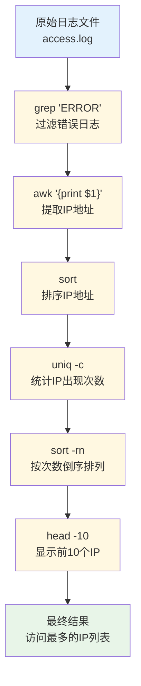
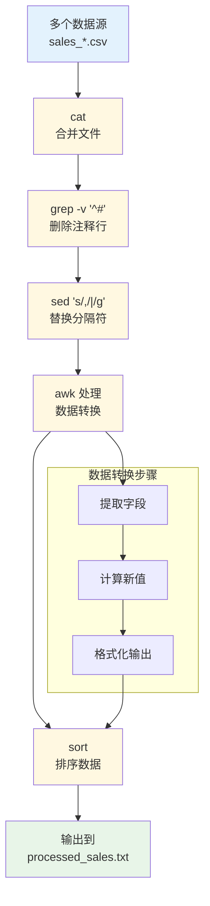
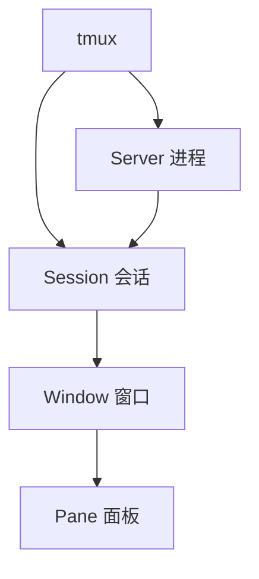

# Shell 命令参考手册

## 目录
- [Shell 命令参考手册](#shell-命令参考手册)
  - [目录](#目录)
  - [文件操作](#文件操作)
    - [文件查找与过滤](#文件查找与过滤)
    - [文件处理](#文件处理)
    - [文件压缩](#文件压缩)
    - [文件权限管理](#文件权限管理)
  - [HDFS操作](#hdfs操作)
    - [文件查看](#文件查看)
    - [文件大小统计](#文件大小统计)
    - [文件上传](#文件上传)
  - [文本处理](#文本处理)
    - [文件读取](#文件读取)
    - [文本过滤](#文本过滤)
    - [高级文本处理](#高级文本处理)
      - [sed 流编辑器](#sed-流编辑器)
      - [awk 文本处理工具](#awk-文本处理工具)
      - [grep 文本搜索工具](#grep-文本搜索工具)
      - [cut 列提取工具](#cut-列提取工具)
      - [sort 排序工具](#sort-排序工具)
      - [uniq 去重工具](#uniq-去重工具)
      - [综合应用示例](#综合应用示例)
      - [管道操作详解](#管道操作详解)
  - [控制结构](#控制结构)
    - [条件判断](#条件判断)
    - [分支语句](#分支语句)
    - [循环语句](#循环语句)
    - [函数定义](#函数定义)
    - [信号与异常处理](#信号与异常处理)
  - [字符串处理](#字符串处理)
    - [字符串基本操作](#字符串基本操作)
    - [字符串截取与替换](#字符串截取与替换)
    - [字符串转换](#字符串转换)
    - [字符串比较与判断](#字符串比较与判断)
    - [正则表达式处理](#正则表达式处理)
  - [数组操作](#数组操作)
    - [数组定义与初始化](#数组定义与初始化)
      - [索引数组](#索引数组)
      - [数组初始化技巧](#数组初始化技巧)
    - [数组访问与修改](#数组访问与修改)
      - [基本访问操作](#基本访问操作)
      - [数组切片操作](#数组切片操作)
      - [数组修改操作](#数组修改操作)
    - [数组遍历](#数组遍历)
      - [基本遍历方法](#基本遍历方法)
      - [高级遍历技巧](#高级遍历技巧)
    - [数组操作方法](#数组操作方法)
      - [数组搜索与查找](#数组搜索与查找)
      - [数组排序](#数组排序)
      - [数组去重与合并](#数组去重与合并)
    - [关联数组](#关联数组)
      - [关联数组基础](#关联数组基础)
      - [关联数组操作](#关联数组操作)
      - [关联数组高级应用](#关联数组高级应用)
    - [数组实用示例](#数组实用示例)
      - [命令行参数处理](#命令行参数处理)
      - [日志处理系统](#日志处理系统)
      - [数据处理管道](#数据处理管道)
  - [数学运算](#数学运算)
    - [基本算术运算](#基本算术运算)
      - [整数运算](#整数运算)
      - [使用let命令](#使用let命令)
      - [使用expr命令](#使用expr命令)
    - [高级数学运算](#高级数学运算)
      - [浮点数运算](#浮点数运算)
      - [使用awk进行数学运算](#使用awk进行数学运算)
    - [数值比较与判断](#数值比较与判断)
      - [数值比较操作](#数值比较操作)
      - [数值范围判断](#数值范围判断)
    - [进制转换](#进制转换)
      - [不同进制之间的转换](#不同进制之间的转换)
    - [随机数生成](#随机数生成)
      - [生成各种随机数](#生成各种随机数)
    - [数学运算实用示例](#数学运算实用示例)
      - [统计计算器](#统计计算器)
      - [数学函数库](#数学函数库)
      - [单位转换器](#单位转换器)
  - [进程管理](#进程管理)
    - [进程监控与控制](#进程监控与控制)
    - [后台任务管理](#后台任务管理)
  - [时间处理](#时间处理)
    - [日期格式化](#日期格式化)
    - [时间计算](#时间计算)
  - [网络请求](#网络请求)
    - [基本网络命令](#基本网络命令)
    - [高级网络操作](#高级网络操作)
  - [系统监控](#系统监控)
    - [资源使用监控](#资源使用监控)
    - [日志分析](#日志分析)
  - [性能分析](#性能分析)
    - [性能测试工具](#性能测试工具)
    - [性能优化技巧](#性能优化技巧)
  - [安全操作](#安全操作)
    - [权限管理](#权限管理)
    - [加密与解密](#加密与解密)
  - [数据库操作](#数据库操作)
    - [MySQL操作](#mysql操作)
    - [PostgreSQL操作](#postgresql操作)
  - [自动化脚本示例](#自动化脚本示例)
    - [定时备份](#定时备份)
    - [批量处理](#批量处理)
  - [实用工具](#实用工具)
  - [终端复用（tmux）](#终端复用tmux)
    - [1. 安装与基础](#1-安装与基础)
    - [2. 会话窗口面板](#2-会话窗口面板)
    - [3. 常用快捷键](#3-常用快捷键)
    - [4. 会话共享与远程](#4-会话共享与远程)
    - [5. 复制滚动与搜索](#5-复制滚动与搜索)
    - [6. 配置与TPM](#6-配置与tpm)
    - [7. 常见问题排查](#7-常见问题排查)
    - [8. 速查表](#8-速查表)

## 文件操作

### 文件查找与过滤
```bash
# 查找目录下以8位数字结尾的文件（YYYYMMDD格式）
find /path/to/dir -type f -regextype posix-extended -regex '.*[0-9]{8}$'

# 检查文件是否存在
if [ ! -f "$file" ]; then
    echo "File not found: $file"
    exit 1
fi

# 查找最近7天修改过的文件
find /path/to/dir -type f -mtime -7

# 查找大于100MB的文件
find /path/to/dir -type f -size +100M

# 查找并删除空文件
find /path/to/dir -type f -empty -delete

# 查找特定权限的文件
find /path/to/dir -type f -perm 644
```

### 文件处理
```bash
# 分割大文件
split -b 10M large_file.txt output_

# 合并文件
cat output_* > combined_file.txt

# 按行分割文件
split -l 1000 large_file.txt output_

# 批量重命名文件
rename 's/\.txt$/.md/' *.txt  # 将所有.txt文件重命名为.md

# 批量替换文件内容
find . -type f -name "*.txt" -exec sed -i 's/old_text/new_text/g' {} \;

# 递归创建目录
mkdir -p path/to/nested/directory
```

### 文件压缩
```bash
# 压缩文件
gzip a.txt          # 压缩并删除原文件
gzip -c a.txt       # 压缩并保留原文件

# 解压文件
gunzip your_file.txt.gz

# tar压缩
tar -czvf archive.tar.gz directory/  # 创建gzip压缩的tar归档
tar -cjvf archive.tar.bz2 directory/ # 创建bzip2压缩的tar归档

# tar解压
tar -xzvf archive.tar.gz    # 解压gzip压缩的tar归档
tar -xjvf archive.tar.bz2   # 解压bzip2压缩的tar归档

# zip压缩
zip -r archive.zip directory/

# zip解压
unzip archive.zip
```

### 文件权限管理
```bash
# 修改文件权限
chmod 755 file.sh   # 设置可执行权限
chmod -R 644 dir/   # 递归修改目录下所有文件权限

# 修改文件所有者
chown user:group file.txt
chown -R user:group directory/  # 递归修改

# 设置SUID/SGID/Sticky位
chmod u+s file      # 设置SUID
chmod g+s directory # 设置SGID
chmod +t directory  # 设置Sticky位

# 复制权限
getfacl source_file | setfacl --set-file=- target_file

# 添加ACL权限
setfacl -m u:user:rwx file.txt  # 为特定用户添加权限
setfacl -m g:group:rx file.txt  # 为特定组添加权限
```

## HDFS操作

### 文件查看
```bash
# 列出HDFS目录下以8位数字结尾的文件
hadoop fs -ls /path/to/dir | awk '$NF ~ /[0-9]{8}$/ {print $NF}'

# 使用grep过滤HDFS目录
hadoop fs -ls /data/dept/bi/dim/data | grep -E "[0-9]{8}$"
```

### 文件大小统计
```bash
# 获取目录文件大小并选择最后一行
hadoop fs -du -h $line | tail -n 1 >> file_size_result.txt
```

### 文件上传
```bash
### 多行文件上传
cat <<EOF | hdfs dfs -put - /path/in/hdfs/multiline.txt
This is line 1
This is line 2
This is line 3
EOF
```

## 文本处理

### 文件读取
```bash
# 遍历文件每一行
file="example.txt"
while IFS= read -r line; do
    echo "$line"
done < "$file"

# 另一种读取方式
cat "$file" | while read line; do
    echo "$line"
done
```

### 文本过滤
```bash
# 查看grep过滤结果的前100个字符
grep "关键词" file.txt | cut -c 1-100

# 显示匹配行及其后5行
curl -s "http://localhost:8080/hotsearch" | grep -A 5 "wallpaper-menu"
```

### 高级文本处理

#### sed 流编辑器

**基本语法**
```bash
# sed 基本语法：sed [选项] '命令' 文件
# 常用选项：
# -i: 直接修改文件
# -n: 静默模式，只输出处理的行
# -e: 多个编辑命令
# -f: 从脚本文件读取命令

# 替换操作
sed 's/old/new/' file.txt           # 替换每行第一个匹配
sed 's/old/new/g' file.txt          # 替换所有匹配
sed 's/old/new/2' file.txt          # 替换每行第二个匹配
sed 's#old#new#g' file.txt          # 使用不同分隔符

# 行操作
sed -n '5p' file.txt                # 打印第5行
sed -n '5,10p' file.txt             # 打印第5到10行
sed -n '$p' file.txt                # 打印最后一行
sed '5d' file.txt                   # 删除第5行
sed '5,10d' file.txt                # 删除第5到10行
sed '/pattern/d' file.txt           # 删除匹配模式的行

# 插入和追加
sed '5i\新行内容' file.txt          # 在第5行前插入
sed '5a\新行内容' file.txt          # 在第5行后追加
sed '/pattern/i\新行内容' file.txt   # 在匹配行前插入
sed '/pattern/a\新行内容' file.txt   # 在匹配行后追加

# 修改行
sed '5c\替换内容' file.txt          # 替换第5行
sed '/pattern/c\替换内容' file.txt   # 替换匹配行
```

**高级sed操作**
```bash
# 多命令操作
sed -e 's/old1/new1/g' -e 's/old2/new2/g' file.txt
sed 's/old1/new1/g; s/old2/new2/g' file.txt

# 条件替换
sed '/pattern/s/old/new/g' file.txt  # 只在匹配行中替换

# 地址范围操作
sed '1,5s/old/new/g' file.txt       # 在1-5行中替换
sed '/start/,/end/s/old/new/g' file.txt  # 在start到end之间替换

# 反向引用
sed 's/\([0-9]\+\)/[\1]/g' file.txt     # 将数字用方括号包围
sed 's/\(.*\):\(.*\)/\2:\1/' file.txt   # 交换冒号前后内容

# 实用示例
# 删除空行
sed '/^$/d' file.txt

# 删除行首空格
sed 's/^[ \t]*//' file.txt

# 删除行尾空格
sed 's/[ \t]*$//' file.txt

# 在每行末尾添加内容
sed 's/$/添加的内容/' file.txt

# 提取IP地址
echo "IP: 192.168.1.1" | sed 's/.*: \([0-9.]*\).*/\1/'

# 格式化配置文件（删除注释和空行）
sed '/^#/d; /^$/d' config.conf

# 批量重命名文件内容
for file in *.txt; do
    sed -i 's/old_company/new_company/g' "$file"
done
```

#### awk 文本处理工具

**基本语法**
```bash
# awk 基本语法：awk 'pattern { action }' 文件
# 内置变量：
# $0: 整行内容
# $1, $2, ...: 第1列、第2列...
# NF: 字段数量
# NR: 行号
# FS: 字段分隔符（默认空格）
# OFS: 输出字段分隔符
# RS: 记录分隔符（默认换行）
# ORS: 输出记录分隔符

# 基本操作
awk '{print $1}' file.txt           # 打印第一列
awk '{print $1, $3}' file.txt       # 打印第一列和第三列
awk '{print NF}' file.txt           # 打印每行字段数
awk '{print NR, $0}' file.txt       # 打印行号和内容

# 指定分隔符
awk -F: '{print $1}' /etc/passwd     # 以冒号为分隔符
awk -F'[,:]' '{print $1}' file.txt  # 多个分隔符

# 条件过滤
awk '$3 > 100' file.txt             # 第三列大于100的行
awk '/pattern/' file.txt            # 包含pattern的行
awk '$1 == "root"' /etc/passwd      # 第一列等于root的行
awk 'length($0) > 80' file.txt     # 行长度大于80的行
```

**高级awk操作**
```bash
# 数学运算
awk '{sum += $1} END {print sum}' file.txt      # 计算第一列总和
awk '{print $1 * $2}' file.txt                 # 计算第一列乘以第二列
awk '{avg = ($1 + $2) / 2; print avg}' file.txt # 计算平均值

# 字符串操作
awk '{print toupper($1)}' file.txt             # 转换为大写
awk '{print tolower($1)}' file.txt             # 转换为小写
awk '{print length($1)}' file.txt              # 字符串长度
awk '{print substr($1, 2, 3)}' file.txt        # 截取子字符串

# 模式匹配
awk '/^[0-9]/' file.txt                        # 以数字开头的行
awk '/error|warning/i' log.txt                 # 包含error或warning的行（忽略大小写）
awk '$1 ~ /^[a-z]+$/' file.txt                 # 第一列只包含小写字母

# 范围处理
awk '/start/,/end/' file.txt                   # 从start到end之间的行
awk 'NR==5,NR==10' file.txt                   # 第5到10行

# 统计操作
awk '{count[$1]++} END {for(i in count) print i, count[i]}' file.txt  # 统计第一列出现次数
awk '{sum+=$1; count++} END {print sum/count}' file.txt               # 计算平均值

# 格式化输出
awk '{printf "%-10s %5d\n", $1, $2}' file.txt  # 格式化输出
awk 'BEGIN{OFS="\t"} {print $1, $2, $3}' file.txt  # 使用制表符分隔输出

# 实用示例
# 处理CSV文件
awk -F, '{print $2}' data.csv                  # 提取CSV第二列

# 分析日志文件
awk '{print $1}' access.log | sort | uniq -c | sort -rn  # 统计IP访问次数

# 计算文件大小总和
ls -l | awk '{sum += $5} END {print "Total:", sum}'

# 提取特定格式数据
echo "Name: John, Age: 30" | awk -F'[:,]' '{print "User " $2 " is " $4 " years old"}'

# 处理多文件
awk '{print FILENAME, NR, $0}' file1.txt file2.txt  # 显示文件名和行号

# 复杂数据处理
awk '
BEGIN { FS=","; OFS="\t" }
NR==1 { print "Name", "Score", "Grade"; next }
{
    if ($2 >= 90) grade = "A"
    else if ($2 >= 80) grade = "B"
    else if ($2 >= 70) grade = "C"
    else grade = "F"
    print $1, $2, grade
}
' students.csv
```

#### grep 文本搜索工具

**基本用法**
```bash
# 基本搜索
grep "pattern" file.txt             # 搜索包含pattern的行
grep -i "pattern" file.txt          # 忽略大小写搜索
grep -v "pattern" file.txt          # 反向搜索（不包含pattern的行）
grep -n "pattern" file.txt          # 显示行号
grep -c "pattern" file.txt          # 统计匹配行数

# 正则表达式
grep "^start" file.txt              # 以start开头的行
grep "end$" file.txt                # 以end结尾的行
grep "[0-9]\+" file.txt             # 包含数字的行
grep "\b[A-Z][a-z]*\b" file.txt     # 首字母大写的单词

# 多文件搜索
grep -r "pattern" directory/        # 递归搜索目录
grep -l "pattern" *.txt             # 只显示包含匹配的文件名
grep -h "pattern" *.txt             # 不显示文件名，只显示匹配行

# 上下文显示
grep -A 3 "pattern" file.txt        # 显示匹配行及后3行
grep -B 3 "pattern" file.txt        # 显示匹配行及前3行
grep -C 3 "pattern" file.txt        # 显示匹配行及前后3行

# 实用示例
# 查找进程
ps aux | grep python

# 查找配置项
grep -n "^[^#]" config.conf         # 查找非注释行

# 提取IP地址
grep -o '[0-9]\{1,3\}\.[0-9]\{1,3\}\.[0-9]\{1,3\}\.[0-9]\{1,3\}' file.txt

# 查找错误日志
grep -i "error\|warning\|fail" log.txt

# 统计代码行数（排除空行和注释）
grep -v "^$\|^#" script.sh | wc -l
```

#### cut 列提取工具

```bash
# 按字符位置切割
cut -c 1-5 file.txt                 # 提取每行第1-5个字符
cut -c 1,3,5 file.txt               # 提取第1、3、5个字符
cut -c 5- file.txt                  # 从第5个字符到行尾

# 按分隔符切割
cut -d: -f1 /etc/passwd             # 以冒号分隔，提取第1列
cut -d, -f1,3 data.csv              # 以逗号分隔，提取第1和第3列
cut -d' ' -f2- file.txt             # 提取第2列及之后所有列

# 实用示例
# 提取文件名
ls -l | cut -d' ' -f9               # 提取文件名列

# 提取用户名
cut -d: -f1 /etc/passwd | sort      # 提取并排序用户名

# 处理CSV文件
cut -d, -f2 data.csv | tail -n +2   # 提取CSV第2列（跳过标题行）
```

#### sort 排序工具

```bash
# 基本排序
sort file.txt                       # 按字典序排序
sort -n file.txt                    # 按数值排序
sort -r file.txt                    # 逆序排序
sort -u file.txt                    # 排序并去重

# 按列排序
sort -k2 file.txt                   # 按第2列排序
sort -k2,2 file.txt                 # 只按第2列排序
sort -k2n file.txt                  # 按第2列数值排序
sort -t: -k3n /etc/passwd           # 以冒号分隔，按第3列数值排序

# 多列排序
sort -k1,1 -k2n file.txt            # 先按第1列字典序，再按第2列数值排序

# 实用示例
# 按文件大小排序
ls -l | sort -k5n                   # 按文件大小排序

# 统计并排序
cut -d: -f7 /etc/passwd | sort | uniq -c | sort -rn  # 统计shell使用情况

# 按IP地址排序
sort -t. -k1,1n -k2,2n -k3,3n -k4,4n ip_list.txt
```

#### uniq 去重工具

```bash
# 基本去重
uniq file.txt                       # 去除相邻重复行（需先排序）
sort file.txt | uniq                # 完全去重

# 统计重复
uniq -c file.txt                    # 显示重复次数
uniq -d file.txt                    # 只显示重复行
uniq -u file.txt                    # 只显示不重复行

# 实用示例
# 统计访问最多的IP
awk '{print $1}' access.log | sort | uniq -c | sort -rn | head -10

# 查找重复文件
find . -type f -exec md5sum {} \; | sort | uniq -d -w32
```

#### 综合应用示例

```bash
# 日志分析：统计HTTP状态码
awk '{print $9}' access.log | sort | uniq -c | sort -rn

# 提取邮箱地址并去重
grep -o '[a-zA-Z0-9._%+-]\+@[a-zA-Z0-9.-]\+\.[a-zA-Z]\{2,\}' file.txt | sort -u

# 分析系统用户
cut -d: -f1,3,7 /etc/passwd | awk -F: '$2 >= 1000 {print $1, $3}' | sort -k2n

# 处理CSV数据：计算平均分
awk -F, 'NR>1 {sum+=$3; count++} END {print "Average:", sum/count}' grades.csv

# 查找大文件并按大小排序
find /var/log -type f -size +10M -exec ls -lh {} \; | sort -k5hr

# 网络连接统计
netstat -an | awk '/^tcp/ {print $6}' | sort | uniq -c | sort -rn

# 提取配置文件有效行
grep -v '^#\|^$' config.conf | sed 's/[[:space:]]*#.*//' | sed '/^$/d'

# 批量处理文件：提取关键信息
for file in *.log; do
    echo "=== $file ==="
    grep -c "ERROR" "$file"
    grep "ERROR" "$file" | head -5
done

# 复杂数据转换：JSON到CSV
echo '{"name":"John","age":30,"city":"NYC"}' | \
sed 's/[{}"]//g' | \
awk -F'[:,]' '{for(i=1;i<=NF;i+=2) printf "%s,", $(i+1)} END {print ""}'


# 验证字符串格式
validate_email() {
    local email=$1
    if [[ $email =~ ^[a-zA-Z0-9._%+-]+@[a-zA-Z0-9.-]+\.[a-zA-Z]{2,}$ ]]; then
        echo "有效的邮箱地址"
        return 0
    else
        echo "无效的邮箱地址"
        return 1
    fi
}

validate_email "user@example.com"
```

#### 管道操作详解

**管道操作基础概念**

管道（Pipeline）是Shell中最重要的概念之一，它允许将一个命令的输出作为另一个命令的输入，形成数据处理的流水线。

**基本语法**：
```bash
command1 | command2 | command3
```

**执行流程**：
```
输入 → command1 → 输出 → command2 → 输出 → command3 → 最终输出
```


**管道操作原理**：
1. **并行执行**：管道中的命令可以并行运行
2. **缓冲机制**：系统会自动处理命令间的数据缓冲
3. **错误处理**：管道中任何命令失败都会影响整个管道
4. **数据流向**：数据从左到右流动，每个命令处理前一个命令的输出

**基础管道示例**

```bash
# 基本管道：查看进程并过滤
ps aux | grep python

# 多级管道：查找、过滤、统计
find /var/log -name "*.log" | xargs grep "ERROR" | wc -l

# 数据转换管道：提取、排序、去重
cat data.txt | cut -d',' -f2 | sort | uniq -c | sort -rn

# 实时监控管道：持续监控系统状态
watch -n 1 'ps aux | head -10'

# 文件处理管道：读取、处理、输出
cat input.txt | tr '[:lower:]' '[:upper:]' | sed 's/OLD/NEW/g' > output.txt
```

**文本处理管道**

```bash
# 日志分析管道
# 1. 读取日志文件
# 2. 提取IP地址
# 3. 统计访问次数
# 4. 按访问量排序
cat access.log | awk '{print $1}' | sort | uniq -c | sort -rn | head -10

# 配置文件处理管道
# 1. 读取配置文件
# 2. 删除注释行
# 3. 删除空行
# 4. 提取有效配置
cat config.conf | grep -v '^#' | grep -v '^$' | sed 's/[[:space:]]*#.*//'

# 数据清洗管道
# 1. 读取CSV文件
# 2. 过滤空行
# 3. 去除首尾空格
# 4. 转换为标准格式
cat data.csv | grep -v '^$' | sed 's/^[[:space:]]*//;s/[[:space:]]*$//' | tr ',' '\t'

# 多文件处理管道
# 1. 查找所有文本文件
# 2. 在每个文件中搜索关键词
# 3. 显示文件名和匹配行
find . -name "*.txt" | xargs grep -l "keyword" | xargs grep -n "keyword"
```

**系统监控管道**

```bash
# 进程监控管道
# 1. 获取所有进程
# 2. 按CPU使用率排序
# 3. 显示前10个最耗CPU的进程
ps aux --sort=-%cpu | head -11 | tail -10

# 内存监控管道
# 1. 获取内存使用情况
# 2. 提取使用内存最多的进程
# 3. 显示进程详细信息
ps aux --sort=-%mem | head -11 | tail -10 | awk '{print $2, $3, $4, $11}'

# 磁盘使用监控管道
# 1. 查看磁盘使用情况
# 2. 过滤出使用率超过80%的分区
# 3. 显示警告信息
df -h | awk '$5 > "80%" {print "警告: " $1 " 使用率 " $5}'

# 网络连接监控管道
# 1. 获取网络连接状态
# 2. 统计各状态连接数
# 3. 按连接数排序
netstat -an | awk '/^tcp/ {print $6}' | sort | uniq -c | sort -rn

# 系统负载监控管道
# 1. 获取系统负载信息
# 2. 提取负载值
# 3. 判断系统状态
uptime | awk '{print "1分钟负载: " $10 ", 5分钟负载: " $11 ", 15分钟负载: " $12}'
```

**数据处理管道**

```bash
# 数据统计管道
# 1. 读取数值数据
# 2. 计算统计信息
# 3. 输出结果
cat numbers.txt | awk '
    BEGIN {sum=0; count=0; min=999999; max=-999999}
    {
        sum+=$1; count++; 
        if($1<min) min=$1; 
        if($1>max) max=$1
    }
    END {
        avg=sum/count;
        print "总数:", count;
        print "总和:", sum;
        print "平均值:", avg;
        print "最小值:", min;
        print "最大值:", max
    }'

# 数据转换管道
# 1. 读取JSON数据
# 2. 提取特定字段
# 3. 转换为CSV格式
cat data.json | jq -r '.[] | [.name, .age, .city] | @csv' | sed 's/"//g'

# 数据过滤管道
# 1. 读取日志数据
# 2. 过滤错误信息
# 3. 提取时间戳和错误消息
# 4. 按时间排序
grep "ERROR" app.log | awk '{print $1, $2, $NF}' | sort -k1,2

# 数据聚合管道
# 1. 读取访问日志
# 2. 按小时统计访问量
# 3. 生成时间序列数据
awk '{print $4}' access.log | cut -d: -f2 | sort | uniq -c | sort -k2n
```

**高级管道技巧**

```bash
# 条件管道：根据条件选择不同的处理路径
if [ -f "data.txt" ]; then
    cat data.txt | process_data
else
    echo "No data file found" | process_data
fi

# 并行管道：同时处理多个数据流
# 使用tee命令分流数据
cat input.txt | tee >(grep "ERROR" > errors.log) >(grep "INFO" > info.log) > /dev/null

# 管道中的错误处理
# 使用set -o pipefail确保管道中任何命令失败都会返回错误
set -o pipefail
command1 | command2 | command3
if [ $? -ne 0 ]; then
    echo "管道执行失败"
fi

# 管道性能优化
# 1. 使用head限制输出量
# 2. 使用grep提前过滤
# 3. 避免不必要的排序
find /var/log -name "*.log" | head -100 | xargs grep "ERROR" | wc -l

# 管道调试技巧
# 使用tee查看管道中间结果
cat data.txt | tee /dev/tty | sed 's/old/new/g' | tee /dev/tty | sort

# 管道中的变量传递
# 使用while read循环处理管道输出
cat users.txt | while read username; do
    echo "Processing user: $username"
    # 处理每个用户
done
```

**实用管道组合**

```bash
# 系统健康检查管道
echo "=== 系统健康检查 ==="
echo "CPU使用率最高的进程:"
ps aux --sort=-%cpu | head -6 | tail -5
echo ""
echo "内存使用率最高的进程:"
ps aux --sort=-%mem | head -6 | tail -5
echo ""
echo "磁盘使用情况:"
df -h | grep -E '^/dev/'
echo ""
echo "系统负载:"
uptime

# 日志分析管道
echo "=== 日志分析报告 ==="
echo "错误日志统计:"
grep -c "ERROR" *.log | sort -t: -k2 -nr
echo ""
echo "最近10条错误日志:"
grep "ERROR" *.log | tail -10
echo ""
echo "按小时统计访问量:"
awk '{print $4}' access.log | cut -d: -f2 | sort | uniq -c | sort -k2n

# 文件系统清理管道
echo "=== 文件系统清理建议 ==="
echo "大文件 (>100MB):"
find /home -type f -size +100M -exec ls -lh {} \; | sort -k5hr | head -10
echo ""
echo "空文件:"
find /home -type f -empty | head -10
echo ""
echo "重复文件 (按大小):"
find /home -type f -size +1M -exec md5sum {} \; | sort | uniq -d -w32

# 网络诊断管道
echo "=== 网络诊断 ==="
echo "活跃连接:"
netstat -an | grep ESTABLISHED | wc -l
echo ""
echo "监听端口:"
netstat -tln | grep LISTEN
echo ""
echo "路由表:"
route -n | head -10
```

**管道性能优化**

```bash
# 1. 减少管道中的命令数量
# 低效：cat file | grep pattern | sed 's/old/new/g' | sort
# 高效：grep pattern file | sed 's/old/new/g' | sort

# 2. 使用更高效的工具组合
# 低效：cat file | grep pattern | wc -l
# 高效：grep -c pattern file

# 3. 避免不必要的排序
# 低效：find . -name "*.txt" | sort | head -10
# 高效：find . -name "*.txt" | head -10

# 4. 使用并行处理
# 使用xargs的-P选项进行并行处理
find . -name "*.log" | xargs -P 4 -I {} grep "ERROR" {}

# 5. 管道中的内存优化
# 使用流式处理避免加载整个文件到内存
cat large_file.txt | while read line; do
    echo "$line" | process_line
done
```

**管道错误处理**

```bash
# 管道错误检测
set -o pipefail  # 启用管道错误检测

# 管道中的错误处理示例
process_with_error_handling() {
    local input_file=$1
    
    if [ ! -f "$input_file" ]; then
        echo "错误: 文件 $input_file 不存在" >&2
        return 1
    fi
    
    # 管道处理，每个步骤都有错误检查
    cat "$input_file" | \
    while read line; do
        if echo "$line" | grep -q "ERROR"; then
            echo "发现错误行: $line" >&2
        else
            echo "$line" | process_line
        fi
    done
    
    # 检查管道执行状态
    if [ $? -ne 0 ]; then
        echo "管道执行失败" >&2
        return 1
    fi
}

# 管道调试函数
debug_pipeline() {
    local stage=1
    echo "开始管道调试..." >&2
    
    while IFS= read -r line; do
        echo "阶段 $stage: $line" >&2
        echo "$line"
        ((stage++))
    done
}

# 使用调试管道
cat data.txt | debug_pipeline | grep "pattern" | debug_pipeline | sort
```

**业务场景管道应用**

```bash
# 1. 日志实时监控管道
# 监控应用日志，实时显示错误信息
tail -f application.log | grep --line-buffered "ERROR\|WARN\|FATAL" | \
while read line; do
    timestamp=$(echo "$line" | awk '{print $1, $2}')
    message=$(echo "$line" | sed 's/^[^:]*:[^:]*:[^:]*://')
    echo "[$timestamp] 发现问题: $message"
    # 可以添加告警逻辑，如发送邮件或短信
done

# 2. 数据ETL管道
# 从多个数据源提取、转换、加载数据
# 提取阶段：从不同文件读取数据
cat sales_*.csv | \
# 转换阶段：数据清洗和格式转换
grep -v "^#" | \
sed 's/,/|/g' | \
awk -F'|' 'NR>1 {print $1, $2, $3*1.1}' | \
# 加载阶段：输出到目标文件
sort -k1,1 > processed_sales.txt

# 3. 系统性能分析管道
# 分析系统性能瓶颈
echo "=== 系统性能分析报告 ==="
echo "CPU使用率分析:"
ps aux | awk 'NR>1 {cpu[$11]+=$3; count[$11]++} END {for(cmd in cpu) printf "%-20s %.1f%%\n", cmd, cpu[cmd]/count[cmd]}' | sort -k2 -nr | head -10

echo ""
echo "内存使用分析:"
ps aux | awk 'NR>1 {mem[$11]+=$4; count[$11]++} END {for(cmd in mem) printf "%-20s %.1f%%\n", cmd, mem[cmd]/count[cmd]}' | sort -k2 -nr | head -10

echo ""
echo "磁盘I/O分析:"
iostat -x 1 1 | awk '/^[a-z]/ {print $1, $2, $3, $4}' | sort -k2 -nr

# 4. 网络流量分析管道
# 分析网络连接和流量模式
echo "=== 网络流量分析 ==="
echo "活跃连接统计:"
netstat -an | awk '/^tcp/ {print $6}' | sort | uniq -c | sort -rn

echo ""
echo "端口使用情况:"
netstat -tln | awk '/^tcp/ {print $4}' | cut -d: -f2 | sort | uniq -c | sort -rn

echo ""
echo "连接最多的IP地址:"
netstat -an | awk '/^tcp/ {print $5}' | cut -d: -f1 | sort | uniq -c | sort -rn | head -10

# 5. 数据库查询结果处理管道
# 处理数据库导出数据
mysql -u user -p database -e "SELECT * FROM users WHERE status='active'" | \
awk 'NR>1 {print $1, $2, $3}' | \
sed 's/\t/,/g' | \
sort -t',' -k2,2 > active_users.csv

# 6. 文件备份验证管道
# 验证备份文件的完整性
find /backup -name "*.tar.gz" -mtime -7 | \
while read backup_file; do
    echo "验证备份文件: $backup_file"
    if tar -tzf "$backup_file" > /dev/null 2>&1; then
        echo "✓ $backup_file 完整性检查通过"
        # 计算文件大小
        size=$(du -h "$backup_file" | cut -f1)
        echo "  文件大小: $size"
    else
        echo "✗ $backup_file 完整性检查失败"
    fi
done

# 7. 批量文件处理管道
# 批量重命名和移动文件
find /downloads -name "*.mp4" | \
while read file; do
    # 提取文件名和扩展名
    dir=$(dirname "$file")
    name=$(basename "$file" .mp4)
    # 创建新文件名
    new_name=$(echo "$name" | tr '[:upper:]' '[:lower:]' | sed 's/[^a-z0-9]/_/g')
    new_file="$dir/${new_name}.mp4"
    # 移动文件
    if [ "$file" != "$new_file" ]; then
        mv "$file" "$new_file"
        echo "重命名: $file -> $new_file"
    fi
done

# 8. 配置管理管道
# 批量更新配置文件
find /etc -name "*.conf" -exec grep -l "old_server" {} \; | \
while read config_file; do
    echo "更新配置文件: $config_file"
    # 备份原文件
    cp "$config_file" "${config_file}.backup.$(date +%Y%m%d)"
    # 替换配置
    sed -i 's/old_server/new_server/g' "$config_file"
    echo "✓ 更新完成"
done

# 9. 服务健康检查管道
# 检查多个服务的运行状态
services=("nginx" "mysql" "redis" "elasticsearch")
echo "=== 服务健康检查 ==="
for service in "${services[@]}"; do
    if systemctl is-active --quiet "$service"; then
        status="运行中"
        uptime=$(systemctl show "$service" --property=ActiveEnterTimestamp | cut -d= -f2)
        echo "✓ $service: $status (启动时间: $uptime)"
    else
        status="已停止"
        echo "✗ $service: $status"
        # 尝试重启服务
        echo "  尝试重启 $service..."
        systemctl restart "$service" 2>/dev/null
    fi
done

# 10. 数据质量检查管道
# 检查数据文件的完整性和一致性
echo "=== 数据质量检查 ==="
for data_file in *.csv; do
    if [ -f "$data_file" ]; then
        echo "检查文件: $data_file"
        
        # 检查文件大小
        size=$(wc -c < "$data_file")
        if [ $size -eq 0 ]; then
            echo "✗ 文件为空"
            continue
        fi
        
        # 检查行数
        lines=$(wc -l < "$data_file")
        echo "  总行数: $lines"
        
        # 检查列数一致性
        column_counts=$(awk -F',' '{print NF}' "$data_file" | sort | uniq -c)
        if [ $(echo "$column_counts" | wc -l) -eq 1 ]; then
            echo "✓ 列数一致"
        else
            echo "✗ 列数不一致:"
            echo "$column_counts"
        fi
        
        # 检查空值
        empty_fields=$(awk -F',' '{for(i=1;i<=NF;i++) if($i=="") count++} END {print count+0}' "$data_file")
        echo "  空字段数: $empty_fields"
    fi
done
```

**管道操作最佳实践**

```bash
# 1. 管道设计原则
# - 单一职责：每个命令只做一件事
# - 数据流向清晰：从左到右，数据逐步处理
# - 错误处理：使用set -o pipefail检测管道错误
# - 性能考虑：避免不必要的中间文件

# 2. 管道调试技巧
# 使用tee命令查看中间结果
cat data.txt | tee /dev/tty | grep "pattern" | tee /dev/tty | sort

# 使用set -x调试整个管道
set -x
cat file.txt | grep "error" | wc -l
set +x

# 3. 管道性能优化
# 使用更高效的工具组合
# 低效：cat file | grep pattern
# 高效：grep pattern file

# 避免重复处理
# 低效：cat file | grep "A" | grep "B"
# 高效：grep "A.*B" file

# 4. 管道可读性提升
# 使用换行符分隔长管道
cat input.txt | \
    grep -v "^#" | \
    sed 's/old/new/g' | \
    sort | \
    uniq -c | \
    sort -rn > output.txt

# 添加注释说明每个步骤
cat log.txt | \
    # 提取时间戳和错误信息
    awk '/ERROR/ {print $1, $2, $NF}' | \
    # 按时间排序
    sort -k1,2 | \
    # 统计错误类型
    awk '{print $3}' | \
    sort | uniq -c | sort -rn
```

**管道操作流程图示例**



**复杂管道操作示例**



**管道操作面试题与解答**

**Q1: 如何统计文件中每个单词的出现次数？**

**A1:** 使用管道组合多个命令实现单词统计：

```bash
# 方法1：基本单词统计
cat file.txt | tr -s '[:space:]' '\n' | sort | uniq -c | sort -rn

# 方法2：忽略大小写的单词统计
cat file.txt | tr '[:upper:]' '[:lower:]' | tr -s '[:space:]' '\n' | \
grep -v '^$' | sort | uniq -c | sort -rn

# 方法3：使用awk进行更精确的单词分割
cat file.txt | awk '{for(i=1;i<=NF;i++) print $i}' | \
tr '[:upper:]' '[:lower:]' | sort | uniq -c | sort -rn
```

**Q2: 如何找出系统中占用内存最多的前5个进程？**

**A2:** 使用ps命令结合管道和排序：

```bash
# 方法1：使用ps aux和管道
ps aux --sort=-%mem | head -6 | tail -5

# 方法2：使用awk提取特定字段
ps aux | awk 'NR>1 {print $2, $3, $4, $11}' | \
sort -k3 -nr | head -5

# 方法3：格式化输出
ps aux --sort=-%mem | head -6 | tail -5 | \
awk '{printf "PID: %-8s 内存: %-6s 命令: %s\n", $2, $4, $11}'
```

**Q3: 如何监控日志文件中的错误信息并实时告警？**

**A3:** 使用tail和管道实现实时监控：

```bash
# 方法1：基本错误监控
tail -f application.log | grep --line-buffered "ERROR\|WARN\|FATAL"

# 方法2：带时间戳的错误监控
tail -f application.log | grep --line-buffered "ERROR\|WARN\|FATAL" | \
while read line; do
    echo "[$(date '+%Y-%m-%d %H:%M:%S')] $line"
done

# 方法3：错误统计和告警
tail -f application.log | grep --line-buffered "ERROR" | \
awk '{count++; print "错误 #" count ": " $0; if(count>=10) exit}'
```

**Q4: 如何批量重命名文件，将文件名中的空格替换为下划线？**

**A4:** 使用find和管道实现批量重命名：

```bash
# 方法1：使用find和while循环
find . -name "* *" -type f | while read file; do
    new_name=$(echo "$file" | tr ' ' '_')
    mv "$file" "$new_name"
    echo "重命名: $file -> $new_name"
done

# 方法2：使用rename命令（如果可用）
rename 's/ /_/g' *

# 方法3：使用bash参数扩展
for file in *\ *; do
    if [ -f "$file" ]; then
        mv "$file" "${file// /_}"
    fi
done
```

**Q5: 如何分析网络连接，找出连接数最多的IP地址？**

**A5:** 使用netstat和管道分析网络连接：

```bash
# 方法1：统计TCP连接
netstat -an | awk '/^tcp/ {print $5}' | \
cut -d: -f1 | sort | uniq -c | sort -rn | head -10

# 方法2：统计所有连接（包括UDP）
netstat -an | awk '/^tcp|^udp/ {print $5}' | \
cut -d: -f1 | grep -v '^$' | sort | uniq -c | sort -rn

# 方法3：按连接状态统计
netstat -an | awk '/^tcp/ {print $5, $6}' | \
cut -d: -f1 | sort | uniq -c | sort -rn
```

**Q6: 如何实现一个简单的数据ETL管道？**

**A6:** 使用管道实现数据提取、转换、加载：

```bash
# ETL管道示例：处理CSV数据
# 提取：从多个文件读取数据
cat sales_*.csv | \
# 转换：数据清洗和转换
grep -v "^#" | \
sed 's/,/|/g' | \
awk -F'|' '
    NR>1 {
        # 数据验证
        if($1 != "" && $2 != "" && $3 > 0) {
            # 数据转换：价格增加10%
            new_price = $3 * 1.1
            # 格式化输出
            printf "%s|%s|%.2f\n", $1, $2, new_price
        }
    }
' | \
# 加载：输出到目标文件
sort -t'|' -k1,1 > processed_sales.txt
```

**Q7: 如何实现管道中的错误处理和调试？**

**A7:** 使用多种技术实现错误处理和调试：

```bash
# 方法1：使用set -o pipefail
set -o pipefail
cat file.txt | grep "pattern" | wc -l
if [ $? -ne 0 ]; then
    echo "管道执行失败"
fi

# 方法2：使用tee调试管道
cat data.txt | tee /dev/tty | grep "pattern" | tee /dev/tty | sort

# 方法3：管道调试函数
debug_pipeline() {
    local stage=1
    while IFS= read -r line; do
        echo "阶段 $stage: $line" >&2
        echo "$line"
        ((stage++))
    done
}

# 使用调试函数
cat data.txt | debug_pipeline | grep "pattern" | debug_pipeline | sort
```

**Q8: 如何优化管道性能？**

**A8:** 使用多种技术优化管道性能：

```bash
# 优化1：减少不必要的命令
# 低效：cat file | grep pattern
# 高效：grep pattern file

# 优化2：使用更高效的工具组合
# 低效：cat file | grep "A" | grep "B"
# 高效：grep "A.*B" file

# 优化3：避免不必要的排序
# 低效：find . -name "*.txt" | sort | head -10
# 高效：find . -name "*.txt" | head -10

# 优化4：使用并行处理
find . -name "*.log" | xargs -P 4 -I {} grep "ERROR" {}

# 优化5：流式处理大文件
cat large_file.txt | while read line; do
    echo "$line" | process_line
done
```

## 控制结构

### 条件判断

**文件测试**
```bash
# 文件存在性测试
[ -e file.txt ] && echo "文件存在"
[ -f file.txt ] && echo "文件存在且是普通文件"
[ -d dir ] && echo "目录存在"
[ -L symlink ] && echo "符号链接存在"
[ -r file.txt ] && echo "文件可读"
[ -w file.txt ] && echo "文件可写"
[ -x file.txt ] && echo "文件可执行"
[ -s file.txt ] && echo "文件大小不为0"

# 文件比较
[ file1 -nt file2 ] && echo "file1比file2新"
[ file1 -ot file2 ] && echo "file1比file2旧"
```

**数值比较**
```bash
# 使用 [ ] 进行数值比较
[ $a -eq $b ] && echo "a等于b"
[ $a -ne $b ] && echo "a不等于b"
[ $a -gt $b ] && echo "a大于b"
[ $a -lt $b ] && echo "a小于b"
[ $a -ge $b ] && echo "a大于等于b"
[ $a -le $b ] && echo "a小于等于b"

# 使用 (( )) 进行数学表达式比较
(( a == b )) && echo "a等于b"
(( a != b )) && echo "a不等于b"
(( a > b )) && echo "a大于b"
(( a < b )) && echo "a小于b"
(( a >= b )) && echo "a大于等于b"
(( a <= b )) && echo "a小于等于b"
```

**字符串比较**
```bash
# 字符串比较
[ "$str1" = "$str2" ] && echo "字符串相等"
[ "$str1" != "$str2" ] && echo "字符串不相等"
[ -z "$str" ] && echo "字符串为空"
[ -n "$str" ] && echo "字符串非空"

# 使用 [[ ]] 进行模式匹配
[[ "$str" == *pattern* ]] && echo "字符串匹配模式"
[[ "$str" =~ ^[0-9]+$ ]] && echo "字符串全为数字"
```

**逻辑运算**
```bash
# 与运算
[ condition1 ] && [ condition2 ] && echo "两个条件都为真"

# 或运算
[ condition1 ] || [ condition2 ] && echo "至少一个条件为真"

# 非运算
[ ! condition ] && echo "条件为假"

# 组合条件
[ condition1 -a condition2 ] && echo "两个条件都为真"
[ condition1 -o condition2 ] && echo "至少一个条件为真"
```

### 分支语句

**if-else语句**
```bash
# 基本if语句
if [ $count -gt 10 ]; then
    echo "Count is greater than 10"
fi

# if-else语句
if [ $count -gt 10 ]; then
    echo "Count is greater than 10"
else
    echo "Count is less than or equal to 10"
fi

# if-elif-else语句
if [ $count -gt 10 ]; then
    echo "Count is greater than 10"
elif [ $count -eq 10 ]; then
    echo "Count is equal to 10"
else
    echo "Count is less than 10"
fi

# 单行if语句
[ $count -gt 10 ] && echo "Count is greater than 10"
[ $count -gt 10 ] || echo "Count is less than or equal to 10"
```

**case语句**
```bash
# 基本case语句
case "$option" in
    start)
        echo "Starting service..."
        start_service
        ;;
    stop)
        echo "Stopping service..."
        stop_service
        ;;
    restart)
        echo "Restarting service..."
        restart_service
        ;;
    *)
        echo "Usage: $0 {start|stop|restart}"
        exit 1
        ;;
esac

# 使用模式匹配
case "$filename" in
    *.jpg|*.jpeg|*.png)
        echo "图像文件"
        ;;
    *.mp3|*.wav|*.ogg)
        echo "音频文件"
        ;;
    *.mp4|*.avi|*.mkv)
        echo "视频文件"
        ;;
    *)
        echo "其他类型文件"
        ;;
esac

# 使用正则表达式 (Bash 4.0+)
case "$string" in
    [0-9]*)
        echo "以数字开头"
        ;;
    [A-Za-z]*)
        echo "以字母开头"
        ;;
    *)
        echo "以其他字符开头"
        ;;
esac
```

### 循环语句

**for循环**
```bash
# 基本for循环
for i in 1 2 3 4 5; do
    echo "Number: $i"
done

# 使用序列
for i in {1..5}; do
    echo "Number: $i"
done

# 带步长的序列 (Bash 4.0+)
for i in {1..10..2}; do
    echo "Odd number: $i"
done

# C风格for循环
for ((i=1; i<=5; i++)); do
    echo "Count: $i"
done

# 遍历文件列表
for file in *.txt; do
    echo "Processing $file"
done

# 遍历命令输出
for line in $(cat file.txt); do
    echo "Line: $line"
done

# 遍历数组

pwd
arr=(${ck_calc_out_path//,/ })
# ${arr[@]} 求数组长度
for v in "${arr[@]}"; do
  echo "当前路径: $v"
  ck_path="hdfs://gt-ga-xs:"$(hadoop fs -ls ${v} |grep parquet | awk '{print $8}' |head -n 1)
  echo "读取文件: "${ck_path}
 # 先cat出来要执行的sql，sed替换掉真实路径，这样避免转义问题
  numCount=$(clickhouse-client  -m --port 9000 --user default --database test --password passwd123 --host hadoop1 -q "$(cat query.sql | sed "s#ckInputPath#$ck_path#g")")
  echo ${numCount}

done
```

**while循环**
```bash
# 基本while循环
count=1
while [ $count -le 5 ]; do
    echo "Count: $count"
    ((count++))
done

# 读取文件每一行
while read -r line; do
    echo "Line: $line"
done < file.txt

# 无限循环
while true; do
    echo "Press Ctrl+C to stop"
    sleep 1
done

# 带条件的无限循环
while :; do
    echo "Another infinite loop"
    sleep 1
done

# 处理命令输出
ls -la | while read -r line; do
    echo "File info: $line"
done
```

**until循环**
```bash
# 基本until循环 (直到条件为真才停止)
count=1
until [ $count -gt 5 ]; do
    echo "Count: $count"
    ((count++))
done

# 等待文件出现
until [ -f "expected_file.txt" ]; do
    echo "Waiting for file to appear..."
    sleep 5
done
echo "File found!"
```

**循环控制**
```bash
# break语句 - 跳出循环
for i in {1..10}; do
    if [ $i -eq 5 ]; then
        echo "Breaking at $i"
        break
    fi
    echo "Number: $i"
done

# continue语句 - 跳过当前迭代
for i in {1..10}; do
    if [ $i -eq 5 ]; then
        echo "Skipping $i"
        continue
    fi
    echo "Number: $i"
done

# 多层循环中的break和continue
for i in {1..3}; do
    for j in {1..3}; do
        if [ $i -eq 2 ] && [ $j -eq 2 ]; then
            echo "Breaking inner loop at i=$i, j=$j"
            break
        fi
        echo "i=$i, j=$j"
    done
done

# 带标签的break (Bash 不支持，但可以用其他方式实现)
outer_loop=true
for i in {1..3}; do
    for j in {1..3}; do
        if [ $i -eq 2 ] && [ $j -eq 2 ]; then
            echo "Breaking both loops at i=$i, j=$j"
            outer_loop=false
            break
        fi
        echo "i=$i, j=$j"
    done
    if ! $outer_loop; then
        break
    fi
done
```

### 函数定义

**基本函数**
```bash
# 定义函数
hello() {
    echo "Hello, World!"
}

# 调用函数
hello

# 带参数的函数
greet() {
    echo "Hello, $1!"
}

greet "John"  # 输出: Hello, John!

# 返回值
is_even() {
    if (( $1 % 2 == 0 )); then
        return 0  # 成功 (true)
    else
        return 1  # 失败 (false)
    fi
}

if is_even 4; then
    echo "4 is even"
else
    echo "4 is odd"
fi

# 函数输出作为返回值
get_date() {
    echo $(date +%Y-%m-%d)
}

today=$(get_date)
echo "Today is $today"

# 局部变量
calculate() {
    local result=$(( $1 + $2 ))
    echo "The sum of $1 and $2 is $result"
}

calculate 5 3
```

**高级函数特性**
```bash
# 默认参数
default_param() {
    local name=${1:-"Guest"}
    echo "Hello, $name!"
}

default_param         # 输出: Hello, Guest!
default_param "John"  # 输出: Hello, John!

# 可变参数
process_all() {
    echo "Processing $# parameters"
    for param in "$@"; do
        echo "- $param"
    done
}

process_all apple banana cherry

# 递归函数
factorial() {
    if [ $1 -le 1 ]; then
        echo 1
    else
        local prev=$(factorial $(( $1 - 1 )))
        echo $(( $1 * prev ))
    done
}

result=$(factorial 5)
echo "5! = $result"  # 输出: 5! = 120
```

### 信号与异常处理

**捕获信号**
```bash
# 捕获SIGINT信号 (Ctrl+C)
trap 'echo "Caught Ctrl+C - Exiting gracefully"; exit' INT

# 捕获多个信号
trap 'echo "Cleaning up..."; rm -f temp_*; exit' EXIT INT TERM

# 在脚本退出时执行清理操作
cleanup() {
    echo "Performing cleanup..."
    rm -f /tmp/tempfile_$$
}
trap cleanup EXIT

# 忽略信号
trap '' INT  # 忽略Ctrl+C

# 恢复默认处理
trap - INT   # 恢复Ctrl+C的默认行为
```

**错误处理**
```bash
# 出错时退出
set -e  # 任何命令返回非零状态时脚本将退出

# 管道错误检测
set -o pipefail  # 管道中任何命令失败时整个管道命令返回失败

# 未定义变量检测
set -u  # 使用未定义变量时脚本将退出

# 调试模式
set -x  # 执行前显示每个命令

# 组合使用
set -euo pipefail  # 严格模式

# 自定义错误处理
error_handler() {
    echo "Error occurred at line $1"
    exit 1
}
trap 'error_handler $LINENO' ERR
```

## 字符串处理

### 字符串基本操作
```bash
# 字符串定义
str="Hello World"
echo $str

# 字符串长度
echo ${#str}  # 输出: 11

# 字符串拼接
str1="Hello"
str2="World"
str3="$str1 $str2"  # 使用变量拼接
str4=$str1$str2     # 直接拼接
echo $str3  # 输出: Hello World
echo $str4  # 输出: HelloWorld

# 字符串重复
repeat_str=$(printf '%.s-' {1..10})
echo $repeat_str  # 输出: ----------
```

### 字符串截取与替换
```bash
# 字符串截取
str="Hello World"
echo ${str:0:5}    # 从索引0开始，截取5个字符，输出: Hello
echo ${str:6}      # 从索引6开始到结束，输出: World
echo ${str: -5}    # 从倒数第5个字符开始到结束，输出: World (注意空格)

# 字符串替换
str="Hello World"
echo ${str/World/Shell}  # 替换第一个匹配，输出: Hello Shell
echo ${str//l/L}         # 替换所有匹配，输出: HeLLo WorLd

# 字符串删除
file="example.tar.gz"
echo ${file#*.}     # 删除第一个.及其左边的字符，输出: tar.gz
echo ${file##*.}    # 删除最后一个.及其左边的字符，输出: gz
echo ${file%.*}     # 删除最后一个.及其右边的字符，输出: example.tar
echo ${file%%.*}    # 删除第一个.及其右边的字符，输出: example

# 字符串前缀和后缀处理
path="/usr/local/bin/bash"
echo ${path##*/}    # 获取文件名，输出: bash
echo ${path%/*}     # 获取目录路径，输出: /usr/local/bin
```

### 字符串转换
```bash
# 大小写转换
str="Hello World"
echo ${str^^}       # 全部转为大写，输出: HELLO WORLD
echo ${str,,}       # 全部转为小写，输出: hello world

# 首字母大写 (Bash 4.0+)
str="hello world"
echo ${str^}        # 首字母大写，输出: Hello world
echo ${str^^[hw]}   # 指定字符大写，输出: Hello World

# 使用tr命令转换大小写
echo "Hello World" | tr '[:lower:]' '[:upper:]'  # 输出: HELLO WORLD
echo "Hello World" | tr '[:upper:]' '[:lower:]'  # 输出: hello world

# 使用awk转换
echo "Hello World" | awk '{print toupper($0)}'  # 输出: HELLO WORLD
echo "Hello World" | awk '{print tolower($0)}'  # 输出: hello world
```

### 字符串比较与判断
```bash
# 字符串比较
str1="abc"
str2="def"

# 相等比较
if [ "$str1" = "$str2" ]; then
    echo "字符串相等"
else
    echo "字符串不相等"
fi

# 大小比较
if [[ "$str1" < "$str2" ]]; then
    echo "$str1 在字典序中小于 $str2"
fi

# 判断字符串是否为空
str=""
if [ -z "$str" ]; then
    echo "字符串为空"
fi

# 判断字符串是否非空
str="Hello"
if [ -n "$str" ]; then
    echo "字符串非空"
fi

# 判断字符串是否包含子串
str="Hello World"
substr="World"
if [[ "$str" == *"$substr"* ]]; then
    echo "字符串包含子串"
fi
```

### 正则表达式处理
```bash
# 使用=~操作符进行正则匹配
str="Hello 123 World"
if [[ $str =~ [0-9]+ ]]; then
    echo "字符串包含数字"
    echo "匹配的数字是: ${BASH_REMATCH[0]}"
fi

# 使用grep提取匹配内容
echo "Email: user@example.com" | grep -o '[a-zA-Z0-9._%+-]\+@[a-zA-Z0-9.-]\+\.[a-zA-Z]\{2,\}'

# 使用sed进行复杂替换
echo "Hello 123 World" | sed -E 's/([0-9]+)/(\1)/g'  # 输出: Hello (123) World
# 将文件输出内容进行替换，分隔符除了用斜杠，也可以用 # 
sed 's#旧的#新的#g' query.sql   

# 使用awk处理格式化字符串
echo "Name: John, Age: 30" | awk -F'[:,]' '{print "User " $2 " is " $4 " years old"}'

# 提取字符串中的数字
str="abc123def456"
echo $str | grep -o '[0-9]\+'  # 输出所有数字序列

# 验证字符串格式
validate_email() {
    local email=$1
    if [[ $email =~ ^[a-zA-Z0-9._%+-]+@[a-zA-Z0-9.-]+\.[a-zA-Z]{2,}$ ]]; then
        echo "有效的邮箱地址"
        return 0
    else
        echo "无效的邮箱地址"
        return 1
    fi
}

validate_email "user@example.com"
```

## 数组操作

### 数组定义与初始化

#### 索引数组

```bash
# 数组定义方式1：直接赋值
array1=("apple" "banana" "cherry" "date")

# 数组定义方式2：逐个赋值
array2[0]="first"
array2[1]="second"
array2[2]="third"

# 数组定义方式3：使用declare
declare -a array3=("element1" "element2" "element3")

# 数组定义方式4：从字符串分割
string="one,two,three,four"
IFS=',' read -ra array4 <<< "$string"

# 数组定义方式5：从命令输出
array5=($(ls *.txt))  # 获取所有txt文件
array6=($(seq 1 10))  # 生成1到10的数组

# 空数组
empty_array=()

# 数组定义方式6：范围生成
range_array=({1..10})        # 1到10
char_array=({a..z})          # a到z
step_array=({1..20..2})      # 1到20，步长为2

# 混合类型数组
mixed_array=("string" 42 "another string" 3.14)
```

#### 数组初始化技巧

```bash
# 使用循环初始化数组
declare -a numbers
for i in {1..10}; do
    numbers[i]=$((i * i))  # 平方数数组
done

# 从文件读取到数组
readarray -t file_lines < file.txt
# 或者
mapfile -t file_lines < file.txt

# 从命令输出读取到数组
readarray -t processes < <(ps aux | grep python)

# 初始化固定大小数组
declare -a fixed_array
for i in {0..99}; do
    fixed_array[i]=0  # 初始化为0
done

# 使用printf初始化
printf -v array_string '%s ' {1..10}
array_from_printf=($array_string)
```

### 数组访问与修改

#### 基本访问操作

```bash
array=("apple" "banana" "cherry" "date" "elderberry")

# 访问单个元素
echo ${array[0]}        # 第一个元素: apple
echo ${array[2]}        # 第三个元素: cherry
echo ${array[-1]}       # 最后一个元素: elderberry (Bash 4.3+)

# 访问所有元素
echo ${array[@]}        # 所有元素，空格分隔
echo ${array[*]}        # 所有元素，IFS分隔
echo "${array[@]}"      # 所有元素，保持原始分隔

# 获取数组长度
echo ${#array[@]}       # 数组元素个数
echo ${#array[*]}       # 数组元素个数（同上）

# 获取特定元素长度
echo ${#array[0]}       # 第一个元素的字符长度

# 获取数组索引
echo ${!array[@]}       # 所有索引
echo ${!array[*]}       # 所有索引
```

#### 数组切片操作

```bash
array=("a" "b" "c" "d" "e" "f" "g" "h")

# 数组切片：${array[@]:start:length}
echo ${array[@]:2:3}    # 从索引2开始，取3个元素: c d e
echo ${array[@]:3}      # 从索引3开始到结尾: d e f g h
echo ${array[@]: -3}    # 最后3个元素: f g h
echo ${array[@]:1:-1}   # 从索引1到倒数第2个: b c d e f g

# 字符串切片（对数组元素）
echo ${array[0]:1:2}    # 第一个元素的子字符串

# 复制数组切片到新数组
sub_array=("${array[@]:2:3}")
echo "子数组: ${sub_array[@]}"
```

#### 数组修改操作

```bash
array=("apple" "banana" "cherry")

# 修改单个元素
array[1]="blueberry"
echo ${array[@]}        # apple blueberry cherry

# 添加元素到数组末尾
array+=("date")
array[${#array[@]}]="elderberry"
echo ${array[@]}        # apple blueberry cherry date elderberry

# 在数组开头插入元素
array=("zero" "${array[@]}")
echo ${array[@]}        # zero apple blueberry cherry date elderberry

# 在指定位置插入元素
insert_at_index() {
    local -n arr=$1
    local index=$2
    local value=$3
    
    # 创建新数组
    local new_array=()
    local i
    
    # 复制插入位置之前的元素
    for ((i=0; i<index; i++)); do
        new_array[i]=${arr[i]}
    done
    
    # 插入新元素
    new_array[index]=$value
    
    # 复制插入位置之后的元素
    for ((i=index; i<${#arr[@]}; i++)); do
        new_array[i+1]=${arr[i]}
    done
    
    # 更新原数组
    arr=("${new_array[@]}")
}

# 使用示例
my_array=("a" "b" "d" "e")
insert_at_index my_array 2 "c"
echo ${my_array[@]}     # a b c d e

# 删除数组元素
unset array[2]          # 删除索引2的元素
echo ${array[@]}        # 注意：索引2变为空，但索引仍存在

# 重新索引数组（去除空隙）
array=("${array[@]}")
echo ${!array[@]}       # 显示新的连续索引
```

### 数组遍历

#### 基本遍历方法

```bash
fruits=("apple" "banana" "cherry" "date")

# 方法1：遍历所有元素
for fruit in "${fruits[@]}"; do
    echo "水果: $fruit"
done

# 方法2：使用索引遍历
for i in "${!fruits[@]}"; do
    echo "索引 $i: ${fruits[i]}"
done

# 方法3：C风格循环
for ((i=0; i<${#fruits[@]}; i++)); do
    echo "位置 $i: ${fruits[i]}"
done

# 方法4：while循环遍历
i=0
while [ $i -lt ${#fruits[@]} ]; do
    echo "元素 $i: ${fruits[i]}"
    ((i++))
done
```

#### 高级遍历技巧

```bash
# 同时遍历多个数组
names=("Alice" "Bob" "Charlie")
ages=(25 30 35)
cities=("New York" "London" "Tokyo")

for i in "${!names[@]}"; do
    echo "${names[i]} (${ages[i]}岁) 住在 ${cities[i]}"
done

# 遍历时进行条件过滤
numbers=(1 2 3 4 5 6 7 8 9 10)
echo "偶数:"
for num in "${numbers[@]}"; do
    if (( num % 2 == 0 )); then
        echo $num
    fi
done

# 遍历时统计
total=0
count=0
for num in "${numbers[@]}"; do
    total=$((total + num))
    count=$((count + 1))
done
average=$((total / count))
echo "平均值: $average"

# 遍历hdfs上文件所有行，切分生成数组进行计算，在数组新增字段，最终输出到hdfs新的文件
echo "类型,还原uuid数量,采样wifi还原数量,推测wifi结果和采样wifi完全一样数量,推测wifi和采样wifi前缀一样数量,推测wifi和采样wifi的ssid相似,准确率" > uuid_metrics_data.txt
hadoop fs -text $metrics_out_path/* | while IFS=',' read -r flag uuid_num sample_uuid_num total_equal_num prefix_equal_num
do
    echo "列1=$flag, 列2=$uuid_num, 列3=$sample_uuid_num, 列4=$total_equal_num, 列5=$prefix_equal_num"
    sim=${ssidSimalarity[$flag]:-0}
    echo $sim
    sum=$(($total_equal_num+$prefix_equal_num+$sim))
    echo "总和$sum"
    # 计算比例
    ratio=$(echo "scale=4; $sum / $sample_uuid_num * 100" | bc)
    # 构造数组元素（用空格分隔）
    rst=("$flag" "$uuid_num" "$sample_uuid_num" "$total_equal_num" "$prefix_equal_num" "$sim" "$ratio")
    # 输出数组，用逗号拼接生成字符串
    ( IFS=','; echo "${rst[*]}" ) >>  uuid_metrics_data.txt
done

# 将结果添加到数组上，上面那种是添加到本地文件，无法更新数组
result=("类型,还原uuid数量,采样wifi还原数量,推测wifi结果和采样wifi完全一样数量,推测wifi和采样wifi前缀一样数量,推测wifi和采样wifi的ssid相似,准确数量,准确率")
while IFS=',' read -r flag uuid_num sample_uuid_num total_equal_num prefix_equal_num
do
    echo "列1=$flag, 列2=$uuid_num, 列3=$sample_uuid_num, 列4=$total_equal_num, 列5=$prefix_equal_num"
    # 取数组值，若为空则默认0
    sim=${ssidSimalarity[$flag]:-0}
    echo $sim
    sum=$(($total_equal_num+$prefix_equal_num+$sim))
    echo "总和$sum"
    # 计算比例
    ratio=$(echo "scale=4; $sum / $sample_uuid_num * 100" | bc)
    # 构造数组元素（用空格分隔）
    row="$flag,$uuid_num,$sample_uuid_num,$total_equal_num,$prefix_equal_num,$sim,$sum,$ratio"
    echo $row
    result+=("$row")
done <<< "$(hadoop fs -text $metrics_out_path/*)"
# 数组换行输出到文件上， -f会覆盖文件 -代表从输入读取数据
printf "%s\n" "${result[@]}" | hdfs dfs -put -f - "$metrics_final_path/data.txt"
hadoop fs -touchz $metrics_final_path/_SUCCESS


# 反向遍历
echo "反向遍历:"
for ((i=${#fruits[@]}-1; i>=0; i--)); do
    echo "${fruits[i]}"
done

# 跳跃遍历（每隔一个元素）
echo "跳跃遍历:"
for ((i=0; i<${#fruits[@]}; i+=2)); do
    echo "${fruits[i]}"
done
```

### 数组操作方法

#### 数组搜索与查找

```bash
# 检查元素是否存在
contains_element() {
    local element="$1"
    shift
    local array=("$@")
    
    for item in "${array[@]}"; do
        if [[ "$item" == "$element" ]]; then
            return 0  # 找到了
        fi
    done
    return 1  # 没找到
}

fruits=("apple" "banana" "cherry")
if contains_element "banana" "${fruits[@]}"; then
    echo "找到了banana"
fi

# 查找元素索引
find_index() {
    local element="$1"
    shift
    local array=("$@")
    
    for i in "${!array[@]}"; do
        if [[ "${array[i]}" == "$element" ]]; then
            echo $i
            return 0
        fi
    done
    echo -1  # 未找到
}

index=$(find_index "cherry" "${fruits[@]}")
echo "cherry的索引: $index"

# 查找匹配模式的元素
find_pattern() {
    local pattern="$1"
    shift
    local array=("$@")
    local matches=()
    
    for item in "${array[@]}"; do
        if [[ "$item" =~ $pattern ]]; then
            matches+=("$item")
        fi
    done
    
    echo "${matches[@]}"
}

files=("test.txt" "data.csv" "script.sh" "readme.md")
text_files=($(find_pattern "\.txt$|\.md$" "${files[@]}"))
echo "文本文件: ${text_files[@]}"
```

#### 数组排序

```bash
# 简单排序（字符串排序）
sort_array() {
    local -n arr=$1
    IFS=$'\n' arr=($(sort <<<"${arr[*]}"))
}

names=("Charlie" "Alice" "Bob" "David")
echo "排序前: ${names[@]}"
sort_array names
echo "排序后: ${names[@]}"

# 数值排序
sort_numeric() {
    local -n arr=$1
    IFS=$'\n' arr=($(printf '%s\n' "${arr[@]}" | sort -n))
}

numbers=(10 2 30 4 50)
echo "数值排序前: ${numbers[@]}"
sort_numeric numbers
echo "数值排序后: ${numbers[@]}"

# 逆序排序
reverse_sort() {
    local -n arr=$1
    IFS=$'\n' arr=($(printf '%s\n' "${arr[@]}" | sort -r))
}

# 自定义排序（按长度）
sort_by_length() {
    local -n arr=$1
    local temp_array=()
    
    # 创建"长度:值"格式的临时数组
    for item in "${arr[@]}"; do
        temp_array+=("${#item}:$item")
    done
    
    # 排序并提取值
    IFS=$'\n' temp_array=($(printf '%s\n' "${temp_array[@]}" | sort -n))
    
    # 重建原数组
    arr=()
    for item in "${temp_array[@]}"; do
        arr+=("${item#*:}")
    done
}

words=("elephant" "cat" "butterfly" "dog")
echo "按长度排序前: ${words[@]}"
sort_by_length words
echo "按长度排序后: ${words[@]}"
```

#### 数组去重与合并

```bash
# 数组去重
remove_duplicates() {
    local -n arr=$1
    local unique_array=()
    local seen=()
    
    for item in "${arr[@]}"; do
        local found=false
        for seen_item in "${seen[@]}"; do
            if [[ "$item" == "$seen_item" ]]; then
                found=true
                break
            fi
        done
        
        if ! $found; then
            unique_array+=("$item")
            seen+=("$item")
        fi
    done
    
    arr=("${unique_array[@]}")
}

# 使用关联数组去重（更高效）
remove_duplicates_fast() {
    local -n arr=$1
    local -A seen
    local unique_array=()
    
    for item in "${arr[@]}"; do
        if [[ -z "${seen[$item]}" ]]; then
            seen[$item]=1
            unique_array+=("$item")
        fi
    done
    
    arr=("${unique_array[@]}")
}

duplicates=("apple" "banana" "apple" "cherry" "banana" "date")
echo "去重前: ${duplicates[@]}"
remove_duplicates_fast duplicates
echo "去重后: ${duplicates[@]}"

# 数组合并
merge_arrays() {
    local result_name=$1
    shift
    local -n result=$result_name
    result=()
    
    while [[ $# -gt 0 ]]; do
        local -n current_array=$1
        result+=("${current_array[@]}")
        shift
    done
}

array1=("a" "b" "c")
array2=("d" "e" "f")
array3=("g" "h" "i")

merge_arrays merged array1 array2 array3
echo "合并后: ${merged[@]}"

# 数组交集
array_intersection() {
    local -n arr1=$1
    local -n arr2=$2
    local -n result=$3
    local -A hash
    result=()
    
    # 将第一个数组的元素放入哈希表
    for item in "${arr1[@]}"; do
        hash[$item]=1
    done
    
    # 检查第二个数组的元素是否在哈希表中
    for item in "${arr2[@]}"; do
        if [[ -n "${hash[$item]}" ]]; then
            result+=("$item")
        fi
    done
}

set1=("apple" "banana" "cherry" "date")
set2=("banana" "cherry" "elderberry" "fig")
intersection=()

array_intersection set1 set2 intersection
echo "交集: ${intersection[@]}"
```

### 关联数组

#### 关联数组基础

```bash
# 声明关联数组
declare -A person
declare -A colors
declare -A config

# 关联数组赋值
person["name"]="John Doe"
person["age"]=30
person["city"]="New York"
person["job"]="Developer"

# 批量赋值
colors=(
    ["red"]="#FF0000"
    ["green"]="#00FF00"
    ["blue"]="#0000FF"
    ["yellow"]="#FFFF00"
)

# 从字符串初始化
config_string="host=localhost port=8080 user=admin password=secret"
for pair in $config_string; do
    key=${pair%=*}
    value=${pair#*=}
    config[$key]=$value
done
```

#### 关联数组操作

```bash
# 访问关联数组
echo "姓名: ${person["name"]}"
echo "年龄: ${person["age"]}"

# 检查键是否存在
if [[ -n "${person["email"]}" ]]; then
    echo "邮箱: ${person["email"]}"
else
    echo "邮箱未设置"
fi

# 更安全的检查方式
if [[ -v person["email"] ]]; then
    echo "邮箱键存在"
else
    echo "邮箱键不存在"
fi

# 获取所有键
echo "所有键: ${!person[@]}"

# 获取所有值
echo "所有值: ${person[@]}"

# 获取键值对数量
echo "键值对数量: ${#person[@]}"

# 遍历关联数组
echo "=== 个人信息 ==="
for key in "${!person[@]}"; do
    echo "$key: ${person[$key]}"
done

# 删除键值对
unset person["job"]
echo "删除job后: ${!person[@]}"

# 清空关联数组
unset person
declare -A person
```

#### 关联数组高级应用

```bash
# 统计文件类型
declare -A file_count
for file in *; do
    if [[ -f "$file" ]]; then
        extension="${file##*.}"
        ((file_count[$extension]++))
    fi
done

echo "=== 文件类型统计 ==="
for ext in "${!file_count[@]}"; do
    echo "$ext: ${file_count[$ext]} 个文件"
done

# 配置管理
declare -A database_config=(
    ["host"]="localhost"
    ["port"]="5432"
    ["database"]="myapp"
    ["username"]="user"
    ["password"]="secret"
)

# 生成配置文件
generate_config() {
    local -n config=$1
    local config_file=$2
    
    echo "# 自动生成的配置文件" > "$config_file"
    echo "# $(date)" >> "$config_file"
    echo "" >> "$config_file"
    
    for key in "${!config[@]}"; do
        echo "$key=${config[$key]}" >> "$config_file"
    done
}

generate_config database_config "db.conf"

# 缓存系统
declare -A cache
declare -A cache_time

cache_set() {
    local key=$1
    local value=$2
    local ttl=${3:-3600}  # 默认1小时
    
    cache[$key]=$value
    cache_time[$key]=$(($(date +%s) + ttl))
}

cache_get() {
    local key=$1
    local current_time=$(date +%s)
    
    if [[ -n "${cache[$key]}" ]] && [[ ${cache_time[$key]} -gt $current_time ]]; then
        echo "${cache[$key]}"
        return 0
    else
        unset cache[$key]
        unset cache_time[$key]
        return 1
    fi
}

# 使用缓存
cache_set "user:123" "John Doe" 60
if result=$(cache_get "user:123"); then
    echo "从缓存获取: $result"
else
    echo "缓存已过期或不存在"
fi
```

### 数组实用示例

#### 命令行参数处理

```bash
#!/bin/bash
# 高级命令行参数处理

declare -A options
declare -a positional_args

# 解析命令行参数
parse_args() {
    while [[ $# -gt 0 ]]; do
        case $1 in
            --*=*)
                key="${1#--}"
                key="${key%=*}"
                value="${1#*=}"
                options[$key]="$value"
                ;;
            --*)
                key="${1#--}"
                if [[ -n "$2" ]] && [[ "$2" != --* ]]; then
                    options[$key]="$2"
                    shift
                else
                    options[$key]="true"
                fi
                ;;
            -*)
                # 短选项处理
                flags="${1#-}"
                for ((i=0; i<${#flags}; i++)); do
                    flag="${flags:$i:1}"
                    options[$flag]="true"
                done
                ;;
            *)
                positional_args+=("$1")
                ;;
        esac
        shift
    done
}

# 使用示例
parse_args --host=localhost --port 8080 --verbose -abc file1.txt file2.txt

echo "=== 选项 ==="
for key in "${!options[@]}"; do
    echo "$key: ${options[$key]}"
done

echo "=== 位置参数 ==="
for arg in "${positional_args[@]}"; do
    echo "$arg"
done
```

#### 日志处理系统

```bash
#!/bin/bash
# 日志分析系统

declare -A log_levels
declare -A log_counts
declare -a log_entries

# 解析日志文件
parse_log() {
    local log_file=$1
    
    while IFS= read -r line; do
        log_entries+=("$line")
        
        # 提取日志级别
        if [[ $line =~ \[(DEBUG|INFO|WARN|ERROR|FATAL)\] ]]; then
            level="${BASH_REMATCH[1]}"
            ((log_counts[$level]++))
        fi
    done < "$log_file"
}

# 生成统计报告
generate_report() {
    echo "=== 日志统计报告 ==="
    echo "总日志条数: ${#log_entries[@]}"
    echo ""
    
    echo "按级别统计:"
    for level in DEBUG INFO WARN ERROR FATAL; do
        count=${log_counts[$level]:-0}
        if [[ $count -gt 0 ]]; then
            printf "%-8s: %d\n" "$level" "$count"
        fi
    done
    
    echo ""
    echo "错误日志详情:"
    for entry in "${log_entries[@]}"; do
        if [[ $entry =~ \[ERROR\] ]]; then
            echo "$entry"
        fi
    done
}

# 使用示例（如果有日志文件）
if [[ -f "application.log" ]]; then
    parse_log "application.log"
    generate_report
fi
```

#### 数据处理管道

```bash
#!/bin/bash
# 数据处理管道

# 数据清洗
clean_data() {
    local -n input_array=$1
    local -n output_array=$2
    
    output_array=()
    for item in "${input_array[@]}"; do
        # 去除空白字符
        item=$(echo "$item" | xargs)
        
        # 跳过空行
        if [[ -n "$item" ]]; then
            # 转换为小写
            item=$(echo "$item" | tr '[:upper:]' '[:lower:]')
            output_array+=("$item")
        fi
    done
}

# 数据验证
validate_data() {
    local -n input_array=$1
    local -n valid_array=$2
    local -n invalid_array=$3
    local pattern=$4
    
    valid_array=()
    invalid_array=()
    
    for item in "${input_array[@]}"; do
        if [[ $item =~ $pattern ]]; then
            valid_array+=("$item")
        else
            invalid_array+=("$item")
        fi
    done
}

# 数据转换
transform_data() {
    local -n input_array=$1
    local -n output_array=$2
    local transform_func=$3
    
    output_array=()
    for item in "${input_array[@]}"; do
        transformed=$($transform_func "$item")
        output_array+=("$transformed")
    done
}

# 示例转换函数
add_prefix() {
    echo "processed_$1"
}

# 使用示例
raw_data=("  Apple  " "" "BANANA" "cherry" "123invalid" "date")
cleaned_data=()
valid_data=()
invalid_data=()
final_data=()

echo "原始数据: ${raw_data[@]}"

# 数据清洗
clean_data raw_data cleaned_data
echo "清洗后: ${cleaned_data[@]}"

# 数据验证（只保留字母）
validate_data cleaned_data valid_data invalid_data "^[a-z]+$"
echo "有效数据: ${valid_data[@]}"
echo "无效数据: ${invalid_data[@]}"

# 数据转换
transform_data valid_data final_data add_prefix
echo "最终数据: ${final_data[@]}"
```

## 数学运算

### 基本算术运算

#### 整数运算

```bash
# 使用 $(( )) 进行算术运算（推荐）
a=10
b=3

# 基本运算
sum=$((a + b))          # 加法: 13
diff=$((a - b))         # 减法: 7
product=$((a * b))      # 乘法: 30
quotient=$((a / b))     # 整数除法: 3
remainder=$((a % b))    # 取余: 1
power=$((a ** b))       # 幂运算: 1000

echo "加法: $a + $b = $sum"
echo "减法: $a - $b = $diff"
echo "乘法: $a * $b = $product"
echo "除法: $a / $b = $quotient"
echo "取余: $a % $b = $remainder"
echo "幂运算: $a ** $b = $power"

# 复合运算
result=$(( (a + b) * 2 - 5 ))    # 复合表达式: 21
echo "复合运算: ($a + $b) * 2 - 5 = $result"

# 自增自减运算
count=5
echo "原值: $count"
echo "前置自增: $((++count))"     # 6
echo "后置自增: $((count++))"     # 6，但count变为7
echo "当前值: $count"             # 7
echo "前置自减: $((--count))"     # 6
echo "后置自减: $((count--))"     # 6，但count变为5
echo "最终值: $count"             # 5

# 复合赋值运算
num=10
((num += 5))    # num = num + 5 = 15
((num -= 3))    # num = num - 3 = 12
((num *= 2))    # num = num * 2 = 24
((num /= 4))    # num = num / 4 = 6
((num %= 4))    # num = num % 4 = 2
echo "复合赋值结果: $num"
```

#### 使用let命令

```bash
# let命令进行算术运算
let "result = 10 + 5 * 2"
echo "let运算结果: $result"      # 20

# let命令的多种写法
let result=10+5*2               # 不需要引号（无空格）
let "result = 10 + 5 * 2"       # 使用引号（有空格）
let result="10 + 5 * 2"         # 另一种写法

# let命令的自增自减
counter=0
let counter++                   # 自增
let ++counter                   # 前置自增
let counter+=5                  # 加5
let counter*=2                  # 乘2
echo "计数器值: $counter"
```

#### 使用expr命令

```bash
# expr命令（较老的方式，需要注意空格和转义）
a=10
b=3

sum=$(expr $a + $b)             # 加法
product=$(expr $a \* $b)        # 乘法（需要转义*）
quotient=$(expr $a / $b)        # 除法
remainder=$(expr $a % $b)       # 取余

echo "expr加法: $sum"
echo "expr乘法: $product"
echo "expr除法: $quotient"
echo "expr取余: $remainder"

# expr的字符串长度计算
string="Hello World"
length=$(expr length "$string")
echo "字符串长度: $length"

# expr的子字符串提取
substring=$(expr substr "$string" 1 5)  # 从位置1开始，长度5
echo "子字符串: $substring"
```

### 高级数学运算

#### 浮点数运算

**bc计算器语法说明**

`bc`（Basic Calculator）是Unix/Linux系统中的任意精度计算器，特别适合浮点数运算。

**基本语法模式**：
```bash
result=$(echo "数学表达式" | bc)
```

**语法组成部分**：
1. **`echo "表达式"`** - 将数学表达式作为字符串输出
2. **`|`** - 管道操作符，将输出传递给下一个命令
3. **`bc`** - 基本计算器，接收并计算数学表达式
4. **`$(...)`** - 命令替换，捕获命令的输出结果
5. **`result=`** - 将结果赋值给变量

**执行流程**：
```
变量值 → echo输出 → 管道传递 → bc计算 → 命令替换 → 变量赋值
 10.5     "10.5*3.2"      "10.5*3.2"      33.60        33.60      product=33.60
```

```bash
# 使用bc计算器进行浮点运算
a=10.5
b=3.2

# 基本浮点运算
sum=$(echo "$a + $b" | bc)
diff=$(echo "$a - $b" | bc)
product=$(echo "$a * $b" | bc)
quotient=$(echo "scale=2; $a / $b" | bc)  # scale设置小数位数

# 语法解释：product=$(echo "$a * $b" | bc)
# 1. echo "$a * $b"        - 输出数学表达式字符串，如 "10.5 * 3.2"
# 2. |                     - 管道操作符，将echo的输出传递给bc
# 3. bc                    - 基本计算器，执行数学运算
# 4. $( ... )              - 命令替换，捕获bc的计算结果
# 5. product=              - 将计算结果赋值给变量product
# 
# 完整流程：变量展开 → 字符串输出 → 管道传递 → bc计算 → 结果捕获 → 变量赋值

# bc命令语法详解
# bc是一个任意精度的计算器语言，支持：
# - 基本运算：+ - * / % ^（幂运算）
# - 函数：sqrt() sin() cos() ln() exp() 等（需要-l选项）
# - 变量和控制结构
# - scale变量控制小数位数

# 常用bc选项：
# bc -l          # 加载数学库，支持浮点运算和数学函数
# bc -q          # 静默模式，不显示版权信息

# 示例：不同的bc使用方式
echo "=== bc使用方式对比 ==="
echo "方式1 - 管道输入: $(echo "10.5 + 3.2" | bc)"
echo "方式2 - Here字符串: $(bc <<< "10.5 + 3.2")"
echo "方式3 - Here文档: $(bc << EOF
scale=2
10.5 + 3.2
EOF
)"

echo "浮点加法: $a + $b = $sum"
echo "浮点减法: $a - $b = $diff"
echo "浮点乘法: $a * $b = $product"
echo "浮点除法: $a / $b = $quotient"

# 高精度计算
pi=$(echo "scale=10; 4*a(1)" | bc -l)    # 计算π，使用数学库
echo "π值: $pi"

# 三角函数（需要-l选项加载数学库）
angle=45
sin_val=$(echo "scale=6; s($angle * 3.14159/180)" | bc -l)  # 正弦值
cos_val=$(echo "scale=6; c($angle * 3.14159/180)" | bc -l)  # 余弦值
echo "$angle度的正弦值: $sin_val"
echo "$angle度的余弦值: $cos_val"

# 对数和指数
number=10
ln_val=$(echo "scale=6; l($number)" | bc -l)      # 自然对数
log10_val=$(echo "scale=6; l($number)/l(10)" | bc -l)  # 常用对数
exp_val=$(echo "scale=6; e($number)" | bc -l)     # 指数函数
echo "$number的自然对数: $ln_val"
echo "$number的常用对数: $log10_val"
echo "e^$number = $exp_val"

# 平方根
sqrt_val=$(echo "scale=6; sqrt($number)" | bc -l)
echo "$number的平方根: $sqrt_val"
```

#### 使用awk进行数学运算

```bash
# awk的数学运算能力
a=10.5
b=3.2

# 基本运算
result=$(awk "BEGIN {print $a + $b}")
echo "awk加法: $result"

result=$(awk "BEGIN {print $a * $b}")
echo "awk乘法: $result"

result=$(awk "BEGIN {printf \"%.2f\", $a / $b}")
echo "awk除法（保留2位小数）: $result"

# awk的数学函数
number=16
sqrt_result=$(awk "BEGIN {print sqrt($number)}")
echo "$number的平方根: $sqrt_result"

angle=45
sin_result=$(awk "BEGIN {print sin($angle * 3.14159/180)}")
cos_result=$(awk "BEGIN {print cos($angle * 3.14159/180)}")
echo "$angle度的正弦值: $sin_result"
echo "$angle度的余弦值: $cos_result"

# awk的随机数
random_num=$(awk "BEGIN {srand(); print rand()}")
echo "0-1之间的随机数: $random_num"

random_int=$(awk "BEGIN {srand(); print int(rand()*100)}")
echo "0-99之间的随机整数: $random_int"
```

### 数值比较与判断

#### 数值比较操作

```bash
# 整数比较
a=10
b=20

# 使用 [ ] 进行比较
if [ $a -eq $b ]; then
    echo "$a 等于 $b"
elif [ $a -lt $b ]; then
    echo "$a 小于 $b"
elif [ $a -gt $b ]; then
    echo "$a 大于 $b"
fi

# 使用 (( )) 进行比较（更直观）
if (( a == b )); then
    echo "$a 等于 $b"
elif (( a < b )); then
    echo "$a 小于 $b"
elif (( a > b )); then
    echo "$a 大于 $b"
fi

# 浮点数比较（使用bc）
float1=10.5
float2=10.3

if (( $(echo "$float1 > $float2" | bc -l) )); then
    echo "$float1 大于 $float2"
fi

# 使用awk进行浮点数比较
if awk "BEGIN {exit !($float1 > $float2)}"; then
    echo "awk比较: $float1 大于 $float2"
fi
```

#### 数值范围判断

```bash
# 判断数值是否在范围内
check_range() {
    local num=$1
    local min=$2
    local max=$3
    
    if (( num >= min && num <= max )); then
        echo "$num 在范围 [$min, $max] 内"
        return 0
    else
        echo "$num 不在范围 [$min, $max] 内"
        return 1
    fi
}

check_range 15 10 20    # 在范围内
check_range 5 10 20     # 不在范围内

# 判断是否为偶数/奇数
is_even() {
    local num=$1
    if (( num % 2 == 0 )); then
        echo "$num 是偶数"
        return 0
    else
        echo "$num 是奇数"
        return 1
    fi
}

is_even 10
is_even 15

# 判断是否为质数
is_prime() {
    local num=$1
    
    if (( num < 2 )); then
        echo "$num 不是质数"
        return 1
    fi
    
    for (( i=2; i*i<=num; i++ )); do
        if (( num % i == 0 )); then
            echo "$num 不是质数"
            return 1
        fi
    done
    
    echo "$num 是质数"
    return 0
}

is_prime 17
is_prime 15
```

### 进制转换

#### 不同进制之间的转换

```bash
# 十进制转其他进制
decimal=255

# 十进制转二进制
binary=$(echo "obase=2; $decimal" | bc)
echo "$decimal (十进制) = $binary (二进制)"

# 十进制转八进制
octal=$(echo "obase=8; $decimal" | bc)
echo "$decimal (十进制) = $octal (八进制)"

# 十进制转十六进制
hex=$(echo "obase=16; $decimal" | bc)
echo "$decimal (十进制) = $hex (十六进制)"

# 使用printf进行进制转换
printf "十进制 %d = 二进制 %s\n" $decimal $(echo "obase=2; $decimal" | bc)
printf "十进制 %d = 八进制 %o\n" $decimal $decimal
printf "十进制 %d = 十六进制 %x\n" $decimal $decimal
printf "十进制 %d = 十六进制 %X\n" $decimal $decimal

# 其他进制转十进制
binary_num="11111111"
decimal_from_binary=$(echo "ibase=2; $binary_num" | bc)
echo "$binary_num (二进制) = $decimal_from_binary (十进制)"

hex_num="FF"
decimal_from_hex=$(echo "ibase=16; $hex_num" | bc)
echo "$hex_num (十六进制) = $decimal_from_hex (十进制)"

octal_num="377"
decimal_from_octal=$(echo "ibase=8; $octal_num" | bc)
echo "$octal_num (八进制) = $decimal_from_octal (十进制)"

# 任意进制转换
convert_base() {
    local number=$1
    local from_base=$2
    local to_base=$3
    
    # 先转为十进制，再转为目标进制
    decimal=$(echo "ibase=$from_base; $number" | bc)
    result=$(echo "obase=$to_base; $decimal" | bc)
    
    echo "$number (${from_base}进制) = $result (${to_base}进制)"
}

convert_base "1010" 2 16    # 二进制转十六进制
convert_base "FF" 16 2      # 十六进制转二进制
```

### 随机数生成

#### 生成各种随机数

```bash
# 使用$RANDOM生成随机数（0-32767）
echo "基本随机数: $RANDOM"

# 生成指定范围的随机数
generate_random() {
    local min=$1
    local max=$2
    echo $(( RANDOM % (max - min + 1) + min ))
}

echo "1-100之间的随机数: $(generate_random 1 100)"
echo "50-150之间的随机数: $(generate_random 50 150)"

# 生成随机浮点数
random_float() {
    local min=$1
    local max=$2
    awk "BEGIN {srand(); printf \"%.2f\", $min + rand() * ($max - $min)}"
}

echo "1.0-10.0之间的随机浮点数: $(random_float 1.0 10.0)"

# 生成随机字符串
generate_random_string() {
    local length=$1
    local charset="ABCDEFGHIJKLMNOPQRSTUVWXYZabcdefghijklmnopqrstuvwxyz0123456789"
    local result=""
    
    for (( i=0; i<length; i++ )); do
        local index=$(( RANDOM % ${#charset} ))
        result="${result}${charset:$index:1}"
    done
    
    echo "$result"
}

echo "随机字符串: $(generate_random_string 10)"

# 生成随机密码
generate_password() {
    local length=${1:-12}
    local charset="ABCDEFGHIJKLMNOPQRSTUVWXYZabcdefghijklmnopqrstuvwxyz0123456789!@#$%^&*"
    local password=""
    
    for (( i=0; i<length; i++ )); do
        local index=$(( RANDOM % ${#charset} ))
        password="${password}${charset:$index:1}"
    done
    
    echo "$password"
}

echo "随机密码: $(generate_password 16)"

# 从数组中随机选择
random_choice() {
    local -n array=$1
    local index=$(( RANDOM % ${#array[@]} ))
    echo "${array[$index]}"
}

colors=("red" "green" "blue" "yellow" "purple")
echo "随机颜色: $(random_choice colors)"

# 随机打乱数组
shuffle_array() {
    local -n arr=$1
    local i j temp
    
    for (( i=${#arr[@]}-1; i>0; i-- )); do
        j=$(( RANDOM % (i+1) ))
        temp=${arr[i]}
        arr[i]=${arr[j]}
        arr[j]=$temp
    done
}

numbers=(1 2 3 4 5 6 7 8 9 10)
echo "原数组: ${numbers[@]}"
shuffle_array numbers
echo "打乱后: ${numbers[@]}"
```

### 数学运算实用示例

#### 统计计算器

```bash
#!/bin/bash
# 统计计算器

calculate_statistics() {
    local -n data=$1
    local sum=0
    local count=${#data[@]}
    local min=${data[0]}
    local max=${data[0]}
    
    # 计算总和、最小值、最大值
    for num in "${data[@]}"; do
        sum=$((sum + num))
        if (( num < min )); then
            min=$num
        fi
        if (( num > max )); then
            max=$num
        fi
    done
    
    # 计算平均值
    local avg=$(echo "scale=2; $sum / $count" | bc)
    
    # 计算中位数
    local sorted_data=($(printf '%s\n' "${data[@]}" | sort -n))
    local median
    if (( count % 2 == 0 )); then
        local mid1=${sorted_data[$((count/2-1))]}
        local mid2=${sorted_data[$((count/2))]}
        median=$(echo "scale=2; ($mid1 + $mid2) / 2" | bc)
    else
        median=${sorted_data[$((count/2))]}
    fi
    
    # 计算方差和标准差
    local variance_sum=0
    for num in "${data[@]}"; do
        local diff=$(echo "$num - $avg" | bc)
        local square=$(echo "$diff * $diff" | bc)
        variance_sum=$(echo "$variance_sum + $square" | bc)
    done
    
    local variance=$(echo "scale=4; $variance_sum / $count" | bc)
    local std_dev=$(echo "scale=4; sqrt($variance)" | bc -l)
    
    echo "=== 统计结果 ==="
    echo "数据个数: $count"
    echo "总和: $sum"
    echo "平均值: $avg"
    echo "中位数: $median"
    echo "最小值: $min"
    echo "最大值: $max"
    echo "方差: $variance"
    echo "标准差: $std_dev"
}

# 测试数据
test_data=(85 92 78 96 88 76 94 82 90 87)
echo "测试数据: ${test_data[@]}"
calculate_statistics test_data
```

#### 数学函数库

```bash
#!/bin/bash
# 数学函数库

# 阶乘计算
factorial() {
    local n=$1
    if (( n <= 1 )); then
        echo 1
    else
        local prev=$(factorial $((n-1)))
        echo $((n * prev))
    fi
}

# 斐波那契数列
fibonacci() {
    local n=$1
    if (( n <= 1 )); then
        echo $n
    else
        local a=$(fibonacci $((n-1)))
        local b=$(fibonacci $((n-2)))
        echo $((a + b))
    fi
}

# 最大公约数（欧几里得算法）
gcd() {
    local a=$1
    local b=$2
    
    while (( b != 0 )); do
        local temp=$b
        b=$((a % b))
        a=$temp
    done
    
    echo $a
}

# 最小公倍数
lcm() {
    local a=$1
    local b=$2
    local gcd_val=$(gcd $a $b)
    echo $(( (a * b) / gcd_val ))
}

# 判断完全数
is_perfect_number() {
    local n=$1
    local sum=0
    
    for (( i=1; i<n; i++ )); do
        if (( n % i == 0 )); then
            sum=$((sum + i))
        fi
    done
    
    if (( sum == n )); then
        echo "$n 是完全数"
        return 0
    else
        echo "$n 不是完全数"
        return 1
    fi
}

# 计算组合数 C(n,r)
combination() {
    local n=$1
    local r=$2
    
    if (( r > n )); then
        echo 0
        return
    fi
    
    local numerator=$(factorial $n)
    local denominator1=$(factorial $r)
    local denominator2=$(factorial $((n-r)))
    
    echo $(( numerator / (denominator1 * denominator2) ))
}

# 使用示例
echo "5的阶乘: $(factorial 5)"
echo "第10个斐波那契数: $(fibonacci 10)"
echo "48和18的最大公约数: $(gcd 48 18)"
echo "12和18的最小公倍数: $(lcm 12 18)"
is_perfect_number 28
echo "C(10,3) = $(combination 10 3)"
```

#### 单位转换器

```bash
#!/bin/bash
# 单位转换器

# 温度转换
celsius_to_fahrenheit() {
    local celsius=$1
    echo "scale=2; $celsius * 9/5 + 32" | bc
}

fahrenheit_to_celsius() {
    local fahrenheit=$1
    echo "scale=2; ($fahrenheit - 32) * 5/9" | bc
}

celsius_to_kelvin() {
    local celsius=$1
    echo "scale=2; $celsius + 273.15" | bc
}

# 长度转换
meters_to_feet() {
    local meters=$1
    echo "scale=4; $meters * 3.28084" | bc
}

feet_to_meters() {
    local feet=$1
    echo "scale=4; $feet / 3.28084" | bc
}

# 重量转换
kg_to_pounds() {
    local kg=$1
    echo "scale=4; $kg * 2.20462" | bc
}

pounds_to_kg() {
    local pounds=$1
    echo "scale=4; $pounds / 2.20462" | bc
}

# 面积转换
sqm_to_sqft() {
    local sqm=$1
    echo "scale=4; $sqm * 10.7639" | bc
}

# 体积转换
liters_to_gallons() {
    local liters=$1
    echo "scale=4; $liters * 0.264172" | bc
}

# 使用示例
echo "25°C = $(celsius_to_fahrenheit 25)°F"
echo "77°F = $(fahrenheit_to_celsius 77)°C"
echo "100米 = $(meters_to_feet 100)英尺"
echo "70公斤 = $(kg_to_pounds 70)磅"
```

## 进程管理

### 进程监控与控制
```bash
# 查看特定进程
ps aux | grep pyspark

# 查看进程树
pstree -p

# 按CPU使用率排序显示进程
ps aux --sort=-%cpu | head -10

# 按内存使用率排序显示进程
ps aux --sort=-%mem | head -10

# 实时监控进程
top -u username

# 杀死进程
kill -9 PID         # 强制终止
kill -15 PID        # 优雅终止

# 批量杀死进程
pkill -f "process_name"
killall process_name

# 查看进程打开的文件
lsof -p PID

# 查看进程使用的端口
lsof -i :8080

# 查看进程的环境变量
cat /proc/PID/environ | tr '\0' '\n'
```

### 后台任务管理
```bash
# 启动后台任务
command &

# 将当前任务放入后台
Ctrl+Z
bg

# 查看后台任务
jobs

# 将后台任务调至前台
fg %job_number

# 启动不受终端关闭影响的任务
nohup command > output.log 2>&1 &

# 使用screen管理会话
screen -S session_name  # 创建新会话
Ctrl+a d                # 分离会话
screen -r session_name  # 重新连接会话
screen -ls              # 列出所有会话

# 使用tmux管理会话
tmux new -s session_name  # 创建新会话
Ctrl+b d                  # 分离会话
tmux attach -t session_name  # 重新连接会话
tmux ls                   # 列出所有会话
```

## 时间处理

### 日期格式化
```bash
# 获取当前日期时间
date "+%Y-%m-%d %H:%M:%S"  # 2023-06-15 14:30:45

# 格式化日期
date "+%Y%m%d"             # 20230615
date "+%H%M%S"             # 143045

# 获取昨天的日期
date -d "yesterday" "+%Y-%m-%d"

# 获取明天的日期
date -d "tomorrow" "+%Y-%m-%d"

# 获取上个月的今天
date -d "1 month ago" "+%Y-%m-%d"

# 获取特定格式的时间戳
date -d "2023-06-15 14:30:45" "+%s"  # 秒级时间戳
```

### 时间计算
```bash
# 获取当前时间戳（秒）
start_time=$(date +%s)
# 执行一些操作
sleep 5
end_time=$(date +%s)

# 计算时间差
elapsed=$((end_time-start_time))
echo "Operation took $elapsed seconds"

# 计算两个日期之间的天数
start_date="2023-01-01"
end_date="2023-06-15"
days=$(( ($(date -d "$end_date" +%s) - $(date -d "$start_date" +%s)) / 86400 ))
echo "Days between: $days"

# 添加时间
date -d "2023-06-15 + 7 days" "+%Y-%m-%d"
date -d "2023-06-15 + 2 months" "+%Y-%m-%d"
date -d "2023-06-15 + 1 year" "+%Y-%m-%d"

# 减去时间
date -d "2023-06-15 - 7 days" "+%Y-%m-%d"

# 获取指定日期前最近的周六,如果当天是周六就是当天
weekday=$(date -d "${log_date}" +%u)
offset=$(( weekday % 7 + 1 ))   # 计算距离上一个周六的天数
woi_date=$(date -d "${log_date} -${offset} days" +%Y%m%d)
```

## 网络请求

### 基本网络命令
```bash
# 检查主机连通性
ping -c 4 example.com

# 查看域名解析
dig example.com
nslookup example.com

# 查看网络路由
traceroute example.com

# 查看网络接口
ifconfig
ip addr show

# 查看开放端口
netstat -tuln
ss -tuln

# 测试端口连通性
telnet example.com 80
nc -zv example.com 80
```

### 高级网络操作
```bash
# 使用curl发送GET请求
curl -s "https://api.example.com/data"

# 使用curl发送POST请求
curl -s -X POST "https://api.example.com/data" \
     -H "Content-Type: application/json" \
     -d '{"key": "value"}'

# 下载文件
curl -O https://example.com/file.zip
wget https://example.com/file.zip

# 限制下载速度
wget --limit-rate=200k https://example.com/file.zip

# 循环发送curl请求
while IFS= read -r i; do
    response=$(curl -s -f --location \
        --request POST 'http://xxxx/api/v1/endpoint' \
        --header 'Content-Type: application/json' \
        -d '{
        "able":true
        }')
    
    if [ $? -eq 0 ]; then
        # 使用jq解析JSON
        unique_items=$(echo "$response" | jq -r '.data[].item' | sort -u)
        echo "Unique items for id $i:"
        echo "$unique_items"
        # 统计数量
        count=$(echo "$unique_items" | wc -l)
        echo "Total unique items: $count"
    else
        echo "Error fetching data for id $i" >&2
    fi
done < input.txt

# 使用curl测试API性能
time curl -s "https://api.example.com/data" > /dev/null

# 监控网站可用性
while true; do
    status_code=$(curl -s -o /dev/null -w "%{http_code}" https://example.com)
    if [ "$status_code" != "200" ]; then
        echo "$(date): Website down! Status code: $status_code"
        # 可以添加告警逻辑
    fi
    sleep 60
done
```

## 系统监控

### 资源使用监控
```bash
# 查看系统负载
uptime

# 查看内存使用情况
free -h

# 查看磁盘使用情况
df -h
du -sh /path/to/directory

# 查看CPU信息
lscpu

# 实时监控系统资源
top
htop  # 更友好的界面

# 查看系统启动时间
uptime -s

# 查看系统运行时间
uptime -p

# 监控I/O活动
iostat -x 1

# 监控网络流量
iftop
nethogs

# 查看系统日志
tail -f /var/log/syslog
journalctl -f  # systemd系统
```

### 日志分析
```bash
# 提取错误日志
grep -i error /var/log/application.log

# 统计特定事件出现次数
grep -c "Failed login" /var/log/auth.log

# 查看最近的登录尝试
last | head

# 查看失败的登录尝试
lastb | head

# 提取特定时间段的日志
sed -n '/2023-06-15 10:00:00/,/2023-06-15 11:00:00/p' application.log

# 统计HTTP状态码
awk '{print $9}' access.log | sort | uniq -c | sort -rn

# 查找最频繁的访问IP
awk '{print $1}' access.log | sort | uniq -c | sort -rn | head -10

# 分析日志中的慢请求
grep -E 'took [0-9]{3,}ms' application.log
```

## 性能分析

### 性能测试工具
```bash
# 测试磁盘I/O性能
dd if=/dev/zero of=test_file bs=1G count=1 oflag=direct
hdparm -Tt /dev/sda

# 测试网络带宽
iperf -s  # 服务器端
iperf -c server_ip  # 客户端

# 测试CPU性能
sysbench --test=cpu --cpu-max-prime=20000 run

# 测试内存性能
sysbench --test=memory --memory-block-size=1K --memory-total-size=10G run

# 查看进程资源使用情况
ps -o pid,user,%cpu,%mem,cmd -p PID

# 分析系统调用
strace -p PID

# 查看进程打开的文件描述符数量
lsof -p PID | wc -l
```

### 性能优化技巧
```bash
# 查找占用CPU最多的进程
ps -eo pid,ppid,cmd,%cpu --sort=-%cpu | head

# 查找占用内存最多的进程
ps -eo pid,ppid,cmd,%mem --sort=-%mem | head

# 查找大文件
find / -type f -size +100M -exec ls -lh {} \; 2>/dev/null | sort -k5,5hr

# 清理系统缓存
sync; echo 3 > /proc/sys/vm/drop_caches

# 限制进程CPU使用率
cpulimit -p PID -l 50  # 限制在50%

# 限制进程I/O
ionice -c2 -n7 -p PID

# 使用nice调整进程优先级
nice -n 19 command  # 最低优先级
renice -n 10 -p PID # 调整运行中的进程
```

## 安全操作

### 权限管理
```bash
# 创建新用户
useradd -m -s /bin/bash username

# 设置用户密码
passwd username

# 添加用户到sudo组
usermod -aG sudo username

# 查看用户组
groups username

# 临时切换用户
su - username

# 以root权限执行命令
sudo command

# 查看sudo权限
sudo -l

# 修改文件所有者
chown user:group file

# 设置安全的文件权限
chmod 600 ~/.ssh/id_rsa  # 私钥
chmod 644 ~/.ssh/id_rsa.pub  # 公钥
chmod 700 ~/.ssh  # SSH目录
```

### 加密与解密
```bash
# 生成SSH密钥对
ssh-keygen -t rsa -b 4096 -C "your_email@example.com"

# 复制SSH公钥到远程服务器
ssh-copy-id user@remote_host

# 使用OpenSSL加密文件
openssl enc -aes-256-cbc -salt -in file.txt -out file.txt.enc

# 解密文件
openssl enc -d -aes-256-cbc -in file.txt.enc -out file.txt

# 生成随机密码
openssl rand -base64 12

# 计算文件的MD5值
md5sum file

# 计算文件的SHA256值
sha256sum file

# 使用GPG加密文件
gpg -c file.txt  # 对称加密
gpg -e -r "Recipient Name" file.txt  # 非对称加密

# 解密GPG文件
gpg -d file.txt.gpg
```

## 数据库操作

### MySQL操作
```bash
# 连接MySQL
mysql -h hostname -u username -p database_name

# 导出数据库
mysqldump -u username -p database_name > backup.sql

# 导出特定表
mysqldump -u username -p database_name table_name > table_backup.sql

# 导入数据库
mysql -u username -p database_name < backup.sql

# 执行SQL文件
mysql -u username -p database_name -e "source file.sql"

# 执行SQL命令
mysql -u username -p -e "SELECT * FROM table_name LIMIT 10;" database_name

# 备份所有数据库
mysqldump -u username -p --all-databases > all_databases.sql

# 监控MySQL查询
mysqladmin -u username -p processlist
```

### PostgreSQL操作
```bash
# 连接PostgreSQL
psql -h hostname -U username -d database_name

# 导出数据库
pg_dump -U username database_name > backup.sql

# 导出特定表
pg_dump -U username -t table_name database_name > table_backup.sql

# 导入数据库
psql -U username -d database_name -f backup.sql

# 执行SQL命令
psql -U username -d database_name -c "SELECT * FROM table_name LIMIT 10;"

# 备份所有数据库
pg_dumpall -U username > all_databases.sql

# 监控PostgreSQL连接
psql -U username -c "SELECT * FROM pg_stat_activity;"
```

## 自动化脚本示例

### 定时备份
```bash
#!/bin/bash
# 数据库自动备份脚本

# 配置
DB_USER="username"
DB_PASS="password"
DB_NAME="database_name"
BACKUP_DIR="/backup/mysql"
DATE=$(date +%Y%m%d_%H%M%S)
BACKUP_FILE="$BACKUP_DIR/$DB_NAME-$DATE.sql.gz"

# 创建备份目录
mkdir -p $BACKUP_DIR

# 执行备份
echo "Starting backup of $DB_NAME at $(date)"
mysqldump -u$DB_USER -p$DB_PASS $DB_NAME | gzip > $BACKUP_FILE

# 检查备份是否成功
if [ $? -eq 0 ]; then
    echo "Backup completed successfully: $BACKUP_FILE"
else
    echo "Backup failed!"
    exit 1
fi

# 删除7天前的备份
find $BACKUP_DIR -name "$DB_NAME-*.sql.gz" -mtime +7 -delete
echo "Deleted old backups"

# 添加到crontab: 0 2 * * * /path/to/backup_script.sh
```

### 批量处理
```bash
#!/bin/bash
# 批量图片处理脚本

# 配置
SOURCE_DIR="./images"
OUTPUT_DIR="./resized_images"
MAX_WIDTH=800
MAX_HEIGHT=600

# 创建输出目录
mkdir -p $OUTPUT_DIR

# 检查依赖
if ! command -v convert &> /dev/null; then
    echo "Error: ImageMagick is not installed. Please install it first."
    exit 1
fi

# 处理所有图片
echo "Starting batch processing..."
count=0
for img in $SOURCE_DIR/*.{jpg,jpeg,png,gif}; do
    # 跳过不存在的文件（如果没有匹配到任何文件）
    [ -f "$img" ] || continue
    
    # 获取文件名
    filename=$(basename "$img")
    
    # 调整图片大小
    convert "$img" -resize ${MAX_WIDTH}x${MAX_HEIGHT}\> "$OUTPUT_DIR/$filename"
    
    # 计数
    ((count++))
    echo "Processed: $filename"
done

echo "Completed processing $count images"
```

## 实用工具
```bash
# 安装Python kernel
python -m ipykernel install --user --name openai --display-name "openai"

# 监控文件变化
inotifywait -m -e modify,create,delete /path/to/watch

# 生成随机数据
dd if=/dev/urandom bs=1M count=10 of=random_file

# 查找重复文件
fdupes -r /path/to/directory

# 批量重命名
rename 's/pattern/replacement/' files*

# 创建文件链接
ln -s /path/to/original /path/to/link  # 软链接
ln /path/to/original /path/to/link     # 硬链接

# 查看二进制文件
hexdump -C binary_file | head

# 查看文件类型
file filename

# 查看端口占用
lsof -i :8080
netstat -tuln | grep 8080

# 查看系统限制
ulimit -a

# 修改系统限制
ulimit -n 65535  # 增加文件描述符限制
```

## 终端复用（tmux）

### 1. 安装与基础
```bash
# macOS
brew install tmux

# Linux (Debian/Ubuntu)
sudo apt-get update && sudo apt-get install -y tmux

# 启动/退出
tmux                # 启动一个新会话，名称自动
tmux new -s work    # 启动并命名会话 work
exit                # 在面板中退出，面板关闭；所有面板退出后会话结束

# 分离与附着
Ctrl-b d            # 分离（detach）当前会话
tmux ls             # 列出会话
tmux attach -t work # 附着到会话 work
tmux kill-session -t work  # 关闭会话
```



说明
- **会话(Session)**: 一组窗口的集合，可分离/附着，适合远程保持任务。
- **窗口(Window)**: 类似标签页，每个窗口可包含多个面板。
- **面板(Pane)**: 窗口内分割的小终端区域，可独立运行程序。

### 2. 会话窗口面板
```bash
# 会话管理
tmux new -s proj           # 新建会话
tmux rename-session -t 0 dev  # 重命名会话
tmux switch -t proj        # 切换到指定会话
tmux kill-session -t proj  # 关闭会话

# 窗口管理
Ctrl-b c        # 新建窗口
Ctrl-b ,        # 重命名窗口
Ctrl-b n / p    # 下一个/上一个窗口
Ctrl-b w        # 窗口列表
Ctrl-b &        # 关闭窗口

# 面板管理
Ctrl-b %        # 垂直分割（左右）
Ctrl-b "        # 水平分割（上下）
Ctrl-b o        # 面板间切换
Ctrl-b <方向键> # 按方向移动焦点
Ctrl-b ;        # 在当前与上一面板间切换
Ctrl-b x        # 关闭当前面板
Ctrl-b !        # 将当前面板提升为新窗口
```

### 3. 常用快捷键
- 默认前缀：**Ctrl-b**（可改为 Ctrl-a）
- 面板尺寸调整：
  - Ctrl-b Alt-<方向键>：小步调整
  - Ctrl-b Ctrl-<方向键>：大步调整（需配置）
- 面板布局：
  - Ctrl-b Space：在预设布局间切换（平铺、水平、垂直、主-从布局）
  - Ctrl-b Ctrl-o：旋转布局
- 同步输入（对比多机器/多目录同操作）：
  - Ctrl-b : set-window-option synchronize-panes on|off

### 4. 会话共享与远程
```bash
# 多用户共享一个会话（确保两人同一台机器或通过SSH登录同一台主机）
tmux new -s pair
# 用户A、B分别执行：
tmux attach -t pair

# SSH + tmux 保活：网络断开后任务不丢
ssh user@host
tmux new -s longrun
# 运行长任务，断开网络后再 attach 即可继续
```

### 5. 复制滚动与搜索
```bash
# 进入复制模式（vi风格）
Ctrl-b [
# 移动：方向键 / h j k l / PgUp PgDn
# 搜索：/ 关键字 ；? 反向搜索；n/N 跳转下/上一个
# 选中复制：Space 开始，Enter 复制到缓冲区
# 粘贴：Ctrl-b ]
```

### 6. 配置与TPM
```bash
# ~/.tmux.conf 常用配置（示例）
set -g mouse on                 # 开启鼠标支持（选择、拖拽分隔、滚动）
set -g history-limit 100000     # 滚动历史
set -g prefix C-a               # 将前缀改为Ctrl-a
unbind C-b
bind C-a send-prefix

# 窗口与状态栏优化
setw -g allow-rename off
set -g status-bg colour235
set -g status-fg white
set -g status-left "#S "
set -g status-right "#(whoami) | %Y-%m-%d %H:%M"

# 面板大小微调
bind -r H resize-pane -L 5
bind -r J resize-pane -D 5
bind -r K resize-pane -U 5
bind -r L resize-pane -R 5

# 同步输入快捷开关
bind y setw synchronize-panes on
bind Y setw synchronize-panes off

# 插件管理（TPM）
# 安装：git clone https://github.com/tmux-plugins/tpm ~/.tmux/plugins/tpm
set -g @plugin 'tmux-plugins/tpm'
set -g @plugin 'tmux-plugins/tmux-sensible'
set -g @plugin 'tmux-plugins/tmux-resurrect'
set -g @plugin 'tmux-plugins/tmux-continuum'
run '~/.tmux/plugins/tpm/tpm'   # 前缀 + I 安装插件；前缀 + U 更新；前缀 + Alt-u 卸载
```

### 7. 常见问题排查
- 前缀冲突：如果使用终端复合快捷键（如 iTerm2）与 tmux 前缀冲突，建议将 tmux 前缀改为 Ctrl-a。
- 鼠标滚动无效：确认 `set -g mouse on` 且终端未拦截滚动事件；或进入复制模式滚动。
- 复制到系统剪贴板：
  - macOS 可结合 `reattach-to-user-namespace` 或使用 iTerm2 原生剪贴板集成。
  - Linux 可安装 `xclip`/`xsel`，或者启用 `tmux-yank` 插件。
- 字体与中文对齐：选择等宽字体（如 JetBrains Mono/Consolas），并关闭自动缩放。

### 8. 速查表
| 类别 | 操作                 | 快捷键/命令                                                              |
| ---- | -------------------- | ------------------------------------------------------------------------ |
| 会话 | 新建/附着/分离       | `tmux new -s name` / `tmux attach -t name` / `Ctrl-b d`                  |
| 会话 | 列表/重命名/删除     | `tmux ls` / `tmux rename-session -t 0 new` / `tmux kill-session -t name` |
| 窗口 | 新建/重命名/切换     | `Ctrl-b c` / `Ctrl-b ,` / `Ctrl-b n                                      | p` |
| 窗口 | 列表/关闭            | `Ctrl-b w` / `Ctrl-b &`                                                  |
| 面板 | 分割/切换            | `Ctrl-b %`、`Ctrl-b "` / `Ctrl-b o`、`Ctrl-b <方向>`                     |
| 面板 | 调整/关闭/提升为窗口 | `Ctrl-b H/J/K/L`（示例）/ `Ctrl-b x` / `Ctrl-b !`                        |
| 文本 | 复制/粘贴/搜索       | `Ctrl-b [` 进入复制模式 / `Ctrl-b ]` 粘贴 / `/` `?` 搜索                 |
| 其他 | 帮助/显示按键绑定    | `tmux list-keys` / `tmux list-commands`                                  |

