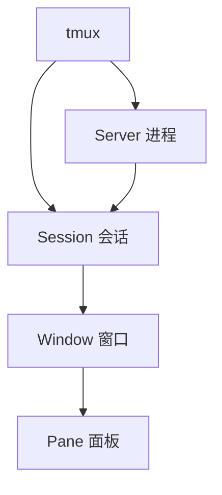

# Shell 命令参考手册

## 目录
- [Shell 命令参考手册](#shell-命令参考手册)
  - [目录](#目录)
  - [文件操作](#文件操作)
    - [文件查找与过滤](#文件查找与过滤)
    - [文件处理](#文件处理)
    - [文件压缩](#文件压缩)
    - [文件权限管理](#文件权限管理)
  - [HDFS操作](#hdfs操作)
    - [文件查看](#文件查看)
    - [文件大小统计](#文件大小统计)
  - [文本处理](#文本处理)
    - [文件读取](#文件读取)
    - [文本过滤](#文本过滤)
    - [高级文本处理](#高级文本处理)
  - [控制结构](#控制结构)
    - [条件判断](#条件判断)
    - [分支语句](#分支语句)
    - [循环语句](#循环语句)
    - [函数定义](#函数定义)
    - [信号与异常处理](#信号与异常处理)
  - [字符串处理](#字符串处理)
    - [字符串基本操作](#字符串基本操作)
    - [字符串截取与替换](#字符串截取与替换)
    - [字符串转换](#字符串转换)
    - [字符串比较与判断](#字符串比较与判断)
    - [正则表达式处理](#正则表达式处理)
  - [进程管理](#进程管理)
    - [进程监控与控制](#进程监控与控制)
    - [后台任务管理](#后台任务管理)
  - [时间处理](#时间处理)
    - [日期格式化](#日期格式化)
    - [时间计算](#时间计算)
  - [网络请求](#网络请求)
    - [基本网络命令](#基本网络命令)
    - [高级网络操作](#高级网络操作)
  - [系统监控](#系统监控)
    - [资源使用监控](#资源使用监控)
    - [日志分析](#日志分析)
  - [性能分析](#性能分析)
    - [性能测试工具](#性能测试工具)
    - [性能优化技巧](#性能优化技巧)
  - [安全操作](#安全操作)
    - [权限管理](#权限管理)
    - [加密与解密](#加密与解密)
  - [数据库操作](#数据库操作)
    - [MySQL操作](#mysql操作)
    - [PostgreSQL操作](#postgresql操作)
  - [自动化脚本示例](#自动化脚本示例)
    - [定时备份](#定时备份)
    - [批量处理](#批量处理)
  - [终端复用（tmux）](#终端复用tmux)
    - [1. 安装与基础](#1-安装与基础)
    - [2. 会话窗口面板](#2-会话窗口面板)
    - [3. 常用快捷键](#3-常用快捷键)
    - [4. 会话共享与远程](#4-会话共享与远程)
    - [5. 复制滚动与搜索](#5-复制滚动与搜索)
    - [6. 配置与TPM](#6-配置与tpm)
    - [7. 常见问题排查](#7-常见问题排查)
    - [8. 速查表](#8-速查表)
  - [实用工具](#实用工具)

## 文件操作

### 文件查找与过滤
```bash
# 查找目录下以8位数字结尾的文件（YYYYMMDD格式）
find /path/to/dir -type f -regextype posix-extended -regex '.*[0-9]{8}$'

# 检查文件是否存在
if [ ! -f "$file" ]; then
    echo "File not found: $file"
    exit 1
fi

# 查找最近7天修改过的文件
find /path/to/dir -type f -mtime -7

# 查找大于100MB的文件
find /path/to/dir -type f -size +100M

# 查找并删除空文件
find /path/to/dir -type f -empty -delete

# 查找特定权限的文件
find /path/to/dir -type f -perm 644
```

### 文件处理
```bash
# 分割大文件
split -b 10M large_file.txt output_

# 合并文件
cat output_* > combined_file.txt

# 按行分割文件
split -l 1000 large_file.txt output_

# 批量重命名文件
rename 's/\.txt$/.md/' *.txt  # 将所有.txt文件重命名为.md

# 批量替换文件内容
find . -type f -name "*.txt" -exec sed -i 's/old_text/new_text/g' {} \;

# 递归创建目录
mkdir -p path/to/nested/directory
```

### 文件压缩
```bash
# 压缩文件
gzip a.txt          # 压缩并删除原文件
gzip -c a.txt       # 压缩并保留原文件

# 解压文件
gunzip your_file.txt.gz

# tar压缩
tar -czvf archive.tar.gz directory/  # 创建gzip压缩的tar归档
tar -cjvf archive.tar.bz2 directory/ # 创建bzip2压缩的tar归档

# tar解压
tar -xzvf archive.tar.gz    # 解压gzip压缩的tar归档
tar -xjvf archive.tar.bz2   # 解压bzip2压缩的tar归档

# zip压缩
zip -r archive.zip directory/

# zip解压
unzip archive.zip
```

### 文件权限管理
```bash
# 修改文件权限
chmod 755 file.sh   # 设置可执行权限
chmod -R 644 dir/   # 递归修改目录下所有文件权限

# 修改文件所有者
chown user:group file.txt
chown -R user:group directory/  # 递归修改

# 设置SUID/SGID/Sticky位
chmod u+s file      # 设置SUID
chmod g+s directory # 设置SGID
chmod +t directory  # 设置Sticky位

# 复制权限
getfacl source_file | setfacl --set-file=- target_file

# 添加ACL权限
setfacl -m u:user:rwx file.txt  # 为特定用户添加权限
setfacl -m g:group:rx file.txt  # 为特定组添加权限
```

## HDFS操作

### 文件查看
```bash
# 列出HDFS目录下以8位数字结尾的文件
hadoop fs -ls /path/to/dir | awk '$NF ~ /[0-9]{8}$/ {print $NF}'

# 使用grep过滤HDFS目录
hadoop fs -ls /data/dept/bi/dim/data | grep -E "[0-9]{8}$"
```

### 文件大小统计
```bash
# 获取目录文件大小并选择最后一行
hadoop fs -du -h $line | tail -n 1 >> file_size_result.txt
```

## 文本处理

### 文件读取
```bash
# 遍历文件每一行
file="example.txt"
while IFS= read -r line; do
    echo "$line"
done < "$file"

# 另一种读取方式
cat "$file" | while read line; do
    echo "$line"
done
```

### 文本过滤
```bash
# 查看grep过滤结果的前100个字符
grep "关键词" file.txt | cut -c 1-100

# 显示匹配行及其后5行
curl -s "http://localhost:8080/hotsearch" | grep -A 5 "wallpaper-menu"
```

### 高级文本处理
```bash
# 使用awk处理格式化字符串
echo "Name: John, Age: 30" | awk -F'[:,]' '{print "User " $2 " is " $4 " years old"}'

# 提取字符串中的数字
str="abc123def456"
echo $str | grep -o '[0-9]\+'  # 输出所有数字序列

# 验证字符串格式
validate_email() {
    local email=$1
    if [[ $email =~ ^[a-zA-Z0-9._%+-]+@[a-zA-Z0-9.-]+\.[a-zA-Z]{2,}$ ]]; then
        echo "有效的邮箱地址"
        return 0
    else
        echo "无效的邮箱地址"
        return 1
    fi
}

validate_email "user@example.com"
```

## 控制结构

### 条件判断

**文件测试**
```bash
# 文件存在性测试
[ -e file.txt ] && echo "文件存在"
[ -f file.txt ] && echo "文件存在且是普通文件"
[ -d dir ] && echo "目录存在"
[ -L symlink ] && echo "符号链接存在"
[ -r file.txt ] && echo "文件可读"
[ -w file.txt ] && echo "文件可写"
[ -x file.txt ] && echo "文件可执行"
[ -s file.txt ] && echo "文件大小不为0"

# 文件比较
[ file1 -nt file2 ] && echo "file1比file2新"
[ file1 -ot file2 ] && echo "file1比file2旧"
```

**数值比较**
```bash
# 使用 [ ] 进行数值比较
[ $a -eq $b ] && echo "a等于b"
[ $a -ne $b ] && echo "a不等于b"
[ $a -gt $b ] && echo "a大于b"
[ $a -lt $b ] && echo "a小于b"
[ $a -ge $b ] && echo "a大于等于b"
[ $a -le $b ] && echo "a小于等于b"

# 使用 (( )) 进行数学表达式比较
(( a == b )) && echo "a等于b"
(( a != b )) && echo "a不等于b"
(( a > b )) && echo "a大于b"
(( a < b )) && echo "a小于b"
(( a >= b )) && echo "a大于等于b"
(( a <= b )) && echo "a小于等于b"
```

**字符串比较**
```bash
# 字符串比较
[ "$str1" = "$str2" ] && echo "字符串相等"
[ "$str1" != "$str2" ] && echo "字符串不相等"
[ -z "$str" ] && echo "字符串为空"
[ -n "$str" ] && echo "字符串非空"

# 使用 [[ ]] 进行模式匹配
[[ "$str" == *pattern* ]] && echo "字符串匹配模式"
[[ "$str" =~ ^[0-9]+$ ]] && echo "字符串全为数字"
```

**逻辑运算**
```bash
# 与运算
[ condition1 ] && [ condition2 ] && echo "两个条件都为真"

# 或运算
[ condition1 ] || [ condition2 ] && echo "至少一个条件为真"

# 非运算
[ ! condition ] && echo "条件为假"

# 组合条件
[ condition1 -a condition2 ] && echo "两个条件都为真"
[ condition1 -o condition2 ] && echo "至少一个条件为真"
```

### 分支语句

**if-else语句**
```bash
# 基本if语句
if [ $count -gt 10 ]; then
    echo "Count is greater than 10"
fi

# if-else语句
if [ $count -gt 10 ]; then
    echo "Count is greater than 10"
else
    echo "Count is less than or equal to 10"
fi

# if-elif-else语句
if [ $count -gt 10 ]; then
    echo "Count is greater than 10"
elif [ $count -eq 10 ]; then
    echo "Count is equal to 10"
else
    echo "Count is less than 10"
fi

# 单行if语句
[ $count -gt 10 ] && echo "Count is greater than 10"
[ $count -gt 10 ] || echo "Count is less than or equal to 10"
```

**case语句**
```bash
# 基本case语句
case "$option" in
    start)
        echo "Starting service..."
        start_service
        ;;
    stop)
        echo "Stopping service..."
        stop_service
        ;;
    restart)
        echo "Restarting service..."
        restart_service
        ;;
    *)
        echo "Usage: $0 {start|stop|restart}"
        exit 1
        ;;
esac

# 使用模式匹配
case "$filename" in
    *.jpg|*.jpeg|*.png)
        echo "图像文件"
        ;;
    *.mp3|*.wav|*.ogg)
        echo "音频文件"
        ;;
    *.mp4|*.avi|*.mkv)
        echo "视频文件"
        ;;
    *)
        echo "其他类型文件"
        ;;
esac

# 使用正则表达式 (Bash 4.0+)
case "$string" in
    [0-9]*)
        echo "以数字开头"
        ;;
    [A-Za-z]*)
        echo "以字母开头"
        ;;
    *)
        echo "以其他字符开头"
        ;;
esac
```

### 循环语句

**for循环**
```bash
# 基本for循环
for i in 1 2 3 4 5; do
    echo "Number: $i"
done

# 使用序列
for i in {1..5}; do
    echo "Number: $i"
done

# 带步长的序列 (Bash 4.0+)
for i in {1..10..2}; do
    echo "Odd number: $i"
done

# C风格for循环
for ((i=1; i<=5; i++)); do
    echo "Count: $i"
done

# 遍历文件列表
for file in *.txt; do
    echo "Processing $file"
done

# 遍历命令输出
for line in $(cat file.txt); do
    echo "Line: $line"
done

# 遍历数组
array=("item1" "item2" "item3")
for item in "${array[@]}"; do
    echo "Array item: $item"
done
```

**while循环**
```bash
# 基本while循环
count=1
while [ $count -le 5 ]; do
    echo "Count: $count"
    ((count++))
done

# 读取文件每一行
while read -r line; do
    echo "Line: $line"
done < file.txt

# 无限循环
while true; do
    echo "Press Ctrl+C to stop"
    sleep 1
done

# 带条件的无限循环
while :; do
    echo "Another infinite loop"
    sleep 1
done

# 处理命令输出
ls -la | while read -r line; do
    echo "File info: $line"
done
```

**until循环**
```bash
# 基本until循环 (直到条件为真才停止)
count=1
until [ $count -gt 5 ]; do
    echo "Count: $count"
    ((count++))
done

# 等待文件出现
until [ -f "expected_file.txt" ]; do
    echo "Waiting for file to appear..."
    sleep 5
done
echo "File found!"
```

**循环控制**
```bash
# break语句 - 跳出循环
for i in {1..10}; do
    if [ $i -eq 5 ]; then
        echo "Breaking at $i"
        break
    fi
    echo "Number: $i"
done

# continue语句 - 跳过当前迭代
for i in {1..10}; do
    if [ $i -eq 5 ]; then
        echo "Skipping $i"
        continue
    fi
    echo "Number: $i"
done

# 多层循环中的break和continue
for i in {1..3}; do
    for j in {1..3}; do
        if [ $i -eq 2 ] && [ $j -eq 2 ]; then
            echo "Breaking inner loop at i=$i, j=$j"
            break
        fi
        echo "i=$i, j=$j"
    done
done

# 带标签的break (Bash 不支持，但可以用其他方式实现)
outer_loop=true
for i in {1..3}; do
    for j in {1..3}; do
        if [ $i -eq 2 ] && [ $j -eq 2 ]; then
            echo "Breaking both loops at i=$i, j=$j"
            outer_loop=false
            break
        fi
        echo "i=$i, j=$j"
    done
    if ! $outer_loop; then
        break
    fi
done
```

### 函数定义

**基本函数**
```bash
# 定义函数
hello() {
    echo "Hello, World!"
}

# 调用函数
hello

# 带参数的函数
greet() {
    echo "Hello, $1!"
}

greet "John"  # 输出: Hello, John!

# 返回值
is_even() {
    if (( $1 % 2 == 0 )); then
        return 0  # 成功 (true)
    else
        return 1  # 失败 (false)
    fi
}

if is_even 4; then
    echo "4 is even"
else
    echo "4 is odd"
fi

# 函数输出作为返回值
get_date() {
    echo $(date +%Y-%m-%d)
}

today=$(get_date)
echo "Today is $today"

# 局部变量
calculate() {
    local result=$(( $1 + $2 ))
    echo "The sum of $1 and $2 is $result"
}

calculate 5 3
```

**高级函数特性**
```bash
# 默认参数
default_param() {
    local name=${1:-"Guest"}
    echo "Hello, $name!"
}

default_param         # 输出: Hello, Guest!
default_param "John"  # 输出: Hello, John!

# 可变参数
process_all() {
    echo "Processing $# parameters"
    for param in "$@"; do
        echo "- $param"
    done
}

process_all apple banana cherry

# 递归函数
factorial() {
    if [ $1 -le 1 ]; then
        echo 1
    else
        local prev=$(factorial $(( $1 - 1 )))
        echo $(( $1 * prev ))
    done
}

result=$(factorial 5)
echo "5! = $result"  # 输出: 5! = 120
```

### 信号与异常处理

**捕获信号**
```bash
# 捕获SIGINT信号 (Ctrl+C)
trap 'echo "Caught Ctrl+C - Exiting gracefully"; exit' INT

# 捕获多个信号
trap 'echo "Cleaning up..."; rm -f temp_*; exit' EXIT INT TERM

# 在脚本退出时执行清理操作
cleanup() {
    echo "Performing cleanup..."
    rm -f /tmp/tempfile_$$
}
trap cleanup EXIT

# 忽略信号
trap '' INT  # 忽略Ctrl+C

# 恢复默认处理
trap - INT   # 恢复Ctrl+C的默认行为
```

**错误处理**
```bash
# 出错时退出
set -e  # 任何命令返回非零状态时脚本将退出

# 管道错误检测
set -o pipefail  # 管道中任何命令失败时整个管道命令返回失败

# 未定义变量检测
set -u  # 使用未定义变量时脚本将退出

# 调试模式
set -x  # 执行前显示每个命令

# 组合使用
set -euo pipefail  # 严格模式

# 自定义错误处理
error_handler() {
    echo "Error occurred at line $1"
    exit 1
}
trap 'error_handler $LINENO' ERR
```

## 字符串处理

### 字符串基本操作
```bash
# 字符串定义
str="Hello World"
echo $str

# 字符串长度
echo ${#str}  # 输出: 11

# 字符串拼接
str1="Hello"
str2="World"
str3="$str1 $str2"  # 使用变量拼接
str4=$str1$str2     # 直接拼接
echo $str3  # 输出: Hello World
echo $str4  # 输出: HelloWorld

# 字符串重复
repeat_str=$(printf '%.s-' {1..10})
echo $repeat_str  # 输出: ----------
```

### 字符串截取与替换
```bash
# 字符串截取
str="Hello World"
echo ${str:0:5}    # 从索引0开始，截取5个字符，输出: Hello
echo ${str:6}      # 从索引6开始到结束，输出: World
echo ${str: -5}    # 从倒数第5个字符开始到结束，输出: World (注意空格)

# 字符串替换
str="Hello World"
echo ${str/World/Shell}  # 替换第一个匹配，输出: Hello Shell
echo ${str//l/L}         # 替换所有匹配，输出: HeLLo WorLd

# 字符串删除
file="example.tar.gz"
echo ${file#*.}     # 删除第一个.及其左边的字符，输出: tar.gz
echo ${file##*.}    # 删除最后一个.及其左边的字符，输出: gz
echo ${file%.*}     # 删除最后一个.及其右边的字符，输出: example.tar
echo ${file%%.*}    # 删除第一个.及其右边的字符，输出: example

# 字符串前缀和后缀处理
path="/usr/local/bin/bash"
echo ${path##*/}    # 获取文件名，输出: bash
echo ${path%/*}     # 获取目录路径，输出: /usr/local/bin
```

### 字符串转换
```bash
# 大小写转换
str="Hello World"
echo ${str^^}       # 全部转为大写，输出: HELLO WORLD
echo ${str,,}       # 全部转为小写，输出: hello world

# 首字母大写 (Bash 4.0+)
str="hello world"
echo ${str^}        # 首字母大写，输出: Hello world
echo ${str^^[hw]}   # 指定字符大写，输出: Hello World

# 使用tr命令转换大小写
echo "Hello World" | tr '[:lower:]' '[:upper:]'  # 输出: HELLO WORLD
echo "Hello World" | tr '[:upper:]' '[:lower:]'  # 输出: hello world

# 使用awk转换
echo "Hello World" | awk '{print toupper($0)}'  # 输出: HELLO WORLD
echo "Hello World" | awk '{print tolower($0)}'  # 输出: hello world
```

### 字符串比较与判断
```bash
# 字符串比较
str1="abc"
str2="def"

# 相等比较
if [ "$str1" = "$str2" ]; then
    echo "字符串相等"
else
    echo "字符串不相等"
fi

# 大小比较
if [[ "$str1" < "$str2" ]]; then
    echo "$str1 在字典序中小于 $str2"
fi

# 判断字符串是否为空
str=""
if [ -z "$str" ]; then
    echo "字符串为空"
fi

# 判断字符串是否非空
str="Hello"
if [ -n "$str" ]; then
    echo "字符串非空"
fi

# 判断字符串是否包含子串
str="Hello World"
substr="World"
if [[ "$str" == *"$substr"* ]]; then
    echo "字符串包含子串"
fi
```

### 正则表达式处理
```bash
# 使用=~操作符进行正则匹配
str="Hello 123 World"
if [[ $str =~ [0-9]+ ]]; then
    echo "字符串包含数字"
    echo "匹配的数字是: ${BASH_REMATCH[0]}"
fi

# 使用grep提取匹配内容
echo "Email: user@example.com" | grep -o '[a-zA-Z0-9._%+-]\+@[a-zA-Z0-9.-]\+\.[a-zA-Z]\{2,\}'

# 使用sed进行复杂替换
echo "Hello 123 World" | sed -E 's/([0-9]+)/(\1)/g'  # 输出: Hello (123) World

# 使用awk处理格式化字符串
echo "Name: John, Age: 30" | awk -F'[:,]' '{print "User " $2 " is " $4 " years old"}'

# 提取字符串中的数字
str="abc123def456"
echo $str | grep -o '[0-9]\+'  # 输出所有数字序列

# 验证字符串格式
validate_email() {
    local email=$1
    if [[ $email =~ ^[a-zA-Z0-9._%+-]+@[a-zA-Z0-9.-]+\.[a-zA-Z]{2,}$ ]]; then
        echo "有效的邮箱地址"
        return 0
    else
        echo "无效的邮箱地址"
        return 1
    fi
}

validate_email "user@example.com"
```

## 进程管理

### 进程监控与控制
```bash
# 查看特定进程
ps aux | grep pyspark

# 查看进程树
pstree -p

# 按CPU使用率排序显示进程
ps aux --sort=-%cpu | head -10

# 按内存使用率排序显示进程
ps aux --sort=-%mem | head -10

# 实时监控进程
top -u username

# 杀死进程
kill -9 PID         # 强制终止
kill -15 PID        # 优雅终止

# 批量杀死进程
pkill -f "process_name"
killall process_name

# 查看进程打开的文件
lsof -p PID

# 查看进程使用的端口
lsof -i :8080

# 查看进程的环境变量
cat /proc/PID/environ | tr '\0' '\n'
```

### 后台任务管理
```bash
# 启动后台任务
command &

# 将当前任务放入后台
Ctrl+Z
bg

# 查看后台任务
jobs

# 将后台任务调至前台
fg %job_number

# 启动不受终端关闭影响的任务
nohup command > output.log 2>&1 &

# 使用screen管理会话
screen -S session_name  # 创建新会话
Ctrl+a d                # 分离会话
screen -r session_name  # 重新连接会话
screen -ls              # 列出所有会话

# 使用tmux管理会话
tmux new -s session_name  # 创建新会话
Ctrl+b d                  # 分离会话
tmux attach -t session_name  # 重新连接会话
tmux ls                   # 列出所有会话
```

## 时间处理

### 日期格式化
```bash
# 获取当前日期时间
date "+%Y-%m-%d %H:%M:%S"  # 2023-06-15 14:30:45

# 格式化日期
date "+%Y%m%d"             # 20230615
date "+%H%M%S"             # 143045

# 获取昨天的日期
date -d "yesterday" "+%Y-%m-%d"

# 获取明天的日期
date -d "tomorrow" "+%Y-%m-%d"

# 获取上个月的今天
date -d "1 month ago" "+%Y-%m-%d"

# 获取特定格式的时间戳
date -d "2023-06-15 14:30:45" "+%s"  # 秒级时间戳
```

### 时间计算
```bash
# 获取当前时间戳（秒）
start_time=$(date +%s)
# 执行一些操作
sleep 5
end_time=$(date +%s)

# 计算时间差
elapsed=$((end_time-start_time))
echo "Operation took $elapsed seconds"

# 计算两个日期之间的天数
start_date="2023-01-01"
end_date="2023-06-15"
days=$(( ($(date -d "$end_date" +%s) - $(date -d "$start_date" +%s)) / 86400 ))
echo "Days between: $days"

# 添加时间
date -d "2023-06-15 + 7 days" "+%Y-%m-%d"
date -d "2023-06-15 + 2 months" "+%Y-%m-%d"
date -d "2023-06-15 + 1 year" "+%Y-%m-%d"

# 减去时间
date -d "2023-06-15 - 7 days" "+%Y-%m-%d"

# 获取指定日期前最近的周六,如果当天是周六就是当天
weekday=$(date -d "${log_date}" +%u)
offset=$(( weekday % 7 + 1 ))   # 计算距离上一个周六的天数
woi_date=$(date -d "${log_date} -${offset} days" +%Y%m%d)
```

## 网络请求

### 基本网络命令
```bash
# 检查主机连通性
ping -c 4 example.com

# 查看域名解析
dig example.com
nslookup example.com

# 查看网络路由
traceroute example.com

# 查看网络接口
ifconfig
ip addr show

# 查看开放端口
netstat -tuln
ss -tuln

# 测试端口连通性
telnet example.com 80
nc -zv example.com 80
```

### 高级网络操作
```bash
# 使用curl发送GET请求
curl -s "https://api.example.com/data"

# 使用curl发送POST请求
curl -s -X POST "https://api.example.com/data" \
     -H "Content-Type: application/json" \
     -d '{"key": "value"}'

# 下载文件
curl -O https://example.com/file.zip
wget https://example.com/file.zip

# 限制下载速度
wget --limit-rate=200k https://example.com/file.zip

# 循环发送curl请求
while IFS= read -r i; do
    response=$(curl -s -f --location \
        --request POST 'http://xxxx/api/v1/endpoint' \
        --header 'Content-Type: application/json' \
        -d '{
        "able":true
        }')
    
    if [ $? -eq 0 ]; then
        # 使用jq解析JSON
        unique_items=$(echo "$response" | jq -r '.data[].item' | sort -u)
        echo "Unique items for id $i:"
        echo "$unique_items"
        # 统计数量
        count=$(echo "$unique_items" | wc -l)
        echo "Total unique items: $count"
    else
        echo "Error fetching data for id $i" >&2
    fi
done < input.txt

# 使用curl测试API性能
time curl -s "https://api.example.com/data" > /dev/null

# 监控网站可用性
while true; do
    status_code=$(curl -s -o /dev/null -w "%{http_code}" https://example.com)
    if [ "$status_code" != "200" ]; then
        echo "$(date): Website down! Status code: $status_code"
        # 可以添加告警逻辑
    fi
    sleep 60
done
```

## 系统监控

### 资源使用监控
```bash
# 查看系统负载
uptime

# 查看内存使用情况
free -h

# 查看磁盘使用情况
df -h
du -sh /path/to/directory

# 查看CPU信息
lscpu

# 实时监控系统资源
top
htop  # 更友好的界面

# 查看系统启动时间
uptime -s

# 查看系统运行时间
uptime -p

# 监控I/O活动
iostat -x 1

# 监控网络流量
iftop
nethogs

# 查看系统日志
tail -f /var/log/syslog
journalctl -f  # systemd系统
```

### 日志分析
```bash
# 提取错误日志
grep -i error /var/log/application.log

# 统计特定事件出现次数
grep -c "Failed login" /var/log/auth.log

# 查看最近的登录尝试
last | head

# 查看失败的登录尝试
lastb | head

# 提取特定时间段的日志
sed -n '/2023-06-15 10:00:00/,/2023-06-15 11:00:00/p' application.log

# 统计HTTP状态码
awk '{print $9}' access.log | sort | uniq -c | sort -rn

# 查找最频繁的访问IP
awk '{print $1}' access.log | sort | uniq -c | sort -rn | head -10

# 分析日志中的慢请求
grep -E 'took [0-9]{3,}ms' application.log
```

## 性能分析

### 性能测试工具
```bash
# 测试磁盘I/O性能
dd if=/dev/zero of=test_file bs=1G count=1 oflag=direct
hdparm -Tt /dev/sda

# 测试网络带宽
iperf -s  # 服务器端
iperf -c server_ip  # 客户端

# 测试CPU性能
sysbench --test=cpu --cpu-max-prime=20000 run

# 测试内存性能
sysbench --test=memory --memory-block-size=1K --memory-total-size=10G run

# 查看进程资源使用情况
ps -o pid,user,%cpu,%mem,cmd -p PID

# 分析系统调用
strace -p PID

# 查看进程打开的文件描述符数量
lsof -p PID | wc -l
```

### 性能优化技巧
```bash
# 查找占用CPU最多的进程
ps -eo pid,ppid,cmd,%cpu --sort=-%cpu | head

# 查找占用内存最多的进程
ps -eo pid,ppid,cmd,%mem --sort=-%mem | head

# 查找大文件
find / -type f -size +100M -exec ls -lh {} \; 2>/dev/null | sort -k5,5hr

# 清理系统缓存
sync; echo 3 > /proc/sys/vm/drop_caches

# 限制进程CPU使用率
cpulimit -p PID -l 50  # 限制在50%

# 限制进程I/O
ionice -c2 -n7 -p PID

# 使用nice调整进程优先级
nice -n 19 command  # 最低优先级
renice -n 10 -p PID # 调整运行中的进程
```

## 安全操作

### 权限管理
```bash
# 创建新用户
useradd -m -s /bin/bash username

# 设置用户密码
passwd username

# 添加用户到sudo组
usermod -aG sudo username

# 查看用户组
groups username

# 临时切换用户
su - username

# 以root权限执行命令
sudo command

# 查看sudo权限
sudo -l

# 修改文件所有者
chown user:group file

# 设置安全的文件权限
chmod 600 ~/.ssh/id_rsa  # 私钥
chmod 644 ~/.ssh/id_rsa.pub  # 公钥
chmod 700 ~/.ssh  # SSH目录
```

### 加密与解密
```bash
# 生成SSH密钥对
ssh-keygen -t rsa -b 4096 -C "your_email@example.com"

# 复制SSH公钥到远程服务器
ssh-copy-id user@remote_host

# 使用OpenSSL加密文件
openssl enc -aes-256-cbc -salt -in file.txt -out file.txt.enc

# 解密文件
openssl enc -d -aes-256-cbc -in file.txt.enc -out file.txt

# 生成随机密码
openssl rand -base64 12

# 计算文件的MD5值
md5sum file

# 计算文件的SHA256值
sha256sum file

# 使用GPG加密文件
gpg -c file.txt  # 对称加密
gpg -e -r "Recipient Name" file.txt  # 非对称加密

# 解密GPG文件
gpg -d file.txt.gpg
```

## 数据库操作

### MySQL操作
```bash
# 连接MySQL
mysql -h hostname -u username -p database_name

# 导出数据库
mysqldump -u username -p database_name > backup.sql

# 导出特定表
mysqldump -u username -p database_name table_name > table_backup.sql

# 导入数据库
mysql -u username -p database_name < backup.sql

# 执行SQL文件
mysql -u username -p database_name -e "source file.sql"

# 执行SQL命令
mysql -u username -p -e "SELECT * FROM table_name LIMIT 10;" database_name

# 备份所有数据库
mysqldump -u username -p --all-databases > all_databases.sql

# 监控MySQL查询
mysqladmin -u username -p processlist
```

### PostgreSQL操作
```bash
# 连接PostgreSQL
psql -h hostname -U username -d database_name

# 导出数据库
pg_dump -U username database_name > backup.sql

# 导出特定表
pg_dump -U username -t table_name database_name > table_backup.sql

# 导入数据库
psql -U username -d database_name -f backup.sql

# 执行SQL命令
psql -U username -d database_name -c "SELECT * FROM table_name LIMIT 10;"

# 备份所有数据库
pg_dumpall -U username > all_databases.sql

# 监控PostgreSQL连接
psql -U username -c "SELECT * FROM pg_stat_activity;"
```

## 自动化脚本示例

### 定时备份
```bash
#!/bin/bash
# 数据库自动备份脚本

# 配置
DB_USER="username"
DB_PASS="password"
DB_NAME="database_name"
BACKUP_DIR="/backup/mysql"
DATE=$(date +%Y%m%d_%H%M%S)
BACKUP_FILE="$BACKUP_DIR/$DB_NAME-$DATE.sql.gz"

# 创建备份目录
mkdir -p $BACKUP_DIR

# 执行备份
echo "Starting backup of $DB_NAME at $(date)"
mysqldump -u$DB_USER -p$DB_PASS $DB_NAME | gzip > $BACKUP_FILE

# 检查备份是否成功
if [ $? -eq 0 ]; then
    echo "Backup completed successfully: $BACKUP_FILE"
else
    echo "Backup failed!"
    exit 1
fi

# 删除7天前的备份
find $BACKUP_DIR -name "$DB_NAME-*.sql.gz" -mtime +7 -delete
echo "Deleted old backups"

# 添加到crontab: 0 2 * * * /path/to/backup_script.sh
```

### 批量处理
```bash
#!/bin/bash
# 批量图片处理脚本

# 配置
SOURCE_DIR="./images"
OUTPUT_DIR="./resized_images"
MAX_WIDTH=800
MAX_HEIGHT=600

# 创建输出目录
mkdir -p $OUTPUT_DIR

# 检查依赖
if ! command -v convert &> /dev/null; then
    echo "Error: ImageMagick is not installed. Please install it first."
    exit 1
fi

# 处理所有图片
echo "Starting batch processing..."
count=0
for img in $SOURCE_DIR/*.{jpg,jpeg,png,gif}; do
    # 跳过不存在的文件（如果没有匹配到任何文件）
    [ -f "$img" ] || continue
    
    # 获取文件名
    filename=$(basename "$img")
    
    # 调整图片大小
    convert "$img" -resize ${MAX_WIDTH}x${MAX_HEIGHT}\> "$OUTPUT_DIR/$filename"
    
    # 计数
    ((count++))
    echo "Processed: $filename"
done

echo "Completed processing $count images"
```

## 实用工具
```bash
# 安装Python kernel
python -m ipykernel install --user --name openai --display-name "openai"

# 监控文件变化
inotifywait -m -e modify,create,delete /path/to/watch

# 生成随机数据
dd if=/dev/urandom bs=1M count=10 of=random_file

# 查找重复文件
fdupes -r /path/to/directory

# 批量重命名
rename 's/pattern/replacement/' files*

# 创建文件链接
ln -s /path/to/original /path/to/link  # 软链接
ln /path/to/original /path/to/link     # 硬链接

# 查看二进制文件
hexdump -C binary_file | head

# 查看文件类型
file filename

# 查看端口占用
lsof -i :8080
netstat -tuln | grep 8080

# 查看系统限制
ulimit -a

# 修改系统限制
ulimit -n 65535  # 增加文件描述符限制
```

## 终端复用（tmux）

### 1. 安装与基础
```bash
# macOS
brew install tmux

# Linux (Debian/Ubuntu)
sudo apt-get update && sudo apt-get install -y tmux

# 启动/退出
tmux                # 启动一个新会话，名称自动
tmux new -s work    # 启动并命名会话 work
exit                # 在面板中退出，面板关闭；所有面板退出后会话结束

# 分离与附着
Ctrl-b d            # 分离（detach）当前会话
tmux ls             # 列出会话
tmux attach -t work # 附着到会话 work
tmux kill-session -t work  # 关闭会话
```



说明
- **会话(Session)**: 一组窗口的集合，可分离/附着，适合远程保持任务。
- **窗口(Window)**: 类似标签页，每个窗口可包含多个面板。
- **面板(Pane)**: 窗口内分割的小终端区域，可独立运行程序。

### 2. 会话窗口面板
```bash
# 会话管理
tmux new -s proj           # 新建会话
tmux rename-session -t 0 dev  # 重命名会话
tmux switch -t proj        # 切换到指定会话
tmux kill-session -t proj  # 关闭会话

# 窗口管理
Ctrl-b c        # 新建窗口
Ctrl-b ,        # 重命名窗口
Ctrl-b n / p    # 下一个/上一个窗口
Ctrl-b w        # 窗口列表
Ctrl-b &        # 关闭窗口

# 面板管理
Ctrl-b %        # 垂直分割（左右）
Ctrl-b "        # 水平分割（上下）
Ctrl-b o        # 面板间切换
Ctrl-b <方向键> # 按方向移动焦点
Ctrl-b ;        # 在当前与上一面板间切换
Ctrl-b x        # 关闭当前面板
Ctrl-b !        # 将当前面板提升为新窗口
```

### 3. 常用快捷键
- 默认前缀：**Ctrl-b**（可改为 Ctrl-a）
- 面板尺寸调整：
  - Ctrl-b Alt-<方向键>：小步调整
  - Ctrl-b Ctrl-<方向键>：大步调整（需配置）
- 面板布局：
  - Ctrl-b Space：在预设布局间切换（平铺、水平、垂直、主-从布局）
  - Ctrl-b Ctrl-o：旋转布局
- 同步输入（对比多机器/多目录同操作）：
  - Ctrl-b : set-window-option synchronize-panes on|off

### 4. 会话共享与远程
```bash
# 多用户共享一个会话（确保两人同一台机器或通过SSH登录同一台主机）
tmux new -s pair
# 用户A、B分别执行：
tmux attach -t pair

# SSH + tmux 保活：网络断开后任务不丢
ssh user@host
tmux new -s longrun
# 运行长任务，断开网络后再 attach 即可继续
```

### 5. 复制滚动与搜索
```bash
# 进入复制模式（vi风格）
Ctrl-b [
# 移动：方向键 / h j k l / PgUp PgDn
# 搜索：/ 关键字 ；? 反向搜索；n/N 跳转下/上一个
# 选中复制：Space 开始，Enter 复制到缓冲区
# 粘贴：Ctrl-b ]
```

### 6. 配置与TPM
```bash
# ~/.tmux.conf 常用配置（示例）
set -g mouse on                 # 开启鼠标支持（选择、拖拽分隔、滚动）
set -g history-limit 100000     # 滚动历史
set -g prefix C-a               # 将前缀改为Ctrl-a
unbind C-b
bind C-a send-prefix

# 窗口与状态栏优化
setw -g allow-rename off
set -g status-bg colour235
set -g status-fg white
set -g status-left "#S "
set -g status-right "#(whoami) | %Y-%m-%d %H:%M"

# 面板大小微调
bind -r H resize-pane -L 5
bind -r J resize-pane -D 5
bind -r K resize-pane -U 5
bind -r L resize-pane -R 5

# 同步输入快捷开关
bind y setw synchronize-panes on
bind Y setw synchronize-panes off

# 插件管理（TPM）
# 安装：git clone https://github.com/tmux-plugins/tpm ~/.tmux/plugins/tpm
set -g @plugin 'tmux-plugins/tpm'
set -g @plugin 'tmux-plugins/tmux-sensible'
set -g @plugin 'tmux-plugins/tmux-resurrect'
set -g @plugin 'tmux-plugins/tmux-continuum'
run '~/.tmux/plugins/tpm/tpm'   # 前缀 + I 安装插件；前缀 + U 更新；前缀 + Alt-u 卸载
```

### 7. 常见问题排查
- 前缀冲突：如果使用终端复合快捷键（如 iTerm2）与 tmux 前缀冲突，建议将 tmux 前缀改为 Ctrl-a。
- 鼠标滚动无效：确认 `set -g mouse on` 且终端未拦截滚动事件；或进入复制模式滚动。
- 复制到系统剪贴板：
  - macOS 可结合 `reattach-to-user-namespace` 或使用 iTerm2 原生剪贴板集成。
  - Linux 可安装 `xclip`/`xsel`，或者启用 `tmux-yank` 插件。
- 字体与中文对齐：选择等宽字体（如 JetBrains Mono/Consolas），并关闭自动缩放。

### 8. 速查表
| 类别 | 操作 | 快捷键/命令 |
| --- | --- | --- |
| 会话 | 新建/附着/分离 | `tmux new -s name` / `tmux attach -t name` / `Ctrl-b d` |
| 会话 | 列表/重命名/删除 | `tmux ls` / `tmux rename-session -t 0 new` / `tmux kill-session -t name` |
| 窗口 | 新建/重命名/切换 | `Ctrl-b c` / `Ctrl-b ,` / `Ctrl-b n|p` |
| 窗口 | 列表/关闭 | `Ctrl-b w` / `Ctrl-b &` |
| 面板 | 分割/切换 | `Ctrl-b %`、`Ctrl-b "` / `Ctrl-b o`、`Ctrl-b <方向>` |
| 面板 | 调整/关闭/提升为窗口 | `Ctrl-b H/J/K/L`（示例）/ `Ctrl-b x` / `Ctrl-b !` |
| 文本 | 复制/粘贴/搜索 | `Ctrl-b [` 进入复制模式 / `Ctrl-b ]` 粘贴 / `/` `?` 搜索 |
| 其他 | 帮助/显示按键绑定 | `tmux list-keys` / `tmux list-commands` |

