# Kubernetes (K8s) 完整技术指南

## 目录
- [Kubernetes (K8s) 完整技术指南](#kubernetes-k8s-完整技术指南)
  - [目录](#目录)
  - [1. Kubernetes 概述与架构](#1-kubernetes-概述与架构)
    - [1.1 什么是 Kubernetes](#11-什么是-kubernetes)
    - [1.2 核心特性](#12-核心特性)
    - [1.3 架构组件](#13-架构组件)
    - [1.4 组件交互流程](#14-组件交互流程)
  - [2. 核心概念深度解析](#2-核心概念深度解析)
    - [2.1 Pod 详解](#21-pod-详解)
      - [2.1.1 Pod 设计理念](#211-pod-设计理念)
      - [2.1.2 Pod 生命周期详解](#212-pod-生命周期详解)
      - [2.1.3 Pod 重启策略](#213-pod-重启策略)
    - [2.2 控制器详解](#22-控制器详解)
      - [2.2.1 控制器工作原理](#221-控制器工作原理)
      - [2.2.2 主要控制器类型](#222-主要控制器类型)
    - [2.3 服务发现与负载均衡](#23-服务发现与负载均衡)
      - [2.3.1 Service 工作原理](#231-service-工作原理)
      - [2.3.2 Service 类型详解](#232-service-类型详解)
      - [2.3.3 Headless Service](#233-headless-service)
    - [2.4 存储系统](#24-存储系统)
      - [2.4.1 存储架构概览](#241-存储架构概览)
      - [2.4.2 Volume 类型详解](#242-volume-类型详解)
      - [2.4.3 StorageClass 动态供应](#243-storageclass-动态供应)
      - [2.4.4 CSI (Container Storage Interface)](#244-csi-container-storage-interface)
    - [2.5 配置管理](#25-配置管理)
      - [2.5.1 ConfigMap 详解](#251-configmap-详解)
      - [2.5.2 Secret 详解](#252-secret-详解)
  - [3. 网络模型与实现](#3-网络模型与实现)
    - [3.1 Kubernetes 网络模型](#31-kubernetes-网络模型)
      - [3.1.1 网络架构层次](#311-网络架构层次)
      - [3.1.2 IP地址分配](#312-ip地址分配)
    - [3.2 CNI 插件](#32-cni-插件)
      - [3.2.1 CNI工作流程](#321-cni工作流程)
      - [3.2.2 主流CNI插件对比](#322-主流cni插件对比)
      - [3.2.3 Calico 网络实现](#323-calico-网络实现)
    - [3.3 Service 网络实现](#33-service-网络实现)
      - [3.3.1 kube-proxy 模式对比](#331-kube-proxy-模式对比)
      - [3.3.2 Service网络转发流程](#332-service网络转发流程)
    - [3.4 Ingress 控制器](#34-ingress-控制器)
      - [3.4.1 Ingress架构](#341-ingress架构)
      - [3.4.2 Ingress配置示例](#342-ingress配置示例)
      - [3.4.3 Ingress Controller对比](#343-ingress-controller对比)
    - [3.5 网络策略](#35-网络策略)
      - [3.5.1 NetworkPolicy工作原理](#351-networkpolicy工作原理)
      - [3.5.2 NetworkPolicy配置示例](#352-networkpolicy配置示例)
  - [4. 安全机制与 RBAC](#4-安全机制与-rbac)
    - [4.1 认证机制](#41-认证机制)
      - [4.1.1 认证流程](#411-认证流程)
      - [4.1.2 认证方式详解](#412-认证方式详解)
    - [4.2 授权机制 RBAC](#42-授权机制-rbac)
      - [4.2.1 RBAC核心概念](#421-rbac核心概念)
      - [4.2.2 Role和ClusterRole](#422-role和clusterrole)
      - [4.2.3 RoleBinding和ClusterRoleBinding](#423-rolebinding和clusterrolebinding)
      - [4.2.4 内置ClusterRole](#424-内置clusterrole)
    - [4.3 准入控制](#43-准入控制)
      - [4.3.1 准入控制器类型](#431-准入控制器类型)
      - [4.3.2 常用准入控制器](#432-常用准入控制器)
      - [4.3.3 Admission Webhook](#433-admission-webhook)
    - [4.4 Pod 安全策略](#44-pod-安全策略)
      - [4.4.1 Pod Security Standards](#441-pod-security-standards)
      - [4.4.2 SecurityContext配置](#442-securitycontext配置)
    - [4.5 安全最佳实践](#45-安全最佳实践)
      - [4.5.1 集群安全加固](#451-集群安全加固)
      - [4.5.2 运行时安全](#452-运行时安全)
      - [4.5.3 密钥管理](#453-密钥管理)
  - [5. 调度机制与算法](#5-调度机制与算法)
    - [5.1 调度器架构](#51-调度器架构)
    - [5.2 调度算法](#52-调度算法)
      - [5.2.1 资源调度策略](#521-资源调度策略)
      - [5.2.2 亲和性与反亲和性](#522-亲和性与反亲和性)
    - [5.3 污点与容忍](#53-污点与容忍)
  - [6. 高级特性与扩展](#6-高级特性与扩展)
    - [6.1 水平自动扩缩容 HPA](#61-水平自动扩缩容-hpa)
    - [6.2 垂直自动扩缩容 VPA](#62-垂直自动扩缩容-vpa)
    - [6.3 自定义资源 CRD](#63-自定义资源-crd)
    - [6.4 Operator 模式](#64-operator-模式)
    - [6.5 Job和CronJob](#65-job和cronjob)
  - [7. 监控、日志与可观测性](#7-监控日志与可观测性)
    - [7.1 Prometheus 监控体系](#71-prometheus-监控体系)
      - [7.1.1 Prometheus架构](#711-prometheus架构)
      - [7.1.2 核心组件配置](#712-核心组件配置)
      - [7.1.3 关键指标监控](#713-关键指标监控)
    - [7.2 日志收集与分析](#72-日志收集与分析)
      - [7.2.1 EFK日志架构](#721-efk日志架构)
      - [7.2.2 Fluentd配置](#722-fluentd配置)
    - [7.3 链路追踪](#73-链路追踪)
      - [7.3.1 Jaeger分布式追踪](#731-jaeger分布式追踪)
      - [7.3.2 应用集成追踪](#732-应用集成追踪)
    - [7.4 告警机制](#74-告警机制)
      - [7.4.1 Alertmanager配置](#741-alertmanager配置)
      - [7.4.2 告警规则最佳实践](#742-告警规则最佳实践)
  - [8. 部署与运维](#8-部署与运维)
    - [8.1 集群部署方式](#81-集群部署方式)
      - [8.1.1 部署方式对比](#811-部署方式对比)
      - [8.1.2 kubeadm生产级部署](#812-kubeadm生产级部署)
    - [8.2 升级策略](#82-升级策略)
      - [8.2.1 集群升级流程](#821-集群升级流程)
    - [8.3 备份与恢复](#83-备份与恢复)
      - [8.3.1 etcd备份策略](#831-etcd备份策略)
      - [8.3.2 应用数据备份](#832-应用数据备份)
    - [8.4 容量规划](#84-容量规划)
      - [8.4.1 资源容量评估](#841-资源容量评估)
    - [8.5 性能调优](#85-性能调优)
      - [8.5.1 系统级优化](#851-系统级优化)
      - [8.5.2 应用级优化](#852-应用级优化)
  - [9. 故障排查与诊断](#9-故障排查与诊断)
    - [9.1 常见问题诊断](#91-常见问题诊断)
      - [9.1.1 Pod启动失败诊断](#911-pod启动失败诊断)
      - [9.1.2 网络连接问题](#912-网络连接问题)
    - [9.2 调试技巧](#92-调试技巧)
      - [9.2.1 kubectl调试命令](#921-kubectl调试命令)
      - [9.2.2 日志分析技巧](#922-日志分析技巧)
    - [9.3 性能问题排查](#93-性能问题排查)
      - [9.3.1 CPU性能分析](#931-cpu性能分析)
      - [9.3.2 内存性能分析](#932-内存性能分析)
    - [9.4 网络问题排查](#94-网络问题排查)
      - [9.4.1 DNS解析问题](#941-dns解析问题)
      - [9.4.2 Service网络问题](#942-service网络问题)
      - [9.4.3 网络策略问题](#943-网络策略问题)
      - [9.4.4 故障排查工具箱](#944-故障排查工具箱)
  - [11. YAML 配置最佳实践](#11-yaml-配置最佳实践)
    - [11.1 资源定义规范](#111-资源定义规范)
      - [11.1.1 YAML编写规范](#1111-yaml编写规范)
      - [11.1.2 标签和注解规范](#1112-标签和注解规范)
    - [11.2 生产环境配置](#112-生产环境配置)
      - [11.2.1 资源管理配置](#1121-资源管理配置)
      - [11.2.2 高可用配置模板](#1122-高可用配置模板)
    - [11.3 安全配置](#113-安全配置)
      - [11.3.1 安全上下文配置](#1131-安全上下文配置)
      - [11.3.2 网络安全配置](#1132-网络安全配置)
  - [12. 生产环境最佳实践](#12-生产环境最佳实践)
    - [12.1 集群规划](#121-集群规划)
      - [12.1.1 环境分离策略](#1211-环境分离策略)
      - [12.1.2 节点标签和污点策略](#1212-节点标签和污点策略)
    - [12.2 应用部署模式](#122-应用部署模式)
      - [12.2.1 蓝绿部署](#1221-蓝绿部署)
      - [12.2.2 金丝雀部署](#1222-金丝雀部署)
    - [12.3 CI/CD 集成](#123-cicd-集成)
      - [12.3.1 GitOps工作流](#1231-gitops工作流)
      - [12.3.2 Helm Chart最佳实践](#1232-helm-chart最佳实践)
    - [12.4 多集群管理](#124-多集群管理)
      - [12.4.1 集群联邦配置](#1241-集群联邦配置)
      - [12.4.2 灾难恢复策略](#1242-灾难恢复策略)
  - [13. Kubernetes 面试题详解](#13-kubernetes-面试题详解)
    - [13.1 基础概念类](#131-基础概念类)
      - [Q1: 什么是Kubernetes？它解决了什么问题？](#q1-什么是kubernetes它解决了什么问题)
      - [Q2: 解释Pod的概念，为什么Kubernetes使用Pod而不是直接管理容器？](#q2-解释pod的概念为什么kubernetes使用pod而不是直接管理容器)
      - [Q3: Kubernetes中Service的作用是什么？有哪些类型？](#q3-kubernetes中service的作用是什么有哪些类型)
    - [13.2 架构原理类](#132-架构原理类)
      - [Q4: 描述Kubernetes的Master组件及其作用？](#q4-描述kubernetes的master组件及其作用)
      - [Q5: 解释Kubernetes的调度过程？](#q5-解释kubernetes的调度过程)
      - [Q6: RBAC在Kubernetes中是如何工作的？](#q6-rbac在kubernetes中是如何工作的)
    - [13.3 网络存储类](#133-网络存储类)
      - [Q7: 解释Kubernetes网络模型的核心要求？](#q7-解释kubernetes网络模型的核心要求)
      - [Q8: PV、PVC、StorageClass的区别和关系？](#q8-pvpvcstorageclass的区别和关系)
    - [13.4 实战应用类](#134-实战应用类)
      - [Q9: 如何实现Kubernetes应用的零停机部署？](#q9-如何实现kubernetes应用的零停机部署)
      - [Q10: 如何排查Pod启动失败的问题？](#q10-如何排查pod启动失败的问题)
    - [13.5 故障排查类](#135-故障排查类)
      - [Q11: 集群中某个Service无法访问，如何排查？](#q11-集群中某个service无法访问如何排查)
      - [Q12: 节点资源不足时如何处理？](#q12-节点资源不足时如何处理)
  - [10. kubectl 命令详解](#10-kubectl-命令详解)
    - [3.1 基础命令](#31-基础命令)
    - [3.2 资源管理](#32-资源管理)
    - [3.3 查看与监控](#33-查看与监控)
    - [3.4 集群管理](#34-集群管理)
    - [3.5 上下文与配置](#35-上下文与配置)
    - [3.6 常用命令组合](#36-常用命令组合)

## 1. Kubernetes 概述与架构

### 1.1 什么是 Kubernetes

**Kubernetes**（简称K8s）是Google开源的容器编排平台，用于自动化容器化应用程序的部署、扩展和管理。它基于Google 15年的容器化生产经验，结合了社区的最佳想法和实践。

**核心价值**：
- **自动化运维**：自动部署、扩缩容、负载均衡、故障恢复
- **声明式管理**：通过YAML描述期望状态，系统自动达成
- **可移植性**：跨云、跨环境的统一容器管理平台
- **高可用性**：内置故障检测、自愈能力和滚动更新机制

### 1.2 核心特性

| 特性 | 描述 | 业务价值 |
|------|------|----------|
| **服务发现与负载均衡** | 自动分配IP、DNS，智能流量分发 | 提高应用可用性和性能 |
| **存储编排** | 自动挂载存储系统（本地、云存储等） | 简化有状态应用管理 |
| **自动化部署和回滚** | 滚动更新、蓝绿部署、金丝雀发布 | 降低发布风险，提高部署效率 |
| **自动装箱** | 根据资源需求自动调度Pod到合适节点 | 提高资源利用率 |
| **自我修复** | 重启失败容器、替换节点、杀死不响应容器 | 提高系统稳定性 |
| **配置和密钥管理** | 部署和更新配置和密钥，无需重新构建镜像 | 提高安全性和灵活性 |

### 1.3 架构组件

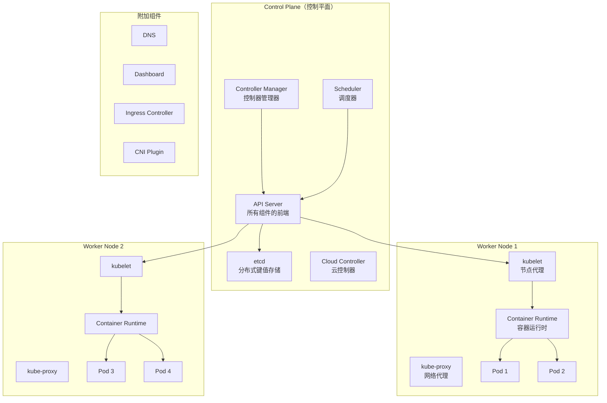
```mermaid
graph TB
    subgraph "Control Plane（控制平面）"
        A1["API Server<br/>所有组件的前端"]
        A2["etcd<br/>分布式键值存储"]
        A3["Controller Manager<br/>控制器管理器"]
        A4["Scheduler<br/>调度器"]
        A5["Cloud Controller<br/>云控制器"]
    end
    
    subgraph "Worker Node 1"
        B1["kubelet<br/>节点代理"]
        B2["kube-proxy<br/>网络代理"]
        B3["Container Runtime<br/>容器运行时"]
        B4["Pod 1"]
        B5["Pod 2"]
    end
    
    subgraph "Worker Node 2"
        C1["kubelet"]
        C2["kube-proxy"]
        C3["Container Runtime"]
        C4["Pod 3"]
        C5["Pod 4"]
    end
    
    subgraph "附加组件"
        D1["DNS"]
        D2["Dashboard"]
        D3["Ingress Controller"]
        D4["CNI Plugin"]
    end
    
    A1 --> A2
    A1 --> B1
    A1 --> C1
    A3 --> A1
    A4 --> A1
    B1 --> B3
    C1 --> C3
    B3 --> B4
    B3 --> B5
    C3 --> C4
    C3 --> C5
```

**Control Plane 组件**：

| 组件 | 核心功能 | 关键作用 |
|------|----------|----------|
| **API Server** | 提供RESTful API，所有组件的通信中枢 | 认证、授权、准入控制、API版本管理 |
| **etcd** | 分布式键值存储，存储集群所有数据 | 数据一致性、集群状态持久化 |
| **Controller Manager** | 运行各种控制器，监控集群状态 | 副本控制、节点控制、服务账户控制 |
| **Scheduler** | 为新Pod选择合适的节点 | 资源调度、亲和性匹配、约束满足 |
| **Cloud Controller** | 与云提供商API交互 | 负载均衡器、存储卷、节点管理 |

**Node 组件**：

| 组件 | 核心功能 | 关键作用 |
|------|----------|----------|
| **kubelet** | 节点上的Kubernetes代理 | Pod生命周期管理、健康检查、资源监控 |
| **kube-proxy** | 网络代理，维护网络规则 | 服务发现、负载均衡、流量转发 |
| **Container Runtime** | 运行容器的软件 | 容器生命周期管理（Docker、containerd、CRI-O） |

### 1.4 组件交互流程

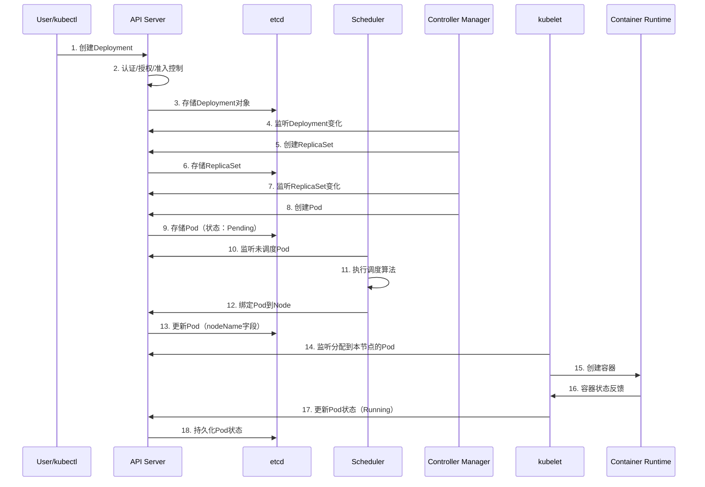
```mermaid
sequenceDiagram
    participant U as User/kubectl
    participant API as API Server
    participant E as etcd
    participant S as Scheduler
    participant CM as Controller Manager
    participant K as kubelet
    participant CR as Container Runtime
    
    U->>API: 1. 创建Deployment
    API->>API: 2. 认证/授权/准入控制
    API->>E: 3. 存储Deployment对象
    
    CM->>API: 4. 监听Deployment变化
    CM->>API: 5. 创建ReplicaSet
    API->>E: 6. 存储ReplicaSet
    
    CM->>API: 7. 监听ReplicaSet变化
    CM->>API: 8. 创建Pod
    API->>E: 9. 存储Pod（状态：Pending）
    
    S->>API: 10. 监听未调度Pod
    S->>S: 11. 执行调度算法
    S->>API: 12. 绑定Pod到Node
    API->>E: 13. 更新Pod（nodeName字段）
    
    K->>API: 14. 监听分配到本节点的Pod
    K->>CR: 15. 创建容器
    CR->>K: 16. 容器状态反馈
    K->>API: 17. 更新Pod状态（Running）
    API->>E: 18. 持久化Pod状态
```

**关键交互说明**：

1. **声明式API**：用户通过kubectl声明期望状态
2. **控制循环**：Controller Manager持续监控实际状态与期望状态的差异
3. **调度决策**：Scheduler基于资源需求、约束条件选择最优节点
4. **状态同步**：kubelet负责将Pod规范转换为实际运行的容器
5. **数据一致性**：所有状态变化最终一致性地存储在etcd中

## 2. 核心概念深度解析

### 2.1 Pod 详解

**Pod** 是Kubernetes中最小的可部署和可管理的计算单元，代表一个或多个紧密耦合的容器的集合。

#### 2.1.1 Pod 设计理念

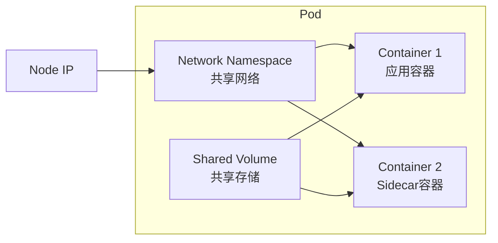
```mermaid
graph LR
    subgraph "Pod"
        A[Container 1<br/>应用容器]
        B[Container 2<br/>Sidecar容器]
        C[Shared Volume<br/>共享存储]
        D[Network Namespace<br/>共享网络]
    end
    
    E[Node IP] --> D
    D --> A
    D --> B
    C --> A
    C --> B
```

**设计原则**：
- **协同定位**：容器需要紧密协作（如应用+日志收集器）
- **资源共享**：共享网络、存储、进程间通信
- **生命周期一致**：容器同时创建、调度、删除
- **原子性部署**：作为单一单元进行扩缩容

#### 2.1.2 Pod 生命周期详解

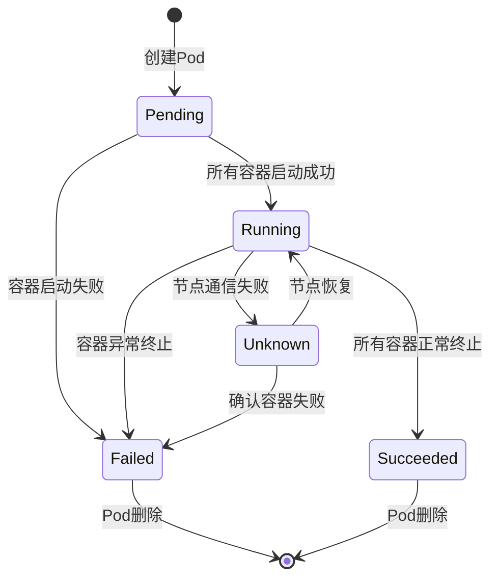
```mermaid
stateDiagram-v2
    [*] --> Pending: 创建Pod
    Pending --> Running: 所有容器启动成功
    Pending --> Failed: 容器启动失败
    Running --> Succeeded: 所有容器正常终止
    Running --> Failed: 容器异常终止
    Running --> Unknown: 节点通信失败
    Failed --> [*]: Pod删除
    Succeeded --> [*]: Pod删除
    Unknown --> Running: 节点恢复
    Unknown --> Failed: 确认容器失败
```

**生命周期阶段详解**：

| 阶段 | 描述 | 常见原因 | 排查方法 |
|------|------|----------|----------|
| **Pending** | Pod已创建但未运行 | 调度失败、镜像拉取失败 | `kubectl describe pod` |
| **Running** | 至少一个容器正在运行 | 正常状态 | `kubectl logs pod` |
| **Succeeded** | 所有容器成功终止 | Job/CronJob完成 | 检查容器退出码 |
| **Failed** | 至少一个容器失败终止 | 应用错误、资源不足 | 检查事件和日志 |
| **Unknown** | 无法获取Pod状态 | 节点网络问题 | 检查节点状态 |

#### 2.1.3 Pod 重启策略

```yaml
# 重启策略配置示例
apiVersion: v1
kind: Pod
metadata:
  name: restart-policy-demo
spec:
  restartPolicy: Always  # Always(默认) | OnFailure | Never
  containers:
  - name: app
    image: nginx
    # 存活性探针
    livenessProbe:
      httpGet:
        path: /healthz
        port: 8080
      initialDelaySeconds: 15
      periodSeconds: 20
      timeoutSeconds: 5
      failureThreshold: 3
    # 就绪性探针  
    readinessProbe:
      httpGet:
        path: /ready
        port: 8080
      initialDelaySeconds: 5
      periodSeconds: 10
```

**探针类型对比**：

| 探针类型 | 作用 | 失败后果 | 使用场景 |
|----------|------|----------|----------|
| **Liveness Probe** | 检测容器是否运行 | 重启容器 | 检测死锁、内存泄漏 |
| **Readiness Probe** | 检测容器是否就绪 | 从Service移除 | 检测依赖服务可用性 |
| **Startup Probe** | 检测容器是否启动 | 重启容器 | 慢启动应用保护 |

### 2.2 控制器详解

控制器实现了Kubernetes的**声明式API**核心理念，通过控制循环确保实际状态与期望状态一致。

#### 2.2.1 控制器工作原理

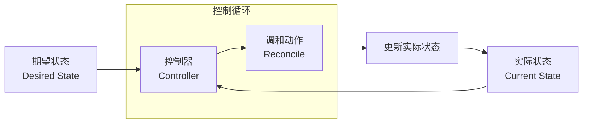
```mermaid
graph LR
    A[期望状态<br/>Desired State] --> B[控制器<br/>Controller]
    C[实际状态<br/>Current State] --> B
    B --> D[调和动作<br/>Reconcile]
    D --> E[更新实际状态]
    E --> C
    
    subgraph "控制循环"
        B
        D
    end
```

#### 2.2.2 主要控制器类型

**Deployment - 无状态应用管理**

```yaml
apiVersion: apps/v1
kind: Deployment
metadata:
  name: nginx-deployment
spec:
  replicas: 3
  strategy:
    type: RollingUpdate
    rollingUpdate:
      maxUnavailable: 1
      maxSurge: 1
  selector:
    matchLabels:
      app: nginx
  template:
    metadata:
      labels:
        app: nginx
    spec:
      containers:
      - name: nginx
        image: nginx:1.20
        resources:
          requests:
            cpu: 100m
            memory: 128Mi
          limits:
            cpu: 500m
            memory: 512Mi
```

**更新策略详解**：

| 策略 | 描述 | 优点 | 缺点 | 使用场景 |
|------|------|------|------|----------|
| **RollingUpdate** | 逐步替换实例 | 无服务中断 | 更新时间较长 | 生产环境常用 |
| **Recreate** | 先删除再创建 | 更新快速 | 有服务中断 | 开发测试环境 |

**StatefulSet - 有状态应用管理**

```yaml
apiVersion: apps/v1
kind: StatefulSet
metadata:
  name: mysql-sts
spec:
  serviceName: "mysql"
  replicas: 3
  selector:
    matchLabels:
      app: mysql
  template:
    metadata:
      labels:
        app: mysql
    spec:
      containers:
      - name: mysql
        image: mysql:8.0
        ports:
        - containerPort: 3306
        volumeMounts:
        - name: mysql-storage
          mountPath: /var/lib/mysql
  volumeClaimTemplates:
  - metadata:
      name: mysql-storage
    spec:
      accessModes: ["ReadWriteOnce"]
      resources:
        requests:
          storage: 10Gi
```

**StatefulSet 特性**：
- **稳定的网络标识**：Pod名称固定（mysql-sts-0, mysql-sts-1...）
- **稳定的持久存储**：每个Pod独立的PVC
- **有序部署和扩展**：按序号顺序操作
- **有序删除和终止**：反序删除保证数据安全

**DaemonSet - 节点守护进程**

```yaml
apiVersion: apps/v1
kind: DaemonSet
metadata:
  name: fluentd-logging
spec:
  selector:
    matchLabels:
      name: fluentd-logging
  template:
    metadata:
      labels:
        name: fluentd-logging
    spec:
      containers:
      - name: fluentd
        image: fluentd:v1.4
        volumeMounts:
        - name: varlog
          mountPath: /var/log
        - name: varlibdockercontainers
          mountPath: /var/lib/docker/containers
          readOnly: true
      volumes:
      - name: varlog
        hostPath:
          path: /var/log
      - name: varlibdockercontainers
        hostPath:
          path: /var/lib/docker/containers
```

**DaemonSet 使用场景**：
- **日志收集**：fluentd、logstash
- **监控代理**：Prometheus Node Exporter
- **网络插件**：CNI插件、kube-proxy
- **存储插件**：CSI驱动程序

### 2.3 服务发现与负载均衡

#### 2.3.1 Service 工作原理

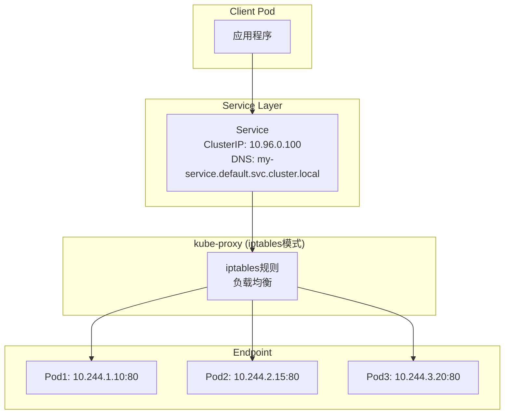
```mermaid
graph TB
    subgraph "Client Pod"
        A[应用程序]
    end
    
    subgraph "Service Layer"
        B[Service<br/>ClusterIP: 10.96.0.100<br/>DNS: my-service.default.svc.cluster.local]
    end
    
    subgraph "Endpoint"
        C[Pod1: 10.244.1.10:80]
        D[Pod2: 10.244.2.15:80]
        E[Pod3: 10.244.3.20:80]
    end
    
    subgraph "kube-proxy (iptables模式)"
        F[iptables规则<br/>负载均衡]
    end
    
    A --> B
    B --> F
    F --> C
    F --> D
    F --> E
```

#### 2.3.2 Service 类型详解

**ClusterIP Service**
```yaml
apiVersion: v1
kind: Service
metadata:
  name: backend-service
spec:
  type: ClusterIP
  selector:
    app: backend
  ports:
  - port: 80
    targetPort: 8080
    protocol: TCP
```

**NodePort Service**
```yaml
apiVersion: v1
kind: Service
metadata:
  name: frontend-service
spec:
  type: NodePort
  selector:
    app: frontend
  ports:
  - port: 80
    targetPort: 8080
    nodePort: 30080  # 30000-32767范围
```

**LoadBalancer Service**
```yaml
apiVersion: v1
kind: Service
metadata:
  name: web-service
spec:
  type: LoadBalancer
  selector:
    app: web
  ports:
  - port: 80
    targetPort: 8080
  loadBalancerSourceRanges:
  - 192.168.1.0/24  # 限制访问来源
```

#### 2.3.3 Headless Service

```yaml
apiVersion: v1
kind: Service
metadata:
  name: mysql-headless
spec:
  clusterIP: None  # Headless Service
  selector:
    app: mysql
  ports:
  - port: 3306
```

**Headless Service 特点**：
- 不分配ClusterIP
- DNS直接返回Pod IP列表
- 用于StatefulSet服务发现
- 支持自定义负载均衡逻辑

### 2.4 存储系统

#### 2.4.1 存储架构概览

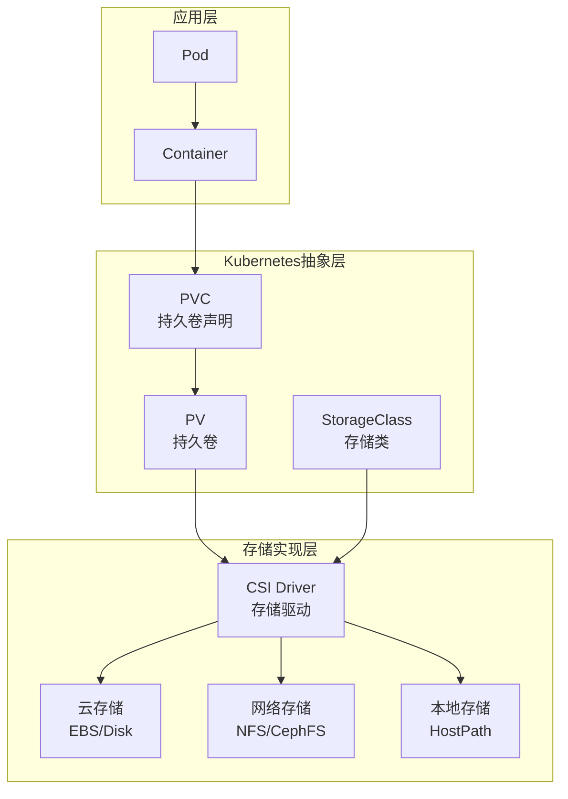
```mermaid
graph TB
    subgraph "应用层"
        A[Pod]
        B[Container]
    end
    
    subgraph "Kubernetes抽象层"
        C[PVC<br/>持久卷声明]
        D[PV<br/>持久卷]
        E[StorageClass<br/>存储类]
    end
    
    subgraph "存储实现层"
        F[CSI Driver<br/>存储驱动]
        G[云存储<br/>EBS/Disk]
        H[网络存储<br/>NFS/CephFS]
        I[本地存储<br/>HostPath]
    end
    
    A --> B
    B --> C
    C --> D
    D --> F
    E --> F
    F --> G
    F --> H
    F --> I
```

#### 2.4.2 Volume 类型详解

**临时存储类型**：

| Volume类型 | 生命周期 | 使用场景 | 示例 |
|------------|----------|----------|------|
| **emptyDir** | Pod生命周期 | 临时数据、缓存 | 日志临时存储 |
| **hostPath** | 节点生命周期 | 访问节点文件系统 | 系统监控 |
| **configMap** | 配置变更时 | 配置文件挂载 | 应用配置 |
| **secret** | 密钥变更时 | 敏感信息挂载 | TLS证书 |

**持久存储类型**：

```yaml
# PV定义示例
apiVersion: v1
kind: PersistentVolume
metadata:
  name: mysql-pv
spec:
  capacity:
    storage: 20Gi
  accessModes:
    - ReadWriteOnce
  persistentVolumeReclaimPolicy: Retain
  storageClassName: fast-ssd
  csi:
    driver: ebs.csi.aws.com
    volumeHandle: vol-0123456789abcdef0
```

```yaml
# PVC定义示例
apiVersion: v1
kind: PersistentVolumeClaim
metadata:
  name: mysql-pvc
spec:
  accessModes:
    - ReadWriteOnce
  resources:
    requests:
      storage: 20Gi
  storageClassName: fast-ssd
```

#### 2.4.3 StorageClass 动态供应

```yaml
apiVersion: storage.k8s.io/v1
kind: StorageClass
metadata:
  name: fast-ssd
provisioner: ebs.csi.aws.com
parameters:
  type: gp3
  iops: "3000"
  throughput: "125"
  encrypted: "true"
allowVolumeExpansion: true
volumeBindingMode: WaitForFirstConsumer
reclaimPolicy: Delete
```

**存储类参数说明**：

| 参数 | 作用 | 可选值 |
|------|------|---------|
| **provisioner** | 存储驱动 | CSI驱动名称 |
| **volumeBindingMode** | 绑定模式 | Immediate/WaitForFirstConsumer |
| **reclaimPolicy** | 回收策略 | Delete/Retain |
| **allowVolumeExpansion** | 支持扩容 | true/false |

#### 2.4.4 CSI (Container Storage Interface)

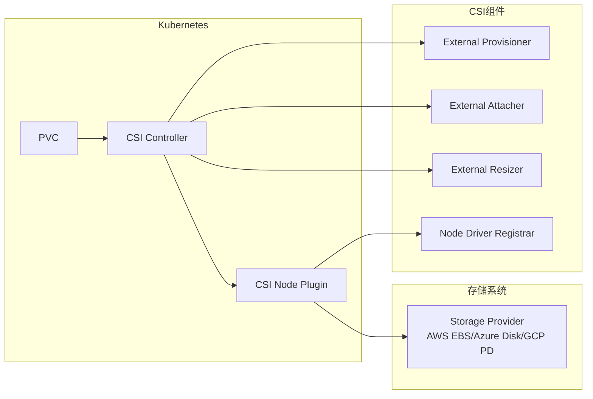
```mermaid
graph LR
    subgraph "Kubernetes"
        A[PVC] --> B[CSI Controller]
        B --> C[CSI Node Plugin]
    end
    
    subgraph "存储系统"
        D[Storage Provider<br/>AWS EBS/Azure Disk/GCP PD]
    end
    
    C --> D
    
    subgraph "CSI组件"
        E[External Provisioner]
        F[External Attacher]
        G[External Resizer]
        H[Node Driver Registrar]
    end
    
    B --> E
    B --> F
    B --> G
    C --> H
```

### 2.5 配置管理

#### 2.5.1 ConfigMap 详解

**ConfigMap 创建方式**：

```bash
# 从文件创建
kubectl create configmap app-config --from-file=config/

# 从目录创建
kubectl create configmap app-config --from-file=config-dir/

# 从字面值创建
kubectl create configmap app-config \
  --from-literal=database_url=mysql://localhost:3306/mydb \
  --from-literal=debug=true
```

**ConfigMap 使用方式**：

```yaml
apiVersion: v1
kind: Pod
metadata:
  name: configmap-demo
spec:
  containers:
  - name: demo
    image: nginx
    # 方式1：环境变量
    env:
    - name: DATABASE_URL
      valueFrom:
        configMapKeyRef:
          name: app-config
          key: database_url
    # 方式2：批量环境变量
    envFrom:
    - configMapRef:
        name: app-config
    # 方式3：文件挂载
    volumeMounts:
    - name: config-volume
      mountPath: /etc/config
  volumes:
  - name: config-volume
    configMap:
      name: app-config
      items:
      - key: app.properties
        path: application.properties
```

#### 2.5.2 Secret 详解

**Secret 类型**：

| 类型 | 用途 | 示例 |
|------|------|------|
| **Opaque** | 通用密钥 | 密码、API密钥 |
| **kubernetes.io/dockerconfigjson** | Docker认证 | 私有镜像仓库 |
| **kubernetes.io/tls** | TLS证书 | HTTPS证书 |
| **kubernetes.io/service-account-token** | 服务账户令牌 | API访问 |

**Secret 创建示例**：

```yaml
# TLS Secret
apiVersion: v1
kind: Secret
metadata:
  name: tls-secret
type: kubernetes.io/tls
data:
  tls.crt: LS0tLS1CRUdJTi... # base64编码的证书
  tls.key: LS0tLS1CRUdJTi... # base64编码的私钥
```

```yaml
# Docker Registry Secret  
apiVersion: v1
kind: Secret
metadata:
  name: docker-registry-secret
type: kubernetes.io/dockerconfigjson
data:
  .dockerconfigjson: eyJhdXRocyI6eyJyZWdpc3RyeS... # base64编码
```

**Secret 安全最佳实践**：
- 使用外部密钥管理系统（Vault、AWS Secrets Manager）
- 启用etcd加密
- 限制Secret访问权限
- 定期轮换密钥
- 避免在镜像中硬编码密钥

## 3. 网络模型与实现

### 3.1 Kubernetes 网络模型

Kubernetes网络模型基于**"扁平网络"**设计，有四个基本要求：
1. **Pod间通信**：任意两个Pod可以直接通信，无需NAT
2. **Node间通信**：节点可以与所有Pod通信，无需NAT
3. **Pod自知性**：Pod内部看到的IP与外部看到的相同
4. **Service抽象**：通过Service提供稳定的服务入口

#### 3.1.1 网络架构层次

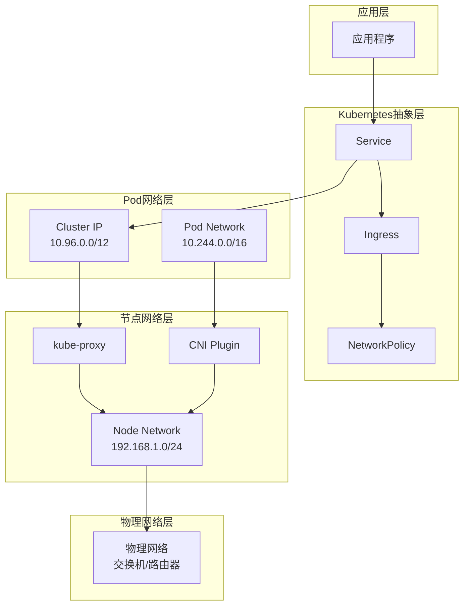
```mermaid
graph TB
    subgraph "应用层"
        A[应用程序]
    end
    
    subgraph "Kubernetes抽象层"
        B[Service]
        C[Ingress]
        D[NetworkPolicy]
    end
    
    subgraph "Pod网络层"
        E[Pod Network<br/>10.244.0.0/16]
        F[Cluster IP<br/>10.96.0.0/12]
    end
    
    subgraph "节点网络层"  
        G[Node Network<br/>192.168.1.0/24]
        H[kube-proxy]
        I[CNI Plugin]
    end
    
    subgraph "物理网络层"
        J[物理网络<br/>交换机/路由器]
    end
    
    A --> B
    B --> C
    C --> D
    B --> F
    E --> I
    F --> H
    H --> G
    I --> G
    G --> J
```

#### 3.1.2 IP地址分配

| IP类型 | 范围示例 | 分配方式 | 用途 |
|--------|----------|----------|------|
| **Node IP** | 192.168.1.0/24 | 物理网络/云平台 | 节点间通信 |
| **Pod IP** | 10.244.0.0/16 | CNI插件 | Pod间通信 |
| **Service IP** | 10.96.0.0/12 | kube-apiserver | 服务发现 |
| **External IP** | 公网IP | LoadBalancer | 外部访问 |

### 3.2 CNI 插件

**CNI (Container Network Interface)** 是Kubernetes网络的核心抽象，定义了容器网络接口标准。

#### 3.2.1 CNI工作流程

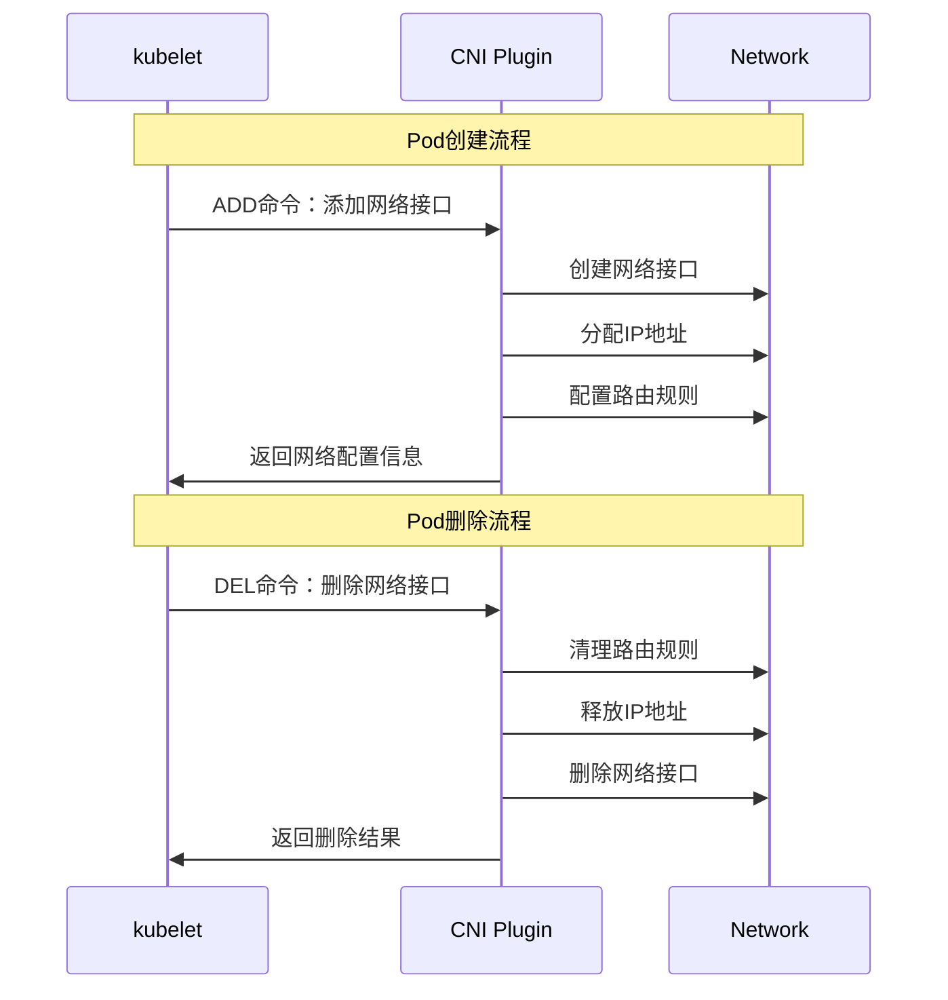
```mermaid
sequenceDiagram
    participant K as kubelet
    participant C as CNI Plugin
    participant N as Network
    
    Note over K,N: Pod创建流程
    K->>C: ADD命令：添加网络接口
    C->>N: 创建网络接口
    C->>N: 分配IP地址
    C->>N: 配置路由规则
    C->>K: 返回网络配置信息
    
    Note over K,N: Pod删除流程  
    K->>C: DEL命令：删除网络接口
    C->>N: 清理路由规则
    C->>N: 释放IP地址
    C->>N: 删除网络接口
    C->>K: 返回删除结果
```

#### 3.2.2 主流CNI插件对比

| CNI插件 | 网络模式 | 性能 | 特性 | 适用场景 |
|---------|----------|------|------|----------|
| **Flannel** | Overlay(VXLAN/UDP) | 中等 | 简单易用、稳定 | 小规模集群 |
| **Calico** | Route/BGP | 高 | 网络策略、安全 | 大规模生产环境 |
| **Weave** | Overlay | 中等 | 自动发现、加密 | 多云环境 |
| **Cilium** | eBPF | 很高 | 观察性、安全 | 现代云原生应用 |
| **Antrea** | OVS | 高 | 微分段、可观测 | VMware环境 |

#### 3.2.3 Calico 网络实现

```yaml
# Calico网络策略示例
apiVersion: projectcalico.org/v3
kind: NetworkPolicy
metadata:
  name: deny-all
  namespace: production
spec:
  selector: all()
  types:
  - Ingress
  - Egress
  egress:
  # 允许DNS查询
  - action: Allow
    protocol: UDP
    destination:
      selector: k8s-app == "kube-dns"
      ports:
      - 53
  # 允许访问API Server
  - action: Allow
    protocol: TCP
    destination:
      nets:
      - 192.168.1.100/32
      ports:
      - 6443
```

### 3.3 Service 网络实现

#### 3.3.1 kube-proxy 模式对比

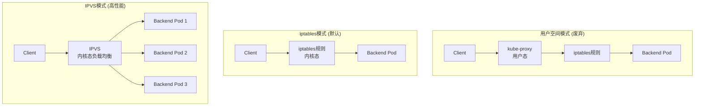
```mermaid
graph TB
    subgraph "用户空间模式 (废弃)"
        A1[Client] --> A2[kube-proxy<br/>用户态]
        A2 --> A3[iptables规则]
        A3 --> A4[Backend Pod]
    end
    
    subgraph "iptables模式 (默认)"
        B1[Client] --> B2[iptables规则<br/>内核态]
        B2 --> B3[Backend Pod]
    end
    
    subgraph "IPVS模式 (高性能)"
        C1[Client] --> C2[IPVS<br/>内核态负载均衡]
        C2 --> C3[Backend Pod 1]
        C2 --> C4[Backend Pod 2]
        C2 --> C5[Backend Pod 3]
    end
```

**模式对比**：

| 模式 | 实现方式 | 性能 | 负载均衡算法 | 适用场景 |
|------|----------|------|--------------|----------|
| **iptables** | iptables规则 | 中等 | 随机 | 中小规模集群 |
| **IPVS** | Linux内核IPVS | 高 | rr/lc/sh等多种 | 大规模集群 |

#### 3.3.2 Service网络转发流程

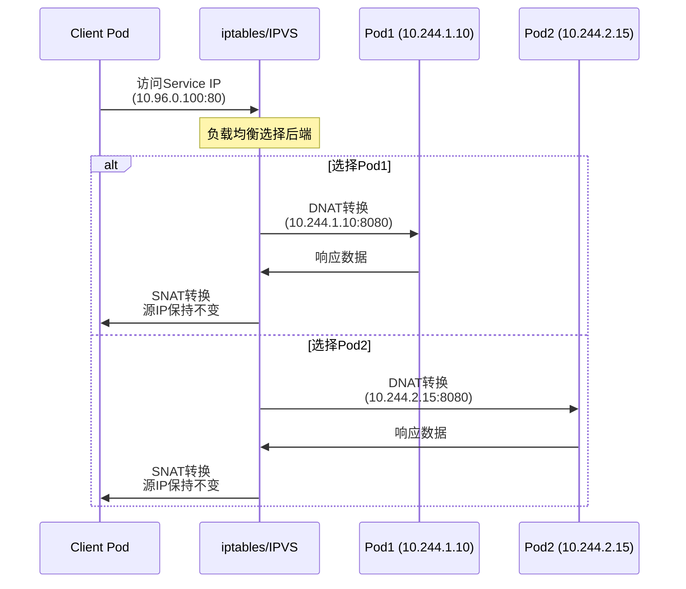
```mermaid
sequenceDiagram
    participant C as Client Pod
    participant IP as iptables/IPVS
    participant P1 as Pod1 (10.244.1.10)
    participant P2 as Pod2 (10.244.2.15)
    
    C->>IP: 访问Service IP<br/>(10.96.0.100:80)
    
    Note over IP: 负载均衡选择后端
    
    alt 选择Pod1
        IP->>P1: DNAT转换<br/>(10.244.1.10:8080)
        P1->>IP: 响应数据
        IP->>C: SNAT转换<br/>源IP保持不变
    else 选择Pod2  
        IP->>P2: DNAT转换<br/>(10.244.2.15:8080)
        P2->>IP: 响应数据
        IP->>C: SNAT转换<br/>源IP保持不变
    end
```

### 3.4 Ingress 控制器

#### 3.4.1 Ingress架构

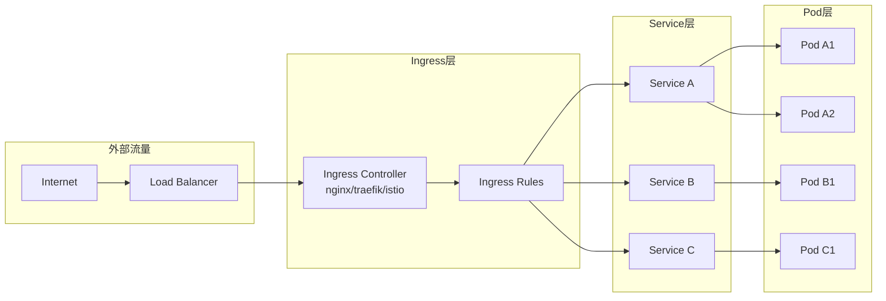
```mermaid
graph LR
    subgraph "外部流量"
        A[Internet]
        B[Load Balancer]
    end
    
    subgraph "Ingress层"
        C[Ingress Controller<br/>nginx/traefik/istio]
        D[Ingress Rules]
    end
    
    subgraph "Service层"
        E[Service A]
        F[Service B]
        G[Service C]
    end
    
    subgraph "Pod层"
        H[Pod A1]
        I[Pod A2]
        J[Pod B1]
        K[Pod C1]
    end
    
    A --> B
    B --> C
    C --> D
    D --> E
    D --> F
    D --> G
    E --> H
    E --> I
    F --> J
    G --> K
```

#### 3.4.2 Ingress配置示例

```yaml
# Ingress资源定义
apiVersion: networking.k8s.io/v1
kind: Ingress
metadata:
  name: web-ingress
  annotations:
    nginx.ingress.kubernetes.io/rewrite-target: /
    nginx.ingress.kubernetes.io/ssl-redirect: "true"
    cert-manager.io/cluster-issuer: "letsencrypt-prod"
spec:
  ingressClassName: nginx
  tls:
  - hosts:
    - api.example.com
    - web.example.com
    secretName: tls-secret
  rules:
  - host: api.example.com
    http:
      paths:
      - path: /api
        pathType: Prefix
        backend:
          service:
            name: api-service
            port:
              number: 80
  - host: web.example.com
    http:
      paths:
      - path: /
        pathType: Prefix
        backend:
          service:
            name: web-service
            port:
              number: 80
```

#### 3.4.3 Ingress Controller对比

| 控制器 | 特性 | 性能 | 生态 | 适用场景 |
|--------|------|------|------|----------|
| **nginx-ingress** | 成熟稳定 | 高 | 丰富注解 | 通用HTTP/HTTPS |
| **Traefik** | 动态配置 | 中等 | 现代UI | 微服务架构 |
| **Istio Gateway** | 服务网格 | 高 | 可观测性 | 复杂微服务 |
| **HAProxy** | 高可用 | 很高 | 企业级 | 关键业务 |

### 3.5 网络策略

#### 3.5.1 NetworkPolicy工作原理

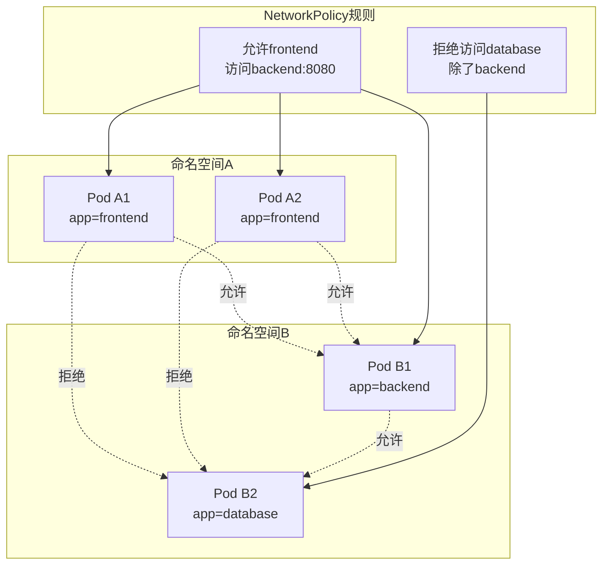
```mermaid
graph TB
    subgraph "命名空间A"
        A1[Pod A1<br/>app=frontend]
        A2[Pod A2<br/>app=frontend]
    end
    
    subgraph "命名空间B"  
        B1[Pod B1<br/>app=backend]
        B2[Pod B2<br/>app=database]
    end
    
    subgraph "NetworkPolicy规则"
        C[允许frontend<br/>访问backend:8080]
        D[拒绝访问database<br/>除了backend]
    end
    
    A1 -.->|允许| B1
    A2 -.->|允许| B1
    A1 -.->|拒绝| B2
    A2 -.->|拒绝| B2
    B1 -.->|允许| B2
    
    C --> A1
    C --> A2
    C --> B1
    D --> B2
```

#### 3.5.2 NetworkPolicy配置示例

```yaml
# 默认拒绝所有入站流量
apiVersion: networking.k8s.io/v1
kind: NetworkPolicy
metadata:
  name: default-deny-ingress
  namespace: production
spec:
  podSelector: {}
  policyTypes:
  - Ingress

---
# 允许特定应用间通信
apiVersion: networking.k8s.io/v1
kind: NetworkPolicy
metadata:
  name: allow-frontend-to-backend
  namespace: production
spec:
  podSelector:
    matchLabels:
      app: backend
  policyTypes:
  - Ingress
  ingress:
  - from:
    - podSelector:
        matchLabels:
          app: frontend
    ports:
    - protocol: TCP
      port: 8080

---
# 允许跨命名空间访问
apiVersion: networking.k8s.io/v1
kind: NetworkPolicy
metadata:
  name: allow-cross-namespace
  namespace: production
spec:
  podSelector:
    matchLabels:
      app: api
  policyTypes:
  - Ingress
  ingress:
  - from:
    - namespaceSelector:
        matchLabels:
          name: frontend
    - podSelector:
        matchLabels:
          app: web
    ports:
    - protocol: TCP
      port: 80
```

**网络策略最佳实践**：
- **默认拒绝**：采用白名单模式，默认拒绝所有流量
- **最小权限**：只允许必要的网络访问
- **分层防护**：结合命名空间、标签、端口进行精细控制
- **监控审计**：记录网络策略违规行为
- **渐进实施**：先监控模式，再强制模式

## 4. 安全机制与 RBAC

### 4.1 认证机制

Kubernetes支持多种认证方式，采用**多重认证**策略，确保集群访问安全。

#### 4.1.1 认证流程

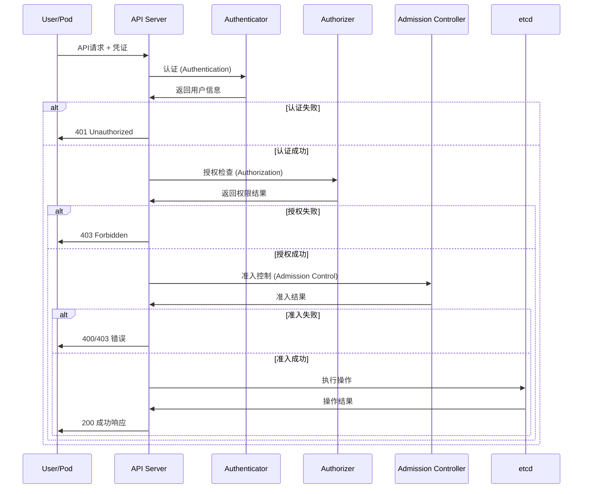
```mermaid
sequenceDiagram
    participant U as User/Pod
    participant A as API Server
    participant Auth as Authenticator
    participant Authz as Authorizer
    participant AC as Admission Controller
    participant E as etcd
    
    U->>A: API请求 + 凭证
    A->>Auth: 认证 (Authentication)
    Auth->>A: 返回用户信息
    
    alt 认证失败
        A->>U: 401 Unauthorized
    else 认证成功
        A->>Authz: 授权检查 (Authorization)
        Authz->>A: 返回权限结果
        
        alt 授权失败
            A->>U: 403 Forbidden
        else 授权成功
            A->>AC: 准入控制 (Admission Control)
            AC->>A: 准入结果
            
            alt 准入失败
                A->>U: 400/403 错误
            else 准入成功
                A->>E: 执行操作
                E->>A: 操作结果
                A->>U: 200 成功响应
            end
        end
    end
```

#### 4.1.2 认证方式详解

| 认证方式 | 适用场景 | 安全级别 | 配置复杂度 |
|----------|----------|----------|------------|
| **X.509客户端证书** | 管理员、组件间 | 高 | 中等 |
| **Bearer Token** | Service Account | 中等 | 简单 |
| **Bootstrap Token** | 节点加入 | 中等 | 简单 |
| **OpenID Connect** | 企业用户 | 高 | 复杂 |
| **Webhook** | 外部认证系统 | 中等 | 中等 |

**Service Account Token认证**：

```yaml
apiVersion: v1
kind: ServiceAccount
metadata:
  name: my-service-account
  namespace: default

---
apiVersion: v1
kind: Secret
metadata:
  name: my-service-account-token
  annotations:
    kubernetes.io/service-account.name: my-service-account
type: kubernetes.io/service-account-token
```

### 4.2 授权机制 RBAC

**RBAC (Role-Based Access Control)** 是Kubernetes推荐的授权机制，基于角色的访问控制。

#### 4.2.1 RBAC核心概念

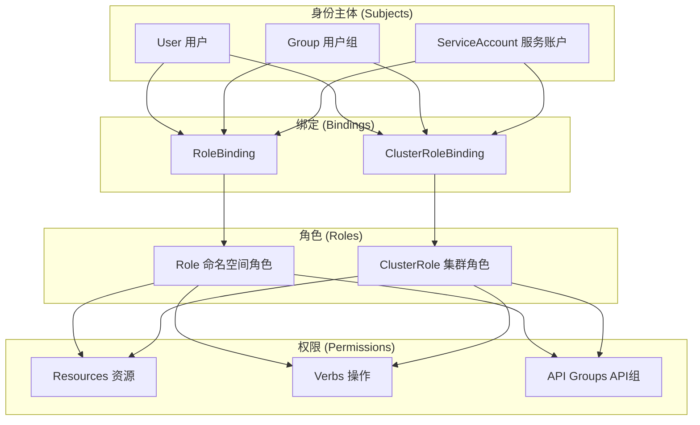
```mermaid
graph TB
    subgraph "身份主体 (Subjects)"
        A[User 用户]
        B[Group 用户组]
        C[ServiceAccount 服务账户]
    end
    
    subgraph "角色 (Roles)"
        D[Role 命名空间角色]
        E[ClusterRole 集群角色]
    end
    
    subgraph "权限 (Permissions)"
        F[Resources 资源]
        G[Verbs 操作]
        H[API Groups API组]
    end
    
    subgraph "绑定 (Bindings)"
        I[RoleBinding]
        J[ClusterRoleBinding]
    end
    
    A --> I
    B --> I
    C --> I
    A --> J
    B --> J
    C --> J
    
    I --> D
    J --> E
    
    D --> F
    D --> G
    D --> H
    E --> F
    E --> G
    E --> H
```

#### 4.2.2 Role和ClusterRole

**命名空间级别Role**：

```yaml
apiVersion: rbac.authorization.k8s.io/v1
kind: Role
metadata:
  namespace: development
  name: pod-reader
rules:
- apiGroups: [""]  # 核心API组
  resources: ["pods", "pods/log"]
  verbs: ["get", "list", "watch"]
- apiGroups: [""]
  resources: ["pods/exec"]
  verbs: ["create"]
- apiGroups: ["apps"]
  resources: ["deployments"]
  verbs: ["get", "list", "watch", "create", "update", "patch", "delete"]
```

**集群级别ClusterRole**：

```yaml
apiVersion: rbac.authorization.k8s.io/v1
kind: ClusterRole
metadata:
  name: node-reader
rules:
- apiGroups: [""]
  resources: ["nodes", "nodes/status"]
  verbs: ["get", "list", "watch"]
- apiGroups: ["metrics.k8s.io"]
  resources: ["nodes", "pods"]
  verbs: ["get", "list"]
- nonResourceURLs: ["/healthz", "/version"]
  verbs: ["get"]
```

#### 4.2.3 RoleBinding和ClusterRoleBinding

**RoleBinding示例**：

```yaml
apiVersion: rbac.authorization.k8s.io/v1
kind: RoleBinding
metadata:
  name: read-pods
  namespace: development
subjects:
- kind: User
  name: jane
  apiGroup: rbac.authorization.k8s.io
- kind: ServiceAccount
  name: pod-reader
  namespace: development
roleRef:
  kind: Role
  name: pod-reader
  apiGroup: rbac.authorization.k8s.io
```

**ClusterRoleBinding示例**：

```yaml
apiVersion: rbac.authorization.k8s.io/v1
kind: ClusterRoleBinding
metadata:
  name: cluster-admin-binding
subjects:
- kind: User
  name: admin
  apiGroup: rbac.authorization.k8s.io
- kind: Group
  name: system:masters
  apiGroup: rbac.authorization.k8s.io
roleRef:
  kind: ClusterRole
  name: cluster-admin
  apiGroup: rbac.authorization.k8s.io
```

#### 4.2.4 内置ClusterRole

| ClusterRole | 权限范围 | 适用场景 |
|-------------|----------|----------|
| **cluster-admin** | 全局超级管理员 | 集群管理员 |
| **admin** | 命名空间全部权限 | 项目管理员 |
| **edit** | 读写权限（除RBAC） | 开发人员 |
| **view** | 只读权限 | 只读用户 |
| **system:node** | kubelet权限 | 工作节点 |
| **system:kube-proxy** | kube-proxy权限 | 网络代理 |

### 4.3 准入控制

**准入控制器 (Admission Controllers)** 在对象持久化到etcd之前拦截API请求，进行验证和变更。

#### 4.3.1 准入控制器类型

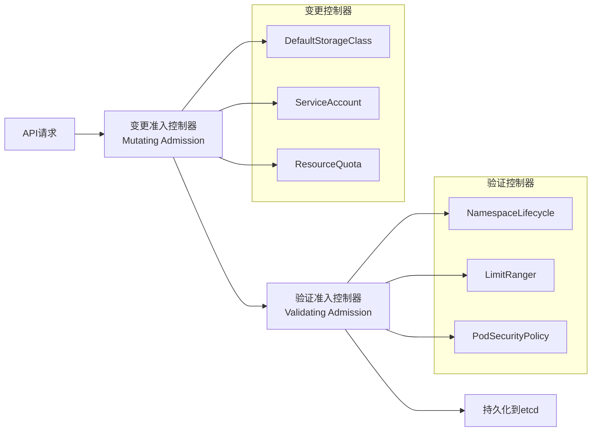
```mermaid
graph LR
    A[API请求] --> B[变更准入控制器<br/>Mutating Admission]
    B --> C[验证准入控制器<br/>Validating Admission]
    C --> D[持久化到etcd]
    
    subgraph "变更控制器"
        E[DefaultStorageClass]
        F[ServiceAccount]
        G[ResourceQuota]
    end
    
    subgraph "验证控制器"
        H[NamespaceLifecycle]
        I[LimitRanger]
        J[PodSecurityPolicy]
    end
    
    B --> E
    B --> F
    B --> G
    C --> H
    C --> I
    C --> J
```

#### 4.3.2 常用准入控制器

| 控制器 | 类型 | 功能 |
|--------|------|------|
| **NamespaceLifecycle** | 验证 | 防止在不存在或删除中的命名空间创建资源 |
| **ServiceAccount** | 变更 | 自动添加默认ServiceAccount |
| **ResourceQuota** | 验证 | 强制执行资源配额限制 |
| **LimitRanger** | 验证 | 强制执行资源限制范围 |
| **DefaultStorageClass** | 变更 | 为PVC添加默认存储类 |
| **PodSecurityPolicy** | 验证 | 实施Pod安全策略 |

#### 4.3.3 Admission Webhook

**自定义准入控制器**：

```yaml
apiVersion: admissionregistration.k8s.io/v1
kind: ValidatingAdmissionWebhook
metadata:
  name: validate-pod-resources
webhooks:
- name: pod-resource-validator.example.com
  clientConfig:
    service:
      name: admission-webhook-service
      namespace: webhook-system
      path: "/validate"
  rules:
  - operations: ["CREATE", "UPDATE"]
    apiGroups: [""]
    apiVersions: ["v1"]
    resources: ["pods"]
  admissionReviewVersions: ["v1", "v1beta1"]
  sideEffects: None
  failurePolicy: Fail
```

### 4.4 Pod 安全策略

#### 4.4.1 Pod Security Standards

Kubernetes 1.25+推荐使用**Pod Security Standards**替代PSP：

| 策略级别 | 限制程度 | 适用场景 |
|----------|----------|----------|
| **Privileged** | 无限制 | 系统组件、特权应用 |
| **Baseline** | 基础限制 | 一般应用 |
| **Restricted** | 严格限制 | 安全敏感应用 |

```yaml
# 命名空间安全策略
apiVersion: v1
kind: Namespace
metadata:
  name: production
  labels:
    pod-security.kubernetes.io/enforce: restricted
    pod-security.kubernetes.io/audit: restricted
    pod-security.kubernetes.io/warn: restricted
```

#### 4.4.2 SecurityContext配置

```yaml
apiVersion: v1
kind: Pod
metadata:
  name: security-context-demo
spec:
  securityContext:
    runAsNonRoot: true
    runAsUser: 1000
    runAsGroup: 3000
    fsGroup: 2000
    seccompProfile:
      type: RuntimeDefault
  containers:
  - name: demo
    image: nginx
    securityContext:
      allowPrivilegeEscalation: false
      capabilities:
        drop:
        - ALL
        add:
        - NET_BIND_SERVICE
      readOnlyRootFilesystem: true
      runAsNonRoot: true
      runAsUser: 1000
    volumeMounts:
    - name: tmp-volume
      mountPath: /tmp
  volumes:
  - name: tmp-volume
    emptyDir: {}
```

### 4.5 安全最佳实践

#### 4.5.1 集群安全加固

**API Server安全**：
```bash
# API Server安全参数
--anonymous-auth=false
--enable-admission-plugins=NodeRestriction,ResourceQuota,LimitRanger
--audit-log-path=/var/log/audit.log
--audit-policy-file=/etc/kubernetes/audit-policy.yaml
--enable-bootstrap-token-auth=false
--encryption-provider-config=/etc/kubernetes/encryption-config.yaml
```

**etcd安全**：
```bash
# etcd安全配置
--client-cert-auth=true
--trusted-ca-file=/etc/etcd/ca.pem
--cert-file=/etc/etcd/server.pem
--key-file=/etc/etcd/server-key.pem
--peer-client-cert-auth=true
--peer-trusted-ca-file=/etc/etcd/ca.pem
```

#### 4.5.2 运行时安全

**镜像安全扫描**：
```yaml
apiVersion: v1
kind: Pod
metadata:
  name: secure-app
spec:
  containers:
  - name: app
    image: myregistry.com/myapp:v1.2.3@sha256:abc123...  # 使用SHA摘要
    imagePullPolicy: Always
    securityContext:
      runAsNonRoot: true
      readOnlyRootFilesystem: true
      allowPrivilegeEscalation: false
```

**网络安全**：
```yaml
apiVersion: networking.k8s.io/v1
kind: NetworkPolicy
metadata:
  name: default-deny-all
spec:
  podSelector: {}
  policyTypes:
  - Ingress
  - Egress
```

#### 4.5.3 密钥管理

**外部密钥管理集成**：
```yaml
apiVersion: v1
kind: SecretProviderClass
metadata:
  name: vault-secrets
spec:
  provider: vault
  parameters:
    vaultAddress: "https://vault.example.com"
    objects: |
      - objectName: "db-password"
        objectType: "secret"
        objectPath: "secret/data/database"
```

**证书自动轮换**：
```yaml
apiVersion: cert-manager.io/v1
kind: Certificate
metadata:
  name: tls-cert
spec:
  secretName: tls-secret
  issuerRef:
    name: letsencrypt-prod
    kind: ClusterIssuer
  dnsNames:
  - api.example.com
  duration: 2160h  # 90天
  renewBefore: 360h  # 15天前续期
```

## 5. 调度机制与算法

### 5.1 调度器架构

Kubernetes调度器负责将Pod分配到合适的节点上，是集群资源管理的核心组件。

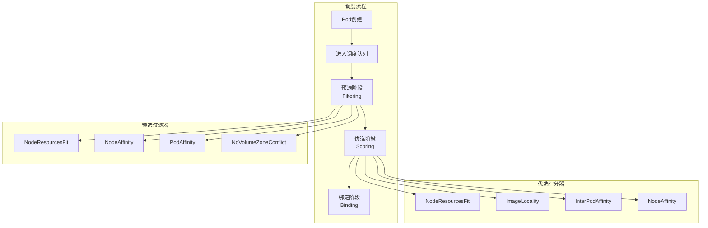
```mermaid
graph TB
    subgraph "调度流程"
        A[Pod创建] --> B[进入调度队列]
        B --> C[预选阶段<br/>Filtering]
        C --> D[优选阶段<br/>Scoring]
        D --> E[绑定阶段<br/>Binding]
    end
    
    subgraph "预选过滤器"
        F[NodeResourcesFit]
        G[NodeAffinity]
        H[PodAffinity]
        I[NoVolumeZoneConflict]
    end
    
    subgraph "优选评分器"
        J[NodeResourcesFit]
        K[ImageLocality]
        L[InterPodAffinity]
        M[NodeAffinity]
    end
    
    C --> F
    C --> G
    C --> H
    C --> I
    D --> J
    D --> K
    D --> L
    D --> M
```

### 5.2 调度算法

#### 5.2.1 资源调度策略

```yaml
# 资源请求和限制
apiVersion: apps/v1
kind: Deployment
metadata:
  name: resource-demo
spec:
  replicas: 3
  selector:
    matchLabels:
      app: resource-demo
  template:
    metadata:
      labels:
        app: resource-demo
    spec:
      containers:
      - name: app
        image: nginx
        resources:
          requests:
            cpu: 100m        # 最小CPU需求
            memory: 128Mi    # 最小内存需求
          limits:
            cpu: 500m        # 最大CPU限制
            memory: 512Mi    # 最大内存限制
      # 节点选择器
      nodeSelector:
        disktype: ssd
      # 容忍度设置
      tolerations:
      - key: "gpu"
        operator: "Equal"
        value: "true"
        effect: "NoSchedule"
```

#### 5.2.2 亲和性与反亲和性

**节点亲和性**：
```yaml
apiVersion: v1
kind: Pod
metadata:
  name: node-affinity-demo
spec:
  affinity:
    nodeAffinity:
      # 硬性要求
      requiredDuringSchedulingIgnoredDuringExecution:
        nodeSelectorTerms:
        - matchExpressions:
          - key: zone
            operator: In
            values:
            - us-west-1a
            - us-west-1b
      # 软性偏好
      preferredDuringSchedulingIgnoredDuringExecution:
      - weight: 100
        preference:
          matchExpressions:
          - key: instance-type
            operator: In
            values:
            - c5.large
            - c5.xlarge
  containers:
  - name: app
    image: nginx
```

**Pod亲和性和反亲和性**：
```yaml
apiVersion: apps/v1
kind: Deployment
metadata:
  name: redis-cluster
spec:
  replicas: 3
  selector:
    matchLabels:
      app: redis
  template:
    metadata:
      labels:
        app: redis
    spec:
      affinity:
        # Pod反亲和性：避免同一节点部署多个Redis实例
        podAntiAffinity:
          requiredDuringSchedulingIgnoredDuringExecution:
          - labelSelector:
              matchExpressions:
              - key: app
                operator: In
                values:
                - redis
            topologyKey: kubernetes.io/hostname
        # Pod亲和性：倾向于部署在有缓存的节点
        podAffinity:
          preferredDuringSchedulingIgnoredDuringExecution:
          - weight: 100
            podAffinityTerm:
              labelSelector:
                matchExpressions:
                - key: app
                  operator: In
                  values:
                  - cache
              topologyKey: kubernetes.io/hostname
      containers:
      - name: redis
        image: redis:6.2
```

### 5.3 污点与容忍

```yaml
# 为节点添加污点
# kubectl taint nodes node1 gpu=true:NoSchedule

# Pod容忍污点
apiVersion: v1
kind: Pod
metadata:
  name: gpu-pod
spec:
  tolerations:
  - key: "gpu"
    operator: "Equal"
    value: "true"
    effect: "NoSchedule"
  - key: "high-memory"
    operator: "Exists"
    effect: "PreferNoSchedule"
  containers:
  - name: gpu-app
    image: tensorflow/tensorflow:latest-gpu
```

## 6. 高级特性与扩展

### 6.1 水平自动扩缩容 HPA

```yaml
apiVersion: autoscaling/v2
kind: HorizontalPodAutoscaler
metadata:
  name: web-app-hpa
spec:
  scaleTargetRef:
    apiVersion: apps/v1
    kind: Deployment
    name: web-app
  minReplicas: 2
  maxReplicas: 10
  metrics:
  # CPU利用率
  - type: Resource
    resource:
      name: cpu
      target:
        type: Utilization
        averageUtilization: 70
  # 内存利用率
  - type: Resource
    resource:
      name: memory
      target:
        type: Utilization
        averageUtilization: 80
  # 自定义指标
  - type: External
    external:
      metric:
        name: queue_messages_ready
      target:
        type: AverageValue
        averageValue: "30"
  behavior:
    scaleDown:
      stabilizationWindowSeconds: 300
      policies:
      - type: Percent
        value: 50
        periodSeconds: 60
    scaleUp:
      stabilizationWindowSeconds: 0
      policies:
      - type: Percent
        value: 100
        periodSeconds: 15
```

### 6.2 垂直自动扩缩容 VPA

```yaml
apiVersion: autoscaling.k8s.io/v1
kind: VerticalPodAutoscaler
metadata:
  name: web-app-vpa
spec:
  targetRef:
    apiVersion: apps/v1
    kind: Deployment
    name: web-app
  updatePolicy:
    updateMode: "Auto"  # Auto/Recreation/Initial/Off
  resourcePolicy:
    containerPolicies:
    - containerName: web-container
      maxAllowed:
        cpu: 1
        memory: 2Gi
      minAllowed:
        cpu: 100m
        memory: 128Mi
      controlledResources: ["cpu", "memory"]
```

### 6.3 自定义资源 CRD

```yaml
# 定义自定义资源
apiVersion: apiextensions.k8s.io/v1
kind: CustomResourceDefinition
metadata:
  name: databases.example.com
spec:
  group: example.com
  versions:
  - name: v1
    served: true
    storage: true
    schema:
      openAPIV3Schema:
        type: object
        properties:
          spec:
            type: object
            properties:
              size:
                type: integer
                minimum: 1
                maximum: 100
              version:
                type: string
                enum: ["5.7", "8.0"]
              replicas:
                type: integer
                minimum: 1
          status:
            type: object
            properties:
              phase:
                type: string
                enum: ["Pending", "Running", "Failed"]
  scope: Namespaced
  names:
    plural: databases
    singular: database
    kind: Database
```

### 6.4 Operator 模式

```yaml
# 使用自定义资源
apiVersion: example.com/v1
kind: Database
metadata:
  name: my-database
  namespace: production
spec:
  size: 50
  version: "8.0"
  replicas: 3
  backup:
    enabled: true
    schedule: "0 2 * * *"
  monitoring:
    enabled: true
    retention: "30d"
```

### 6.5 Job和CronJob

```yaml
# 一次性任务
apiVersion: batch/v1
kind: Job
metadata:
  name: data-migration
spec:
  parallelism: 3
  completions: 10
  template:
    spec:
      containers:
      - name: migration
        image: data-migration:v1.0
        command: ["./migrate.sh"]
      restartPolicy: Never
  backoffLimit: 6

---
# 定时任务
apiVersion: batch/v1
kind: CronJob
metadata:
  name: backup-job
spec:
  schedule: "0 2 * * *"  # 每天凌晨2点
  jobTemplate:
    spec:
      template:
        spec:
          containers:
          - name: backup
            image: backup-tool:v1.0
            command: ["./backup.sh"]
          restartPolicy: OnFailure
  successfulJobsHistoryLimit: 3
  failedJobsHistoryLimit: 1
  concurrencyPolicy: Forbid
```

## 7. 监控、日志与可观测性

### 7.1 Prometheus 监控体系

**Prometheus** 是Kubernetes生态中的标准监控解决方案，提供指标收集、存储和告警功能。

#### 7.1.1 Prometheus架构

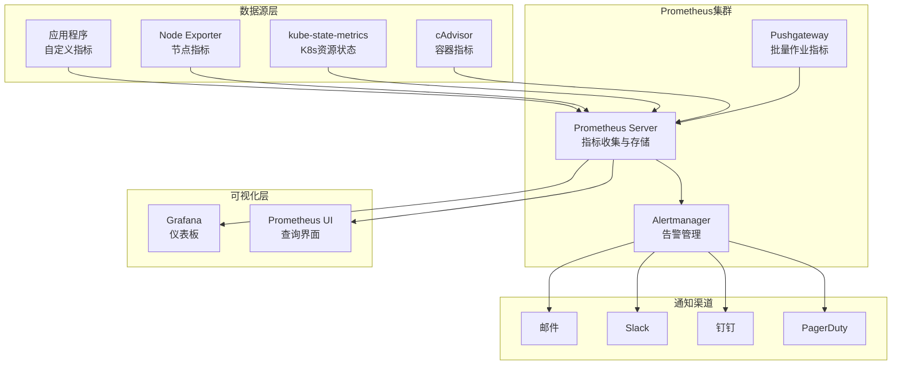
```mermaid
graph TB
    subgraph "数据源层"
        A[应用程序<br/>自定义指标]
        B[Node Exporter<br/>节点指标]
        C[kube-state-metrics<br/>K8s资源状态]
        D[cAdvisor<br/>容器指标]
    end
    
    subgraph "Prometheus集群"
        E[Prometheus Server<br/>指标收集与存储]
        F[Alertmanager<br/>告警管理]
        G[Pushgateway<br/>批量作业指标]
    end
    
    subgraph "可视化层"
        H[Grafana<br/>仪表板]
        I[Prometheus UI<br/>查询界面]
    end
    
    subgraph "通知渠道"
        J[邮件]
        K[Slack]
        L[钉钉]
        M[PagerDuty]
    end
    
    A --> E
    B --> E
    C --> E
    D --> E
    G --> E
    E --> F
    E --> H
    E --> I
    F --> J
    F --> K
    F --> L
    F --> M
```

#### 7.1.2 核心组件配置

**Prometheus Server配置**：
```yaml
apiVersion: v1
kind: ConfigMap
metadata:
  name: prometheus-config
data:
  prometheus.yml: |
    global:
      scrape_interval: 15s
      evaluation_interval: 15s
    
    rule_files:
      - "/etc/prometheus/rules/*.yml"
    
    alerting:
      alertmanagers:
        - static_configs:
            - targets:
              - alertmanager:9093
    
    scrape_configs:
    # Kubernetes API Server
    - job_name: 'kubernetes-apiservers'
      kubernetes_sd_configs:
      - role: endpoints
      scheme: https
      tls_config:
        ca_file: /var/run/secrets/kubernetes.io/serviceaccount/ca.crt
      bearer_token_file: /var/run/secrets/kubernetes.io/serviceaccount/token
      relabel_configs:
      - source_labels: [__meta_kubernetes_namespace, __meta_kubernetes_service_name, __meta_kubernetes_endpoint_port_name]
        action: keep
        regex: default;kubernetes;https
    
    # Node Exporter
    - job_name: 'node-exporter'
      kubernetes_sd_configs:
      - role: endpoints
      relabel_configs:
      - source_labels: [__meta_kubernetes_endpoints_name]
        action: keep
        regex: node-exporter
    
    # Pods with prometheus.io/scrape annotation
    - job_name: 'kubernetes-pods'
      kubernetes_sd_configs:
      - role: pod
      relabel_configs:
      - source_labels: [__meta_kubernetes_pod_annotation_prometheus_io_scrape]
        action: keep
        regex: true
      - source_labels: [__meta_kubernetes_pod_annotation_prometheus_io_path]
        action: replace
        target_label: __metrics_path__
        regex: (.+)
```

#### 7.1.3 关键指标监控

**集群级别指标**：
```yaml
# 告警规则配置
groups:
- name: kubernetes-cluster
  rules:
  # 节点资源告警
  - alert: NodeHighCPUUsage
    expr: (100 - (avg by (instance) (irate(node_cpu_seconds_total{mode="idle"}[5m])) * 100)) > 80
    for: 5m
    labels:
      severity: warning
    annotations:
      summary: "节点CPU使用率过高"
      description: "节点 {{ $labels.instance }} CPU使用率超过80%"
  
  - alert: NodeHighMemoryUsage
    expr: (1 - (node_memory_MemAvailable_bytes / node_memory_MemTotal_bytes)) * 100 > 85
    for: 5m
    labels:
      severity: warning
    annotations:
      summary: "节点内存使用率过高"
      description: "节点 {{ $labels.instance }} 内存使用率超过85%"
  
  # Pod资源告警
  - alert: PodCrashLooping
    expr: rate(kube_pod_container_status_restarts_total[15m]) > 0
    for: 5m
    labels:
      severity: critical
    annotations:
      summary: "Pod持续重启"
      description: "Pod {{ $labels.namespace }}/{{ $labels.pod }} 在过去15分钟内重启"
```

### 7.2 日志收集与分析

#### 7.2.1 EFK日志架构

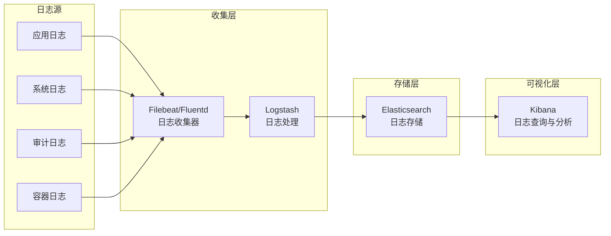
```mermaid
graph LR
    subgraph "日志源"
        A[应用日志]
        B[系统日志]
        C[审计日志]
        D[容器日志]
    end
    
    subgraph "收集层"
        E[Filebeat/Fluentd<br/>日志收集器]
        F[Logstash<br/>日志处理]
    end
    
    subgraph "存储层"
        G[Elasticsearch<br/>日志存储]
    end
    
    subgraph "可视化层"
        H[Kibana<br/>日志查询与分析]
    end
    
    A --> E
    B --> E
    C --> E
    D --> E
    E --> F
    F --> G
    G --> H
```

#### 7.2.2 Fluentd配置

```yaml
apiVersion: v1
kind: ConfigMap
metadata:
  name: fluentd-config
data:
  fluent.conf: |
    <source>
      @type tail
      path /var/log/containers/*.log
      pos_file /var/log/fluentd-containers.log.pos
      tag kubernetes.*
      read_from_head true
      <parse>
        @type json
        time_format %Y-%m-%dT%H:%M:%S.%NZ
      </parse>
    </source>
    
    <filter kubernetes.**>
      @type kubernetes_metadata
    </filter>
    
    # 应用日志解析
    <filter kubernetes.var.log.containers.**>
      @type parser
      key_name log
      reserve_data true
      remove_key_name_field true
      <parse>
        @type multi_format
        <pattern>
          format json
        </pattern>
        <pattern>
          format none
        </pattern>
      </parse>
    </filter>
    
    # 输出到Elasticsearch
    <match kubernetes.**>
      @type elasticsearch
      host elasticsearch.logging.svc.cluster.local
      port 9200
      index_name k8s-logs
      type_name _doc
      include_tag_key true
      tag_key @log_name
      <buffer>
        @type file
        path /var/log/fluentd-buffers/kubernetes.system.buffer
        flush_mode interval
        retry_type exponential_backoff
        flush_thread_count 2
        flush_interval 5s
        retry_forever
        retry_max_interval 30
        chunk_limit_size 2M
        queue_limit_length 8
        overflow_action block
      </buffer>
    </match>
```

### 7.3 链路追踪

#### 7.3.1 Jaeger分布式追踪

```yaml
# Jaeger部署配置
apiVersion: apps/v1
kind: Deployment
metadata:
  name: jaeger-all-in-one
spec:
  replicas: 1
  selector:
    matchLabels:
      app: jaeger
  template:
    metadata:
      labels:
        app: jaeger
    spec:
      containers:
      - name: jaeger
        image: jaegertracing/all-in-one:latest
        ports:
        - containerPort: 16686  # Jaeger UI
        - containerPort: 14268  # HTTP collector
        - containerPort: 6831   # UDP agent
        env:
        - name: COLLECTOR_ZIPKIN_HTTP_PORT
          value: "9411"
        - name: MEMORY_MAX_TRACES
          value: "10000"
```

#### 7.3.2 应用集成追踪

```java
// Spring Boot应用集成示例
@RestController
public class UserController {
    
    @Autowired
    private UserService userService;
    
    @GetMapping("/users/{id}")
    @Traced(operationName = "get-user")
    public ResponseEntity<User> getUser(@PathVariable Long id) {
        Span span = tracer.nextSpan()
            .name("get-user-from-db")
            .tag("user.id", String.valueOf(id))
            .start();
        
        try (Tracer.SpanInScope ws = tracer.withSpanInScope(span)) {
            User user = userService.findById(id);
            span.tag("user.found", user != null);
            return ResponseEntity.ok(user);
        } finally {
            span.end();
        }
    }
}
```

### 7.4 告警机制

#### 7.4.1 Alertmanager配置

```yaml
apiVersion: v1
kind: ConfigMap
metadata:
  name: alertmanager-config
data:
  alertmanager.yml: |
    global:
      smtp_smarthost: 'smtp.gmail.com:587'
      smtp_from: 'alerts@company.com'
      
    route:
      group_by: ['alertname', 'cluster', 'service']
      group_wait: 10s
      group_interval: 10s
      repeat_interval: 1h
      receiver: 'default'
      routes:
      - match:
          severity: critical
        receiver: 'critical-alerts'
      - match:
          severity: warning
        receiver: 'warning-alerts'
    
    receivers:
    - name: 'default'
      email_configs:
      - to: 'admin@company.com'
        subject: 'Kubernetes Alert'
        
    - name: 'critical-alerts'
      email_configs:
      - to: 'oncall@company.com'
        subject: '🚨 Critical Alert - {{ .GroupLabels.alertname }}'
      slack_configs:
      - api_url: 'https://hooks.slack.com/services/xxx'
        channel: '#alerts'
        title: 'Critical Alert'
        text: '{{ range .Alerts }}{{ .Annotations.description }}{{ end }}'
        
    - name: 'warning-alerts'
      email_configs:
      - to: 'team@company.com'
        subject: '⚠️ Warning - {{ .GroupLabels.alertname }}'
    
    inhibit_rules:
    - source_match:
        severity: 'critical'
      target_match:
        severity: 'warning'
      equal: ['alertname', 'instance']
```

#### 7.4.2 告警规则最佳实践

**分层告警策略**：

| 级别 | 场景 | 响应时间 | 通知方式 |
|------|------|----------|----------|
| **Critical** | 服务完全不可用 | 立即 | 电话+短信+邮件 |
| **Warning** | 性能下降或潜在问题 | 15分钟内 | 邮件+Slack |
| **Info** | 状态变更通知 | 1小时内 | 邮件 |

```yaml
# 分层告警规则示例
groups:
- name: sla-alerts
  rules:
  # SLA违规告警
  - alert: HighErrorRate
    expr: rate(http_requests_total{status=~"5.."}[5m]) / rate(http_requests_total[5m]) > 0.1
    for: 5m
    labels:
      severity: critical
    annotations:
      summary: "服务错误率过高"
      description: "{{ $labels.service }} 5xx错误率超过10%"
  
  # 性能告警
  - alert: HighLatency
    expr: histogram_quantile(0.95, rate(http_request_duration_seconds_bucket[5m])) > 0.5
    for: 5m
    labels:
      severity: warning
    annotations:
      summary: "服务响应延迟过高"
      description: "{{ $labels.service }} P95延迟超过500ms"
```

## 8. 部署与运维

### 8.1 集群部署方式

#### 8.1.1 部署方式对比

| 部署方式 | 复杂度 | 可控性 | 维护成本 | 适用场景 |
|----------|--------|--------|----------|----------|
| **托管服务** | 低 | 低 | 低 | 快速上线、小团队 |
| **kubeadm** | 中等 | 高 | 中等 | 生产环境、自建集群 |
| **二进制部署** | 高 | 很高 | 高 | 深度定制、安全要求高 |
| **容器化部署** | 中等 | 中等 | 中等 | 开发测试环境 |

#### 8.1.2 kubeadm生产级部署

**高可用Master部署**：
```bash
# 初始化第一个Master节点
kubeadm init \
  --control-plane-endpoint=k8s-api.example.com:6443 \
  --upload-certs \
  --pod-network-cidr=10.244.0.0/16 \
  --service-cidr=10.96.0.0/12 \
  --apiserver-advertise-address=192.168.1.10

# 生成其他Master节点加入命令
kubeadm token create --print-join-command
kubeadm init phase upload-certs --upload-certs

# 其他Master节点加入
kubeadm join k8s-api.example.com:6443 \
  --token <token> \
  --discovery-token-ca-cert-hash sha256:<hash> \
  --control-plane \
  --certificate-key <cert-key>
```

**Worker节点配置**：
```yaml
# kubelet配置文件
apiVersion: kubelet.config.k8s.io/v1beta1
kind: KubeletConfiguration
address: 0.0.0.0
port: 10250
readOnlyPort: 0
cgroupDriver: systemd
clusterDNS:
- 10.96.0.10
clusterDomain: cluster.local
failSwapOn: false
authentication:
  anonymous:
    enabled: false
  webhook:
    enabled: true
authorization:
  mode: Webhook
serverTLSBootstrap: true
```

### 8.2 升级策略

#### 8.2.1 集群升级流程

```mermaid
sequenceDiagram
    participant A as 管理员
    participant M as Master节点
    participant W as Worker节点
    participant P as Pod/应用
    
    A->>M: 1. 升级第一个Master
    M->>M: 2. 停止kubelet和容器运行时
    M->>M: 3. 升级二进制文件
    M->>M: 4. 重启服务
    
    A->>M: 5. 验证Master功能
    
    loop 每个Worker节点
        A->>W: 6. drain节点
        P->>W: 7. Pod迁移到其他节点
        W->>W: 8. 升级kubelet
        W->>W: 9. 重启服务
        A->>W: 10. uncordon节点
    end
    
    A->>M: 11. 验证整个集群
```

**升级前检查清单**：
```bash
# 版本兼容性检查
kubectl version --short
kubeadm version

# 备份etcd数据
ETCDCTL_API=3 etcdctl snapshot save backup.db \
  --endpoints=https://127.0.0.1:2379 \
  --cacert=/etc/kubernetes/pki/etcd/ca.crt \
  --cert=/etc/kubernetes/pki/etcd/server.crt \
  --key=/etc/kubernetes/pki/etcd/server.key

# 检查集群健康状态
kubectl get nodes
kubectl get pods --all-namespaces
kubectl get componentstatuses
```

### 8.3 备份与恢复

#### 8.3.1 etcd备份策略

**自动化备份脚本**：
```bash
#!/bin/bash
# etcd-backup.sh

BACKUP_DIR="/var/backups/etcd"
DATE=$(date +%Y%m%d_%H%M%S)
BACKUP_FILE="$BACKUP_DIR/etcd-backup-$DATE.db"

# 创建备份目录
mkdir -p $BACKUP_DIR

# 执行备份
ETCDCTL_API=3 etcdctl snapshot save $BACKUP_FILE \
  --endpoints=https://127.0.0.1:2379 \
  --cacert=/etc/kubernetes/pki/etcd/ca.crt \
  --cert=/etc/kubernetes/pki/etcd/server.crt \
  --key=/etc/kubernetes/pki/etcd/server.key

# 验证备份
ETCDCTL_API=3 etcdctl snapshot status $BACKUP_FILE

# 清理旧备份（保留7天）
find $BACKUP_DIR -name "etcd-backup-*.db" -mtime +7 -delete

echo "Backup completed: $BACKUP_FILE"
```

**定时备份CronJob**：
```yaml
apiVersion: batch/v1
kind: CronJob
metadata:
  name: etcd-backup
  namespace: kube-system
spec:
  schedule: "0 2 * * *"  # 每天凌晨2点
  jobTemplate:
    spec:
      template:
        spec:
          hostNetwork: true
          containers:
          - name: etcd-backup
            image: k8s.gcr.io/etcd:3.5.1-0
            command:
            - /bin/sh
            - -c
            - |
              ETCDCTL_API=3 etcdctl snapshot save /backup/etcd-backup-$(date +%Y%m%d_%H%M%S).db \
                --endpoints=https://127.0.0.1:2379 \
                --cacert=/etc/kubernetes/pki/etcd/ca.crt \
                --cert=/etc/kubernetes/pki/etcd/server.crt \
                --key=/etc/kubernetes/pki/etcd/server.key
            volumeMounts:
            - name: etcd-certs
              mountPath: /etc/kubernetes/pki/etcd
              readOnly: true
            - name: backup-storage
              mountPath: /backup
          volumes:
          - name: etcd-certs
            hostPath:
              path: /etc/kubernetes/pki/etcd
          - name: backup-storage
            persistentVolumeClaim:
              claimName: etcd-backup-pvc
          restartPolicy: OnFailure
```

#### 8.3.2 应用数据备份

**Velero集群备份**：
```yaml
# 安装Velero
apiVersion: v1
kind: Namespace
metadata:
  name: velero

---
# 备份策略
apiVersion: velero.io/v1
kind: Schedule
metadata:
  name: daily-backup
  namespace: velero
spec:
  schedule: "0 1 * * *"
  template:
    includedNamespaces:
    - production
    - staging
    excludedResources:
    - secrets
    storageLocation: default
    volumeSnapshotLocations:
    - default
    ttl: 168h0m0s  # 7天保留期
```

### 8.4 容量规划

#### 8.4.1 资源容量评估

**节点规格推荐**：

| 环境类型 | CPU | 内存 | 存储 | 网络 | 节点数 |
|----------|-----|------|------|------|--------|
| **开发环境** | 4核 | 8GB | 100GB SSD | 1Gbps | 3-5个 |
| **测试环境** | 8核 | 16GB | 200GB SSD | 1Gbps | 5-10个 |
| **生产环境** | 16核 | 32GB | 500GB SSD | 10Gbps | 10+个 |

**容量监控指标**：
```yaml
# 资源使用率监控
groups:
- name: capacity-planning
  rules:
  - alert: NodeCPUCapacityWarning
    expr: (1 - (sum by (instance) (irate(node_cpu_seconds_total{mode="idle"}[5m])))) > 0.7
    for: 10m
    labels:
      severity: warning
    annotations:
      summary: "节点CPU容量告警"
      
  - alert: ClusterMemoryCapacityWarning  
    expr: (1 - (sum(node_memory_MemAvailable_bytes) / sum(node_memory_MemTotal_bytes))) > 0.8
    for: 5m
    labels:
      severity: warning
    annotations:
      summary: "集群内存容量告警"
```

### 8.5 性能调优

#### 8.5.1 系统级优化

**内核参数优化**：
```bash
# /etc/sysctl.d/k8s.conf
net.bridge.bridge-nf-call-ip6tables = 1
net.bridge.bridge-nf-call-iptables = 1
net.ipv4.ip_forward = 1
net.ipv4.conf.all.forwarding = 1
net.ipv6.conf.all.forwarding = 1

# 网络性能优化
net.core.somaxconn = 32768
net.core.netdev_max_backlog = 16384
net.ipv4.tcp_max_syn_backlog = 8192
net.ipv4.tcp_slow_start_after_idle = 0

# 文件描述符限制
fs.file-max = 2097152
fs.inotify.max_user_instances = 8192
fs.inotify.max_user_watches = 1048576
```

**kubelet性能优化**：
```yaml
# kubelet配置
apiVersion: kubelet.config.k8s.io/v1beta1
kind: KubeletConfiguration
maxPods: 250
podPidsLimit: 2048
imageGCHighThresholdPercent: 85
imageGCLowThresholdPercent: 80
evictionHard:
  memory.available: "100Mi"
  nodefs.available: "10%"
  imagefs.available: "15%"
kubeReserved:
  cpu: "100m"
  memory: "128Mi"
systemReserved:
  cpu: "100m"  
  memory: "128Mi"
```

#### 8.5.2 应用级优化

**Pod资源优化**：
```yaml
apiVersion: v1
kind: Pod
metadata:
  name: optimized-app
spec:
  containers:
  - name: app
    image: myapp:v1.0
    resources:
      requests:
        cpu: 100m
        memory: 128Mi
      limits:
        cpu: 500m
        memory: 512Mi
    # 就绪性探针优化
    readinessProbe:
      httpGet:
        path: /health
        port: 8080
      initialDelaySeconds: 10
      periodSeconds: 5
      timeoutSeconds: 3
    # 存活性探针优化  
    livenessProbe:
      httpGet:
        path: /health
        port: 8080
      initialDelaySeconds: 30
      periodSeconds: 10
      timeoutSeconds: 5
      failureThreshold: 3
  # Pod优先级设置
  priorityClassName: high-priority
  # 节点选择优化
  nodeSelector:
    node-type: compute-optimized
```

**性能监控Dashboard**：
```json
{
  "dashboard": {
    "title": "Kubernetes Performance",
    "panels": [
      {
        "title": "Pod CPU Usage",
        "targets": [
          {
            "expr": "rate(container_cpu_usage_seconds_total{container!=\"POD\"}[5m]) * 100"
          }
        ]
      },
      {
        "title": "Pod Memory Usage", 
        "targets": [
          {
            "expr": "container_memory_working_set_bytes{container!=\"POD\"} / 1024 / 1024"
          }
        ]
      }
    ]
  }
}
```

## 9. 故障排查与诊断

### 9.1 常见问题诊断

#### 9.1.1 Pod启动失败诊断

**诊断流程图**：

```mermaid
flowchart TD
    A[Pod启动失败] --> B{检查Pod状态}
    B --> C[Pending]
    B --> D[ImagePullBackOff]
    B --> E[CrashLoopBackOff]
    B --> F[Error/Failed]
    
    C --> C1[检查资源限制]
    C --> C2[检查节点选择器]
    C --> C3[检查存储挂载]
    
    D --> D1[检查镜像名称]
    D --> D2[检查镜像仓库权限]
    D --> D3[检查网络连接]
    
    E --> E1[检查应用日志]
    E --> E2[检查健康检查配置]
    E --> E3[检查资源使用]
    
    F --> F1[检查容器退出码]
    F --> F2[检查配置错误]
    F --> F3[检查依赖服务]
```

**常见错误及解决方案**：

| 状态 | 错误信息 | 根本原因 | 解决方案 |
|------|----------|----------|----------|
| **Pending** | FailedScheduling | 资源不足 | 增加节点或调整资源请求 |
| **Pending** | NodeSelector不匹配 | 标签选择器错误 | 修正nodeSelector或添加标签 |
| **ImagePullBackOff** | ErrImageNeverPull | 镜像策略问题 | 修改imagePullPolicy |
| **ImagePullBackOff** | unauthorized | 镜像仓库认证失败 | 配置imagePullSecrets |
| **CrashLoopBackOff** | Exit Code 1 | 应用启动失败 | 检查应用配置和依赖 |
| **CrashLoopBackOff** | Exit Code 137 | 内存不足被杀死 | 增加内存限制 |

#### 9.1.2 网络连接问题

**网络诊断工具集**：
```yaml
apiVersion: v1
kind: Pod
metadata:
  name: network-debug-pod
spec:
  containers:
  - name: debug
    image: nicolaka/netshoot
    command: ["sleep", "3600"]
  restartPolicy: Never
```

**诊断命令集合**：
```bash
# 1. DNS解析测试
nslookup kubernetes.default.svc.cluster.local
dig @10.96.0.10 kubernetes.default.svc.cluster.local

# 2. Service连通性测试
curl -v http://service-name:port
telnet service-name port

# 3. Pod间连通性测试
ping pod-ip
curl http://pod-ip:port

# 4. 网络策略检查
kubectl get networkpolicies
kubectl describe networkpolicy policy-name

# 5. 端口监听检查
netstat -tlnp
ss -tlnp
```

### 9.2 调试技巧

#### 9.2.1 kubectl调试命令

**资源状态查看**：
```bash
# 查看Pod详细信息
kubectl describe pod <pod-name> -n <namespace>

# 查看Pod事件
kubectl get events --field-selector involvedObject.name=<pod-name>

# 查看Pod日志
kubectl logs <pod-name> -c <container-name> --previous
kubectl logs <pod-name> -f --tail=100

# 进入Pod调试
kubectl exec -it <pod-name> -- /bin/bash
kubectl exec <pod-name> -c <container-name> -- env

# 端口转发
kubectl port-forward pod/<pod-name> 8080:80
kubectl port-forward service/<service-name> 8080:80
```

**资源使用情况**：
```bash
# 查看资源使用
kubectl top pods --all-namespaces
kubectl top nodes

# 查看资源配额
kubectl describe quota -n <namespace>
kubectl describe limitrange -n <namespace>

# 查看资源分配
kubectl describe node <node-name>
```

#### 9.2.2 日志分析技巧

**结构化日志分析**：
```bash
# 过滤错误日志
kubectl logs <pod-name> | grep -i error
kubectl logs <pod-name> | grep -E "(error|failed|exception)"

# 按时间过滤
kubectl logs <pod-name> --since=1h
kubectl logs <pod-name> --since-time=2023-01-01T10:00:00Z

# 多容器日志
kubectl logs <pod-name> --all-containers=true
kubectl logs <pod-name> -c <container1> -c <container2>

# 日志聚合查询(使用jq)
kubectl logs <pod-name> | jq 'select(.level=="error")'
```

### 9.3 性能问题排查

#### 9.3.1 CPU性能分析

**CPU使用监控**：
```yaml
# Prometheus查询示例
# 节点CPU使用率
100 - (avg by (instance) (irate(node_cpu_seconds_total{mode="idle"}[5m])) * 100)

# Pod CPU使用率
rate(container_cpu_usage_seconds_total{container!="POD"}[5m]) * 100

# CPU限制使用率
rate(container_cpu_usage_seconds_total[5m]) / container_spec_cpu_quota * container_spec_cpu_period * 100
```

**CPU性能优化建议**：
```yaml
apiVersion: v1
kind: Pod
metadata:
  name: cpu-optimized-app
spec:
  containers:
  - name: app
    image: myapp:latest
    resources:
      requests:
        cpu: 100m        # 设置合理的CPU请求
      limits:
        cpu: 1000m       # 设置CPU限制防止资源竞争
    env:
    - name: GOMAXPROCS   # 限制Go程序使用的CPU核数
      value: "1"
  # CPU亲和性设置
  affinity:
    nodeAffinity:
      requiredDuringSchedulingIgnoredDuringExecution:
        nodeSelectorTerms:
        - matchExpressions:
          - key: kubernetes.io/arch
            operator: In
            values:
            - amd64
```

#### 9.3.2 内存性能分析

**内存泄漏诊断**：
```bash
# 查看进程内存使用
kubectl exec <pod-name> -- ps aux --sort=-%mem
kubectl exec <pod-name> -- cat /proc/meminfo

# 使用pprof分析(Go应用)
kubectl port-forward <pod-name> 6060:6060
go tool pprof http://localhost:6060/debug/pprof/heap

# Java应用内存分析
kubectl exec <pod-name> -- jmap -histo <pid>
kubectl exec <pod-name> -- jstat -gc <pid> 1s
```

**内存优化配置**：
```yaml
apiVersion: apps/v1
kind: Deployment
metadata:
  name: memory-optimized-app
spec:
  template:
    spec:
      containers:
      - name: app
        image: openjdk:11-jre-slim
        resources:
          requests:
            memory: 256Mi
          limits:
            memory: 512Mi
        env:
        # JVM内存配置
        - name: JAVA_OPTS
          value: "-Xms128m -Xmx384m -XX:+UseG1GC -XX:MaxGCPauseMillis=200"
        # 容器内存感知
        - name: JAVA_TOOL_OPTIONS
          value: "-XX:+UnlockExperimentalVMOptions -XX:+UseCGroupMemoryLimitForHeap"
```

### 9.4 网络问题排查

#### 9.4.1 DNS解析问题

**DNS故障诊断流程**：
```bash
# 1. 检查CoreDNS状态
kubectl get pods -n kube-system -l k8s-app=kube-dns
kubectl logs -n kube-system -l k8s-app=kube-dns

# 2. 测试DNS解析
kubectl run dns-test --image=busybox:1.28 --rm -it --restart=Never -- nslookup kubernetes.default

# 3. 检查DNS配置
kubectl get configmap coredns -n kube-system -o yaml

# 4. 验证Service和Endpoints
kubectl get svc kubernetes
kubectl get endpoints kubernetes
```

**DNS配置优化**：
```yaml
apiVersion: v1
kind: ConfigMap
metadata:
  name: coredns
  namespace: kube-system
data:
  Corefile: |
    .:53 {
        errors
        health {
            lameduck 5s
        }
        ready
        kubernetes cluster.local in-addr.arpa ip6.arpa {
            pods insecure
            fallthrough in-addr.arpa ip6.arpa
            ttl 30
        }
        prometheus :9153
        forward . /etc/resolv.conf {
            max_concurrent 1000
        }
        cache 30
        loop
        reload
        loadbalance
    }
```

#### 9.4.2 Service网络问题

**Service连接故障排查**：
```bash
# 1. 检查Service配置
kubectl get svc <service-name> -o wide
kubectl describe svc <service-name>

# 2. 检查Endpoints
kubectl get endpoints <service-name>

# 3. 检查Pod标签匹配
kubectl get pods --show-labels
kubectl get pods -l app=<app-label>

# 4. 测试Service连接
kubectl run test-client --image=busybox --rm -it --restart=Never -- wget -qO- <service-name>:port

# 5. 检查kube-proxy
kubectl get pods -n kube-system -l k8s-app=kube-proxy
kubectl logs -n kube-system <kube-proxy-pod>
```

**kube-proxy模式切换**：
```yaml
apiVersion: v1
kind: ConfigMap
metadata:
  name: kube-proxy
  namespace: kube-system
data:
  config.conf: |
    apiVersion: kubeproxy.config.k8s.io/v1alpha1
    kind: KubeProxyConfiguration
    mode: "ipvs"  # 切换到IPVS模式
    ipvs:
      scheduler: "rr"  # 轮询调度
      excludeCIDRs: 
      - "10.96.0.0/12"
    iptables:
      masqueradeAll: false
      masqueradeBit: 14
      minSyncPeriod: 0s
      syncPeriod: 30s
```

#### 9.4.3 网络策略问题

**NetworkPolicy调试**：
```bash
# 1. 查看网络策略
kubectl get networkpolicies --all-namespaces
kubectl describe networkpolicy <policy-name>

# 2. 测试网络连通性
kubectl run test-pod-1 --image=busybox --rm -it --restart=Never -- sh
kubectl run test-pod-2 --image=busybox --rm -it --restart=Never -- sh

# 3. 检查CNI插件状态
kubectl get pods -n kube-system -l app=calico-node
kubectl logs -n kube-system <calico-node-pod>

# 4. 检查防火墙规则(Calico)
kubectl exec -n kube-system <calico-node-pod> -- calicoctl get policy
```

**网络策略测试工具**：
```yaml
apiVersion: v1
kind: Pod
metadata:
  name: network-policy-test
  labels:
    app: test-client
spec:
  containers:
  - name: test
    image: appropriate/curl
    command: ["sleep", "3600"]
---
apiVersion: networking.k8s.io/v1
kind: NetworkPolicy
metadata:
  name: test-policy
spec:
  podSelector:
    matchLabels:
      app: test-server
  policyTypes:
  - Ingress
  ingress:
  - from:
    - podSelector:
        matchLabels:
          app: test-client
    ports:
    - protocol: TCP
      port: 80
```

#### 9.4.4 故障排查工具箱

**集成诊断工具Pod**：
```yaml
apiVersion: v1
kind: Pod
metadata:
  name: k8s-debug-toolkit
spec:
  containers:
  - name: debug
    image: nicolaka/netshoot
    command: ["sleep", "3600"]
    securityContext:
      capabilities:
        add: ["NET_ADMIN", "SYS_PTRACE"]
    volumeMounts:
    - name: proc
      mountPath: /host/proc
      readOnly: true
    - name: sys
      mountPath: /host/sys
      readOnly: true
  volumes:
  - name: proc
    hostPath:
      path: /proc
  - name: sys
    hostPath:
      path: /sys
  hostNetwork: true
  hostPID: true
```

**常用诊断脚本**：
```bash
#!/bin/bash
# k8s-health-check.sh

echo "=== Kubernetes Cluster Health Check ==="

# 检查节点状态
echo "1. 检查节点状态:"
kubectl get nodes -o wide

# 检查系统Pod
echo -e "\n2. 检查系统组件:"
kubectl get pods -n kube-system

# 检查存储
echo -e "\n3. 检查存储:"
kubectl get pv,pvc --all-namespaces

# 检查网络
echo -e "\n4. 检查网络:"
kubectl get svc --all-namespaces
kubectl get ingress --all-namespaces

# 检查资源使用
echo -e "\n5. 检查资源使用:"
kubectl top nodes 2>/dev/null || echo "Metrics server not available"
kubectl top pods --all-namespaces 2>/dev/null || echo "Metrics server not available"

# 检查事件
echo -e "\n6. 最近事件:"
kubectl get events --all-namespaces --sort-by=.metadata.creationTimestamp | tail -10

echo -e "\n=== 检查完成 ==="
```

## 11. YAML 配置最佳实践

### 11.1 资源定义规范

#### 11.1.1 YAML编写规范

**基本结构规范**：
```yaml
# 完整的资源定义模板
apiVersion: apps/v1
kind: Deployment
metadata:
  name: app-name                    # 使用kebab-case命名
  namespace: production              # 明确指定命名空间
  labels:                           # 统一标签策略
    app: app-name
    version: v1.0.0
    component: backend
    env: production
  annotations:                      # 重要配置说明
    deployment.kubernetes.io/revision: "1"
    kubernetes.io/change-cause: "Initial deployment"
spec:
  replicas: 3                       # 明确副本数
  strategy:                         # 明确更新策略
    type: RollingUpdate
    rollingUpdate:
      maxUnavailable: 1
      maxSurge: 1
  selector:
    matchLabels:
      app: app-name
  template:
    metadata:
      labels:
        app: app-name
        version: v1.0.0
    spec:
      containers:
      - name: app-container
        image: myregistry.com/app:v1.0.0@sha256:abc123...  # 使用SHA摘要
        imagePullPolicy: Always
        ports:
        - name: http
          containerPort: 8080
          protocol: TCP
        resources:                  # 必须设置资源限制
          requests:
            cpu: 100m
            memory: 128Mi
      limits:
            cpu: 500m
            memory: 512Mi
        env:                        # 环境变量配置
        - name: ENV
          value: "production"
        - name: DB_PASSWORD         # 敏感信息使用Secret
          valueFrom:
            secretKeyRef:
              name: app-secrets
              key: password
        livenessProbe:              # 健康检查配置
          httpGet:
            path: /health
            port: http
          initialDelaySeconds: 30
          periodSeconds: 10
        readinessProbe:
          httpGet:
            path: /ready
            port: http
          initialDelaySeconds: 5
          periodSeconds: 5
```

#### 11.1.2 标签和注解规范

**推荐标签策略**：
```yaml
metadata:
  labels:
    # 核心标签(必需)
    app.kubernetes.io/name: myapp
    app.kubernetes.io/instance: myapp-prod
    app.kubernetes.io/version: "1.0.0"
    app.kubernetes.io/component: backend
    app.kubernetes.io/part-of: ecommerce-system
    app.kubernetes.io/managed-by: helm
    
    # 环境标签
    environment: production
    tier: backend
    
    # 业务标签  
    team: platform
    cost-center: engineering
```

**有用的注解**：
```yaml
metadata:
  annotations:
    # 变更记录
    kubernetes.io/change-cause: "Update to version 1.2.0"
    
    # 联系信息
    contact: "team-platform@company.com"
    
    # 监控配置
    prometheus.io/scrape: "true"
    prometheus.io/port: "8080"
    prometheus.io/path: "/metrics"
    
    # 部署信息
    deployment.kubernetes.io/revision: "3"
    
    # 安全扫描
    security.scan.last-scan: "2023-01-01"
    security.scan.status: "passed"
```

### 11.2 生产环境配置

#### 11.2.1 资源管理配置

**资源配额管理**：
```yaml
apiVersion: v1
kind: ResourceQuota
metadata:
  name: production-quota
  namespace: production
spec:
  hard:
    requests.cpu: "100"
    requests.memory: 200Gi
    limits.cpu: "200"
    limits.memory: 400Gi
    persistentvolumeclaims: "10"
    services: "20"
    secrets: "10"
    configmaps: "10"
---
apiVersion: v1
kind: LimitRange
metadata:
  name: production-limits
  namespace: production
spec:
  limits:
  - default:                        # 默认限制
      cpu: "500m"
        memory: "512Mi"
    defaultRequest:                  # 默认请求
      cpu: "100m"
      memory: "128Mi"
    type: Container
  - max:                            # 最大限制
      cpu: "2"
      memory: "4Gi"
    min:                            # 最小请求
      cpu: "50m"
      memory: "64Mi"
    type: Container
```

#### 11.2.2 高可用配置模板

**高可用Deployment配置**：
```yaml
apiVersion: apps/v1
kind: Deployment
metadata:
  name: ha-web-app
spec:
  replicas: 3                       # 至少3个副本
  strategy:
    type: RollingUpdate
    rollingUpdate:
      maxUnavailable: 1             # 确保服务可用性
      maxSurge: 1
  template:
    spec:
      # Pod反亲和性确保分布到不同节点
      affinity:
        podAntiAffinity:
          requiredDuringSchedulingIgnoredDuringExecution:
          - labelSelector:
              matchExpressions:
              - key: app
                operator: In
                values:
                - ha-web-app
            topologyKey: kubernetes.io/hostname
      # 容忍度配置
      tolerations:
      - key: "node.kubernetes.io/unreachable"
        operator: "Exists"
        effect: "NoExecute"
        tolerationSeconds: 300
      - key: "node.kubernetes.io/not-ready"
        operator: "Exists"
        effect: "NoExecute"
        tolerationSeconds: 300
      containers:
      - name: web-app
        image: nginx:1.20
        resources:
      requests:
            cpu: 100m
            memory: 128Mi
          limits:
            cpu: 500m
            memory: 512Mi
        # 完整的健康检查配置
    livenessProbe:
      httpGet:
            path: /healthz
            port: 8080
          initialDelaySeconds: 30
      periodSeconds: 10
          timeoutSeconds: 5
          failureThreshold: 3
    readinessProbe:
      httpGet:
            path: /ready
            port: 8080
      initialDelaySeconds: 5
      periodSeconds: 5
          timeoutSeconds: 3
          failureThreshold: 3
        # 优雅关闭配置
        lifecycle:
          preStop:
            exec:
              command: ["/bin/sh", "-c", "sleep 15"]
      terminationGracePeriodSeconds: 30
```

### 11.3 安全配置

#### 11.3.1 安全上下文配置

**安全强化Pod配置**：
```yaml
apiVersion: v1
kind: Pod
metadata:
  name: secure-app
spec:
  securityContext:
    runAsNonRoot: true              # 非root用户运行
    runAsUser: 1000
    runAsGroup: 3000
    fsGroup: 2000
    seccompProfile:                 # Seccomp配置
      type: RuntimeDefault
  containers:
  - name: app
    image: myapp:secure
    securityContext:
      allowPrivilegeEscalation: false
      capabilities:
        drop:
        - ALL                       # 删除所有能力
        add:
        - NET_BIND_SERVICE          # 只添加必需的能力
      readOnlyRootFilesystem: true  # 只读文件系统
      runAsNonRoot: true
    volumeMounts:
    - name: tmp-volume              # 临时文件卷
      mountPath: /tmp
    - name: cache-volume            # 缓存卷
      mountPath: /app/cache
  volumes:
  - name: tmp-volume
    emptyDir: {}
  - name: cache-volume
    emptyDir: {}
```

#### 11.3.2 网络安全配置

**网络策略模板**：
```yaml
# 默认拒绝策略
apiVersion: networking.k8s.io/v1
kind: NetworkPolicy
metadata:
  name: default-deny-all
  namespace: production
spec:
  podSelector: {}
  policyTypes:
  - Ingress
  - Egress
---
# 允许特定流量
apiVersion: networking.k8s.io/v1
kind: NetworkPolicy
metadata:
  name: allow-frontend-to-backend
  namespace: production
spec:
  podSelector:
    matchLabels:
      tier: backend
  policyTypes:
  - Ingress
  ingress:
  - from:
    - podSelector:
        matchLabels:
          tier: frontend
    ports:
    - protocol: TCP
      port: 8080
---
# 允许出站DNS和HTTPS
apiVersion: networking.k8s.io/v1
kind: NetworkPolicy
metadata:
  name: allow-dns-and-https
  namespace: production
spec:
  podSelector: {}
  policyTypes:
  - Egress
  egress:
  - to: []                          # DNS查询
    ports:
    - protocol: UDP
      port: 53
  - to: []                          # HTTPS出站
    ports:
    - protocol: TCP
      port: 443
```

## 12. 生产环境最佳实践

### 12.1 集群规划

#### 12.1.1 环境分离策略

**多环境集群规划**：

| 环境 | 用途 | 节点配置 | 隔离策略 | 数据持久化 |
|------|------|----------|----------|------------|
| **开发(dev)** | 功能开发 | 2-4核/8GB | 命名空间隔离 | 临时存储 |
| **测试(test)** | 集成测试 | 4-8核/16GB | 集群隔离 | 短期持久化 |
| **预生产(staging)** | 生产验证 | 与生产相同 | 集群隔离 | 生产级存储 |
| **生产(prod)** | 生产服务 | 16核+/32GB+ | 集群隔离 | 高可用存储 |

**命名空间规划**：
```yaml
# 生产环境命名空间配置
apiVersion: v1
kind: Namespace
metadata:
  name: production
  labels:
    name: production
    environment: prod
    team: platform
    # Pod安全策略
    pod-security.kubernetes.io/enforce: restricted
    pod-security.kubernetes.io/audit: restricted
    pod-security.kubernetes.io/warn: restricted
---
apiVersion: v1
kind: Namespace
metadata:
  name: staging
  labels:
    name: staging
    environment: staging
    team: platform
    pod-security.kubernetes.io/enforce: baseline
---
apiVersion: v1
kind: Namespace
metadata:
  name: monitoring
  labels:
    name: monitoring
    purpose: infrastructure
```

#### 12.1.2 节点标签和污点策略

**节点分类标签**：
```bash
# 计算密集型节点
kubectl label nodes worker-1 node-type=compute-intensive
kubectl label nodes worker-1 workload=cpu-intensive

# 内存密集型节点  
kubectl label nodes worker-2 node-type=memory-intensive
kubectl label nodes worker-2 workload=memory-intensive

# GPU节点
kubectl label nodes gpu-1 accelerator=nvidia-tesla-v100
kubectl taint nodes gpu-1 nvidia.com/gpu=true:NoSchedule

# 存储节点
kubectl label nodes storage-1 storage-type=ssd
kubectl label nodes storage-1 zone=us-west-1a
```

### 12.2 应用部署模式

#### 12.2.1 蓝绿部署

**蓝绿部署配置**：
```yaml
# 蓝色环境(当前生产)
apiVersion: apps/v1
kind: Deployment
metadata:
  name: app-blue
  labels:
    app: myapp
    version: blue
spec:
  replicas: 3
  selector:
    matchLabels:
      app: myapp
      version: blue
  template:
    metadata:
      labels:
        app: myapp
        version: blue
    spec:
      containers:
      - name: app
        image: myapp:v1.0.0
---
# 绿色环境(新版本)
apiVersion: apps/v1
kind: Deployment
metadata:
  name: app-green
  labels:
    app: myapp
    version: green
spec:
  replicas: 3
  selector:
    matchLabels:
      app: myapp
      version: green
  template:
    metadata:
      labels:
        app: myapp
        version: green
    spec:
      containers:
      - name: app
        image: myapp:v2.0.0
---
# Service切换配置
apiVersion: v1
kind: Service
metadata:
  name: app-service
spec:
  selector:
    app: myapp
    version: blue  # 切换到green进行部署
        ports:
  - port: 80
    targetPort: 8080
```

#### 12.2.2 金丝雀部署

**金丝雀部署配置**：
```yaml
# 主要版本(90%流量)
apiVersion: apps/v1
kind: Deployment
metadata:
  name: app-stable
spec:
  replicas: 9
  selector:
    matchLabels:
      app: myapp
      track: stable
  template:
    metadata:
      labels:
        app: myapp
        track: stable
    spec:
      containers:
      - name: app
        image: myapp:v1.0.0
---
# 金丝雀版本(10%流量)
apiVersion: apps/v1
kind: Deployment
metadata:
  name: app-canary
spec:
  replicas: 1
  selector:
    matchLabels:
      app: myapp
      track: canary
  template:
    metadata:
      labels:
        app: myapp
        track: canary
    spec:
      containers:
      - name: app
        image: myapp:v2.0.0
---
# Service负载均衡
apiVersion: v1
kind: Service
metadata:
  name: app-service
spec:
  selector:
    app: myapp  # 选择所有版本
  ports:
  - port: 80
    targetPort: 8080
```

### 12.3 CI/CD 集成

#### 12.3.1 GitOps工作流

**ArgoCD应用配置**：
```yaml
apiVersion: argoproj.io/v1alpha1
kind: Application
metadata:
  name: myapp-production
  namespace: argocd
spec:
  project: default
  source:
    repoURL: https://github.com/company/k8s-manifests
    targetRevision: main
    path: apps/myapp/overlays/production
  destination:
    server: https://kubernetes.default.svc
    namespace: production
  syncPolicy:
    automated:
      prune: true
      selfHeal: true
      allowEmpty: false
    syncOptions:
    - CreateNamespace=true
    retry:
      limit: 5
      backoff:
        duration: 5s
        factor: 2
        maxDuration: 3m
```

#### 12.3.2 Helm Chart最佳实践

**生产级Helm Chart结构**：
```yaml
# values.yaml
image:
  repository: myregistry.com/myapp
  tag: v1.0.0
  pullPolicy: Always

replicaCount: 3

resources:
  limits:
    cpu: 500m
    memory: 512Mi
  requests:
    cpu: 100m
    memory: 128Mi

autoscaling:
  enabled: true
  minReplicas: 3
  maxReplicas: 10
  targetCPUUtilizationPercentage: 70

service:
  type: ClusterIP
  port: 80

ingress:
  enabled: true
  className: nginx
  hosts:
    - host: myapp.example.com
      paths:
        - path: /
          pathType: Prefix

monitoring:
  enabled: true
  serviceMonitor:
    enabled: true

security:
  podSecurityContext:
    runAsNonRoot: true
    runAsUser: 1000
    fsGroup: 2000
  securityContext:
    allowPrivilegeEscalation: false
    capabilities:
      drop:
      - ALL
    readOnlyRootFilesystem: true
```

### 12.4 多集群管理

#### 12.4.1 集群联邦配置

**多集群管理策略**：
```yaml
# 集群注册配置
apiVersion: cluster.open-cluster-management.io/v1
kind: ManagedCluster
metadata:
  name: production-us-west
  labels:
    environment: production
    region: us-west
    provider: aws
spec:
  hubAcceptsClient: true
---
apiVersion: cluster.open-cluster-management.io/v1
kind: ManagedCluster
metadata:
  name: production-eu-west
  labels:
    environment: production
    region: eu-west
    provider: azure
spec:
  hubAcceptsClient: true
```

#### 12.4.2 灾难恢复策略

**跨区域备份配置**：
```yaml
apiVersion: velero.io/v1
kind: Schedule
metadata:
  name: cross-region-backup
spec:
  schedule: "0 2 * * *"
  template:
    includedNamespaces:
    - production
    excludedResources:
    - events
    - events.events.k8s.io
    storageLocation: aws-s3-backup
    volumeSnapshotLocations:
    - aws-ebs-snapshots
    ttl: 720h0m0s  # 30天保留
    hooks:
  resources:
      - name: database-backup
        includedNamespaces:
        - production
        labelSelector:
          matchLabels:
            app: database
        pre:
        - exec:
            command:
            - /bin/bash
            - -c
            - "pg_dump database > /backup/dump.sql"
            container: database
```

**多集群应用同步**：
```yaml
apiVersion: apps.open-cluster-management.io/v1
kind: Subscription
metadata:
  name: myapp-subscription
  namespace: production
spec:
  channel: github-channel/myapp-charts
  placement:
    placementRef:
      name: production-clusters
  packageOverrides:
  - packageName: myapp
    packageOverrides:
    - path: spec.replicas
      value: 5
    - path: spec.template.spec.containers[0].resources.limits.memory
      value: 1Gi
```

这些最佳实践涵盖了从集群规划到应用部署、从CI/CD集成到多集群管理的完整生产环境实践指南，为企业级Kubernetes部署提供了全面的参考。

## 13. Kubernetes 面试题详解

### 13.1 基础概念类

#### Q1: 什么是Kubernetes？它解决了什么问题？

**答案**：
Kubernetes是Google开源的**容器编排平台**，用于自动化容器化应用的部署、扩展和管理。

**解决的核心问题**：
- **服务发现与负载均衡**：自动分配IP地址和DNS名称，分发网络流量
- **存储编排**：自动挂载存储系统，支持本地存储、云存储等
- **自动化部署和回滚**：声明式地部署应用，支持滚动更新和自动回滚
- **自动修复**：重启失败的容器，替换和重新调度不健康的容器
- **配置和密钥管理**：管理敏感信息和配置，无需重新构建镜像

#### Q2: 解释Pod的概念，为什么Kubernetes使用Pod而不是直接管理容器？

**答案**：
**Pod是Kubernetes最小的部署单元**，包含一个或多个紧密耦合的容器。

**设计原因**：
1. **共享资源**：Pod内容器共享网络命名空间、存储卷和生命周期
2. **原子性操作**：Pod作为整体进行调度、扩缩容和管理
3. **协同定位**：需要紧密协作的容器（如应用+sidecar）放在同一Pod
4. **简化网络**：Pod内容器通过localhost通信，外部通过Pod IP访问

**典型使用场景**：
- 主应用容器 + 日志收集sidecar
- Web服务器 + 反向代理
- 应用容器 + 配置热更新容器

#### Q3: Kubernetes中Service的作用是什么？有哪些类型？

**答案**：
**Service为Pod提供稳定的网络访问入口**，解决Pod IP变化的问题。

**核心作用**：
- **服务发现**：提供固定的DNS名称和IP地址
- **负载均衡**：在后端Pod之间分发流量
- **故障隔离**：自动移除不健康的Pod

**Service类型**：

| 类型 | 访问范围 | 使用场景 | IP分配 |
|------|----------|----------|---------|
| **ClusterIP** | 集群内部 | 微服务间通信 | 集群内虚拟IP |
| **NodePort** | 集群外部 | 开发测试环境 | 节点IP+固定端口 |
| **LoadBalancer** | 集群外部 | 生产环境 | 云厂商负载均衡器 |
| **ExternalName** | 外部服务 | 数据库等外部依赖 | DNS CNAME |

### 13.2 架构原理类

#### Q4: 描述Kubernetes的Master组件及其作用？

**答案**：
**Master组件构成控制平面**，负责集群的全局决策和管理。

**核心组件详解**：

| 组件 | 核心功能 | 关键职责 |
|------|----------|----------|
| **API Server** | 集群网关 | 认证授权、API版本管理、与etcd交互 |
| **etcd** | 数据存储 | 集群状态持久化、配置存储、服务发现 |
| **Controller Manager** | 状态控制 | 副本控制、节点控制、服务账户管理 |
| **Scheduler** | 资源调度 | Pod到Node的分配、资源匹配、策略执行 |

**交互流程**：
1. 用户通过kubectl向API Server发送请求
2. API Server验证并将数据存储到etcd
3. Controller Manager监听变化并执行控制逻辑
4. Scheduler为新Pod选择合适的Node
5. kubelet从API Server获取Pod规范并执行

#### Q5: 解释Kubernetes的调度过程？

**答案**：
**Kubernetes调度是将Pod分配到合适Node的过程**，包含两个阶段：

**调度流程**：
```
Pod创建 → 调度队列 → 预选(Filtering) → 优选(Scoring) → 绑定(Binding)
```

**预选阶段**：
- **NodeResourcesFit**：检查节点资源是否足够
- **NodeAffinity**：检查节点亲和性规则
- **PodAffinity/AntiAffinity**：检查Pod亲和性规则
- **Taints/Tolerations**：检查污点和容忍度

**优选阶段**：
- **资源均衡**：优先选择资源使用均衡的节点
- **镜像本地化**：优先选择已有镜像的节点
- **亲和性权重**：根据亲和性规则打分
- **负载均衡**：分散Pod到不同节点

#### Q6: RBAC在Kubernetes中是如何工作的？

**答案**：
**RBAC是基于角色的访问控制机制**，通过角色和绑定实现权限管理。

**核心概念**：
- **Subject（主体）**：User、Group、ServiceAccount
- **Role/ClusterRole（角色）**：权限集合定义
- **RoleBinding/ClusterRoleBinding（绑定）**：主体与角色的关联

**权限模型**：
```
Subject --绑定--> Role --包含--> 权限(资源+动作)
```

**权限格式**：
```yaml
rules:
- apiGroups: [""]
  resources: ["pods"]
  verbs: ["get", "list", "create"]
```

**最佳实践**：
- 遵循最小权限原则
- 使用命名空间级别的Role
- 定期审计权限分配
- 避免直接使用cluster-admin

### 13.3 网络存储类

#### Q7: 解释Kubernetes网络模型的核心要求？

**答案**：
**Kubernetes网络模型基于"扁平网络"设计**，有四个基本要求：

**网络要求**：
1. **Pod间直接通信**：任意两个Pod可以直接通信，无需NAT
2. **Node到Pod通信**：节点可以与所有Pod通信，无需NAT  
3. **Pod网络可见性**：Pod看到的自己的IP与其他Pod看到的相同
4. **Service抽象层**：通过Service提供稳定的访问入口

**实现层次**：
```
应用层 → Service/Ingress → Pod网络 → 节点网络 → 物理网络
```

**关键组件**：
- **CNI插件**：实现Pod网络（Flannel、Calico、Cilium等）
- **kube-proxy**：实现Service网络（iptables/IPVS模式）
- **CoreDNS**：提供集群内DNS解析

#### Q8: PV、PVC、StorageClass的区别和关系？

**答案**：
**这是Kubernetes存储抽象的三层架构**：

**概念对比**：

| 组件 | 角色 | 管理者 | 生命周期 |
|------|------|--------|----------|
| **PV** | 存储资源 | 集群管理员 | 独立于Pod |
| **PVC** | 存储请求 | 应用开发者 | 绑定到Pod |
| **StorageClass** | 存储类型 | 集群管理员 | 静态配置 |

**工作流程**：
1. **管理员**创建StorageClass定义存储类型
2. **开发者**创建PVC声明存储需求  
3. **系统**根据StorageClass动态创建PV
4. **调度器**将PVC绑定到合适的PV
5. **Pod**通过PVC使用存储

**典型配置**：
```yaml
StorageClass → 定义存储参数（类型、IOPS等）
PVC → 请求存储大小和访问模式
PV → 具体存储资源实例
```

### 13.4 实战应用类

#### Q9: 如何实现Kubernetes应用的零停机部署？

**答案**：
**零停机部署通过滚动更新策略实现**，核心是渐进式替换实例。

**滚动更新配置**：
```yaml
strategy:
  type: RollingUpdate
  rollingUpdate:
    maxUnavailable: 1      # 最大不可用实例数
    maxSurge: 1           # 最大超出实例数
```

**部署流程**：
1. **创建新版本Pod**：根据maxSurge控制
2. **等待新Pod就绪**：通过readinessProbe确认
3. **移除旧版本Pod**：根据maxUnavailable控制
4. **重复直到完成**：所有Pod更新为新版本

**关键配置**：
- **健康检查**：确保新Pod完全就绪后才接收流量
- **优雅终止**：设置terminationGracePeriodSeconds
- **资源限制**：避免资源不足导致部署失败

#### Q10: 如何排查Pod启动失败的问题？

**答案**：
**Pod启动失败排查需要系统性的诊断方法**：

**排查步骤**：

1. **查看Pod状态**：
```bash
kubectl get pods -o wide
kubectl describe pod <pod-name>
```

2. **检查Pod事件**：
```bash
kubectl get events --sort-by=.metadata.creationTimestamp
```

3. **查看容器日志**：
```bash
kubectl logs <pod-name> -c <container-name>
kubectl logs <pod-name> --previous  # 查看之前容器日志
```

**常见问题分类**：

| 状态 | 原因 | 排查方法 |
|------|------|----------|
| **Pending** | 调度失败 | 检查资源需求、节点状态、亲和性 |
| **ImagePullBackOff** | 镜像拉取失败 | 检查镜像名称、仓库权限、网络 |
| **CrashLoopBackOff** | 容器启动失败 | 检查应用日志、资源限制、配置 |
| **Error** | 容器异常退出 | 检查退出码、错误日志、依赖服务 |

**高级排查**：
- 进入容器调试：`kubectl exec -it <pod> -- /bin/sh`
- 检查节点状态：`kubectl describe node <node-name>`
- 查看系统日志：`journalctl -u kubelet`

### 13.5 故障排查类

#### Q11: 集群中某个Service无法访问，如何排查？

**答案**：
**Service访问问题需要分层排查**，从应用到网络逐层诊断。

**排查思路**：
```
客户端 → Service → Endpoints → Pod → 应用
```

**具体步骤**：

1. **检查Service配置**：
```bash
kubectl get svc <service-name> -o yaml
kubectl describe svc <service-name>
```

2. **检查Endpoints**：
```bash
kubectl get endpoints <service-name>
# 确认是否有后端Pod IP
```

3. **验证Pod状态**：
```bash
kubectl get pods -l app=<label-selector>
kubectl describe pod <pod-name>
```

4. **测试网络连通性**：
```bash
# 在集群内测试
kubectl run test-pod --image=busybox -it --rm -- /bin/sh
nslookup <service-name>
wget -qO- <service-name>:<port>
```

**常见问题**：
- **标签选择器不匹配**：Service selector与Pod labels不一致
- **端口配置错误**：Service port与Pod containerPort不匹配
- **Pod不健康**：Pod未通过readinessProbe检查
- **网络策略阻断**：NetworkPolicy规则阻止访问

#### Q12: 节点资源不足时如何处理？

**答案**：
**节点资源不足需要从监控、调度、扩容多方面处理**。

**监控诊断**：
```bash
# 查看节点资源使用情况
kubectl top nodes
kubectl describe node <node-name>

# 查看Pod资源使用
kubectl top pods --all-namespaces
```

**即时处理**：
1. **驱逐低优先级Pod**：
```bash
kubectl drain <node-name> --ignore-daemonsets
```

2. **调整资源限制**：
```yaml
resources:
  requests:
    cpu: 100m      # 降低请求值
    memory: 128Mi
  limits:
    cpu: 500m      # 设置合理限制
    memory: 512Mi
```

**长期优化**：
- **水平扩容**：增加集群节点
- **垂直扩容**：升级节点规格
- **资源优化**：优化应用资源使用
- **调度优化**：使用亲和性分散负载

**预防措施**：
- 设置ResourceQuota限制命名空间资源
- 配置LimitRange设置默认资源限制
- 监控资源使用趋势，提前扩容
- 使用HPA/VPA自动调整资源

这些面试题涵盖了Kubernetes的核心概念、架构原理、网络存储、实战应用和故障排查等方面，**答案简洁明了，重点突出，层次清晰**，可以作为面试准备的标准参考。

## 10. kubectl 命令详解

kubectl是Kubernetes的命令行工具，用于与集群交互。

```mermaid
graph LR
    A[kubectl命令] --> B[资源管理]
    A --> C[查看与监控]
    A --> D[集群管理]
    A --> E[上下文与配置]
    
    B --> B1[create]
    B --> B2[apply]
    B --> B3[delete]
    B --> B4[edit]
    
    C --> C1[get]
    C --> C2[describe]
    C --> C3[logs]
    C --> C4[exec]
    
    D --> D1[drain]
    D --> D2[cordon/uncordon]
    D --> D3[taint]
    
    E --> E1[config]
    E --> E2[context]
```

### 3.1 基础命令

```bash
# 获取版本信息
kubectl version

# 获取集群信息
kubectl cluster-info

# 获取 API 资源列表
kubectl api-resources

# 获取命令帮助
kubectl help [command]
```

### 3.2 资源管理

```bash
# 创建资源
kubectl create -f filename.yaml
kubectl create deployment nginx --image=nginx

# 应用配置
kubectl apply -f filename.yaml
kubectl apply -f directory/

# 删除资源
kubectl delete -f filename.yaml
kubectl delete pod <pod-name>
kubectl delete deployment <deployment-name>
kubectl delete namespace <namespace-name>

# 编辑资源
kubectl edit deployment <deployment-name>
```

### 3.3 查看与监控

```bash
# 获取资源列表
kubectl get pods
kubectl get deployments
kubectl get services
kubectl get all
kubectl get nodes

# 使用标签选择器
kubectl get pods -l app=nginx

# 查看资源详情
kubectl describe pod <pod-name>
kubectl describe deployment <deployment-name>

# 查看日志
kubectl logs <pod-name>
kubectl logs -f <pod-name>  # 持续查看
kubectl logs <pod-name> -c <container-name>  # 指定容器

# 在容器中执行命令
kubectl exec -it <pod-name> -- /bin/bash
kubectl exec <pod-name> -- ls /

# 查看资源使用情况
kubectl top nodes
kubectl top pods
```

### 3.4 集群管理

```bash
# 标记节点不可调度
kubectl cordon <node-name>

# 恢复节点可调度
kubectl uncordon <node-name>

# 排空节点（将 Pod 迁移到其他节点）
kubectl drain <node-name> --ignore-daemonsets

# 添加污点
kubectl taint nodes <node-name> key=value:effect

# 移除污点
kubectl taint nodes <node-name> key:effect-
```

### 3.5 上下文与配置

```bash
# 查看当前上下文
kubectl config current-context

# 查看所有上下文
kubectl config get-contexts

# 切换上下文
kubectl config use-context <context-name>

# 查看配置
kubectl config view
```

### 3.6 常用命令组合

```bash
# 查看所有命名空间中的所有 Pod
kubectl get pods --all-namespaces

# 按名称排序获取节点
kubectl get nodes --sort-by=.metadata.name

# 获取所有 Pod 的资源使用情况
kubectl top pods --all-namespaces

# 强制删除 Pod
kubectl delete pod <pod-name> --grace-period=0 --force

# 使用端口转发访问服务
kubectl port-forward service/<service-name> 8080:80

# 查看 Pod 的 YAML 定义
kubectl get pod <pod-name> -o yaml

# 在不应用的情况下查看变更
kubectl diff -f filename.yaml

# 创建命名空间
kubectl create namespace <namespace-name>

# 在特定命名空间中操作
kubectl -n <namespace-name> get pods
```
