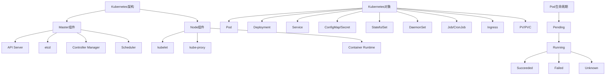
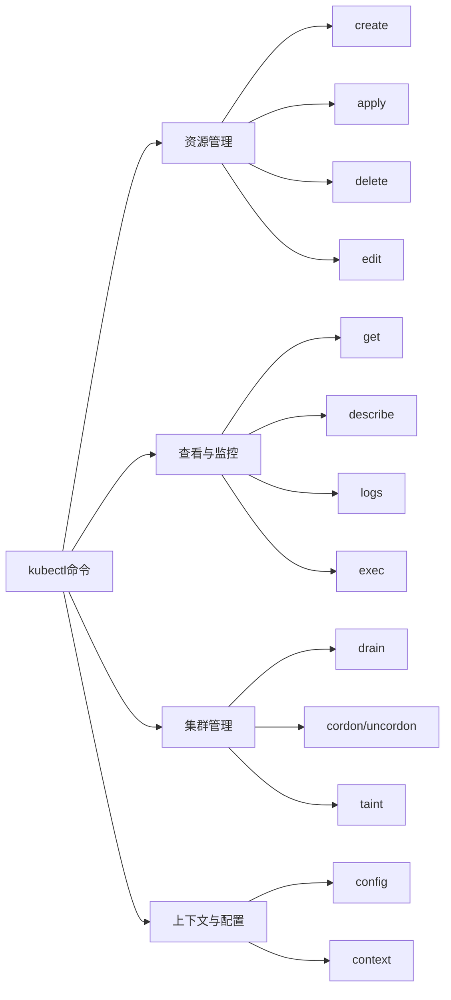

# Kubernetes (K8s) 参考指南

## 目录
- [Kubernetes (K8s) 参考指南](#kubernetes-k8s-参考指南)
  - [目录](#目录)
  - [1. Kubernetes 架构](#1-kubernetes-架构)
    - [1.1 Master 组件](#11-master-组件)
    - [1.2 Node 组件](#12-node-组件)
    - [1.3 附加组件](#13-附加组件)
  - [2. 核心概念](#2-核心概念)
    - [2.1 Pod](#21-pod)
    - [2.2 Controller](#22-controller)
    - [2.3 Service \& Networking](#23-service--networking)
    - [2.4 Storage](#24-storage)
    - [2.5 Configuration](#25-configuration)
  - [3. kubectl 命令](#3-kubectl-命令)
    - [3.1 基础命令](#31-基础命令)
    - [3.2 资源管理](#32-资源管理)
    - [3.3 查看与监控](#33-查看与监控)
    - [3.4 集群管理](#34-集群管理)
    - [3.5 上下文与配置](#35-上下文与配置)
    - [3.6 常用命令组合](#36-常用命令组合)
  - [4. YAML 配置示例](#4-yaml-配置示例)
    - [4.1 Pod](#41-pod)
    - [4.2 Deployment](#42-deployment)
    - [4.3 Service](#43-service)
    - [4.4 ConfigMap \& Secret](#44-configmap--secret)
    - [4.5 其他资源](#45-其他资源)
  - [5. 常见操作与最佳实践](#5-常见操作与最佳实践)
    - [5.1 资源管理](#51-资源管理)
    - [5.2 安全性](#52-安全性)
    - [5.3 监控与日志](#53-监控与日志)
    - [5.4 高可用性](#54-高可用性)
    - [5.5 故障排查](#55-故障排查)
  - [6. 参考资源](#6-参考资源)

## 1. Kubernetes 架构

Kubernetes 是一个开源的容器编排平台，用于自动化部署、扩展和管理容器化应用程序。



### 1.1 Master 组件

Master 组件组成了集群的控制平面，负责集群的全局决策和事件检测与响应。

| 组件 | 描述 |
|------|------|
| **API Server** | 提供 Kubernetes API，是所有组件通信的中枢 |
| **etcd** | 一致且高可用的键值存储，用于所有集群数据 |
| **Controller Manager** | 运行控制器进程，如节点控制器、副本控制器等 |
| **Scheduler** | 监视新创建的 Pod，并将其分配到节点 |

### 1.2 Node 组件

Node 组件运行在每个节点上，维护运行的 Pod 并提供 Kubernetes 运行环境。

| 组件 | 描述 |
|------|------|
| **kubelet** | 确保容器运行在 Pod 中，与 Master 组件通信 |
| **kube-proxy** | 维护节点上的网络规则，允许从集群内部或外部与 Pod 通信 |
| **Container Runtime** | 负责运行容器的软件，如 Docker、containerd、CRI-O 等 |

### 1.3 附加组件

| 组件 | 描述 |
|------|------|
| **DNS** | 为 Kubernetes 服务提供 DNS 记录 |
| **Dashboard** | 基于 Web 的 Kubernetes 用户界面 |
| **Ingress Controller** | 管理外部访问集群中服务的规则 |
| **Network Plugin** | 实现 Kubernetes 网络模型的软件 |
| **Metrics Server** | 收集资源使用数据 |

## 2. 核心概念

### 2.1 Pod

Pod 是 Kubernetes 中最小的可部署单元，可以包含一个或多个容器。

**特点**:
- 共享网络命名空间（IP 地址和端口）
- 共享存储卷
- 共同调度（总是运行在同一节点）

**生命周期**:
1. Pending: Pod 已创建，但容器尚未全部启动
2. Running: Pod 已绑定到节点，所有容器已启动
3. Succeeded: 所有容器已成功终止
4. Failed: 至少一个容器已终止，且至少一个容器终止失败
5. Unknown: 由于某种原因无法获取 Pod 状态

### 2.2 Controller

控制器管理 Pod 的副本、生命周期和更新。

| 控制器 | 用途 |
|-------|------|
| **Deployment** | 提供声明式更新和管理 Pod 和 ReplicaSet |
| **StatefulSet** | 管理有状态应用的部署和扩展，提供稳定的网络标识和持久存储 |
| **DaemonSet** | 确保所有（或部分）节点运行一个 Pod 副本 |
| **Job** | 运行一次性任务，确保指定数量的 Pod 成功完成 |
| **CronJob** | 按照指定的时间表运行 Job |

### 2.3 Service & Networking

| 资源 | 描述 |
|------|------|
| **Service** | 定义一组 Pod 的访问方式，提供固定 IP 和负载均衡 |
| **Ingress** | 管理外部访问集群中服务的规则，通常是 HTTP |
| **NetworkPolicy** | 指定 Pod 间通信规则 |

**Service 类型**:
- **ClusterIP**: 默认类型，仅集群内部可访问
- **NodePort**: 通过节点 IP 和静态端口访问
- **LoadBalancer**: 使用云提供商的负载均衡器
- **ExternalName**: 映射到外部服务

### 2.4 Storage

| 资源 | 描述 |
|------|------|
| **PersistentVolume (PV)** | 集群中的存储资源，由管理员配置或动态供应 |
| **PersistentVolumeClaim (PVC)** | 用户对存储的请求 |
| **StorageClass** | 定义动态供应 PV 的方式 |
| **Volume** | Pod 中容器可访问的目录 |

### 2.5 Configuration

| 资源 | 描述 |
|------|------|
| **ConfigMap** | 存储非机密配置数据 |
| **Secret** | 存储敏感信息，如密码、令牌等 |
| **ResourceQuota** | 限制命名空间中资源的使用 |
| **LimitRange** | 设置命名空间中资源的默认限制 |

## 3. kubectl 命令

kubectl 是 Kubernetes 命令行工具，用于与集群交互。



### 3.1 基础命令

```bash
# 获取版本信息
kubectl version

# 获取集群信息
kubectl cluster-info

# 获取 API 资源列表
kubectl api-resources

# 获取命令帮助
kubectl help [command]
```

### 3.2 资源管理

```bash
# 创建资源
kubectl create -f filename.yaml
kubectl create deployment nginx --image=nginx

# 应用配置
kubectl apply -f filename.yaml
kubectl apply -f directory/

# 删除资源
kubectl delete -f filename.yaml
kubectl delete pod <pod-name>
kubectl delete deployment <deployment-name>
kubectl delete namespace <namespace-name>

# 编辑资源
kubectl edit deployment <deployment-name>
```

### 3.3 查看与监控

```bash
# 获取资源列表
kubectl get pods
kubectl get deployments
kubectl get services
kubectl get all
kubectl get nodes

# 使用标签选择器
kubectl get pods -l app=nginx

# 查看资源详情
kubectl describe pod <pod-name>
kubectl describe deployment <deployment-name>

# 查看日志
kubectl logs <pod-name>
kubectl logs -f <pod-name>  # 持续查看
kubectl logs <pod-name> -c <container-name>  # 指定容器

# 在容器中执行命令
kubectl exec -it <pod-name> -- /bin/bash
kubectl exec <pod-name> -- ls /

# 查看资源使用情况
kubectl top nodes
kubectl top pods
```

### 3.4 集群管理

```bash
# 标记节点不可调度
kubectl cordon <node-name>

# 恢复节点可调度
kubectl uncordon <node-name>

# 排空节点（将 Pod 迁移到其他节点）
kubectl drain <node-name> --ignore-daemonsets

# 添加污点
kubectl taint nodes <node-name> key=value:effect

# 移除污点
kubectl taint nodes <node-name> key:effect-
```

### 3.5 上下文与配置

```bash
# 查看当前上下文
kubectl config current-context

# 查看所有上下文
kubectl config get-contexts

# 切换上下文
kubectl config use-context <context-name>

# 查看配置
kubectl config view
```

### 3.6 常用命令组合

```bash
# 查看所有命名空间中的所有 Pod
kubectl get pods --all-namespaces

# 按名称排序获取节点
kubectl get nodes --sort-by=.metadata.name

# 获取所有 Pod 的资源使用情况
kubectl top pods --all-namespaces

# 强制删除 Pod
kubectl delete pod <pod-name> --grace-period=0 --force

# 使用端口转发访问服务
kubectl port-forward service/<service-name> 8080:80

# 查看 Pod 的 YAML 定义
kubectl get pod <pod-name> -o yaml

# 在不应用的情况下查看变更
kubectl diff -f filename.yaml

# 创建命名空间
kubectl create namespace <namespace-name>

# 在特定命名空间中操作
kubectl -n <namespace-name> get pods
```

## 4. YAML 配置示例

### 4.1 Pod

```yaml
apiVersion: v1
kind: Pod
metadata:
  name: nginx-pod
  labels:
    app: nginx
spec:
  containers:
  - name: nginx
    image: nginx:1.19
    ports:
    - containerPort: 80
    resources:
      limits:
        cpu: "0.5"
        memory: "512Mi"
      requests:
        cpu: "0.2"
        memory: "256Mi"
    livenessProbe:
      httpGet:
        path: /
        port: 80
      initialDelaySeconds: 15
      periodSeconds: 10
    readinessProbe:
      httpGet:
        path: /
        port: 80
      initialDelaySeconds: 5
      periodSeconds: 5
```

### 4.2 Deployment

```yaml
apiVersion: apps/v1
kind: Deployment
metadata:
  name: nginx-deployment
  labels:
    app: nginx
spec:
  replicas: 3
  selector:
    matchLabels:
      app: nginx
  strategy:
    type: RollingUpdate
    rollingUpdate:
      maxSurge: 1
      maxUnavailable: 0
  template:
    metadata:
      labels:
        app: nginx
    spec:
      containers:
      - name: nginx
        image: nginx:1.19
        ports:
        - containerPort: 80
```

### 4.3 Service

```yaml
apiVersion: v1
kind: Service
metadata:
  name: nginx-service
spec:
  selector:
    app: nginx
  ports:
  - port: 80
    targetPort: 80
  type: ClusterIP
```

### 4.4 ConfigMap & Secret

**ConfigMap**:
```yaml
apiVersion: v1
kind: ConfigMap
metadata:
  name: app-config
data:
  app.properties: |
    environment=production
    log.level=info
  settings.json: |
    {
      "theme": "dark",
      "timeout": 30
    }
```

**Secret**:
```yaml
apiVersion: v1
kind: Secret
metadata:
  name: app-secrets
type: Opaque
data:
  username: YWRtaW4=  # base64 encoded 'admin'
  password: cGFzc3dvcmQxMjM=  # base64 encoded 'password123'
```

### 4.5 其他资源

**Ingress**:
```yaml
apiVersion: networking.k8s.io/v1
kind: Ingress
metadata:
  name: nginx-ingress
  annotations:
    nginx.ingress.kubernetes.io/rewrite-target: /
spec:
  rules:
  - host: example.com
    http:
      paths:
      - path: /
        pathType: Prefix
        backend:
          service:
            name: nginx-service
            port:
              number: 80
```

**PersistentVolumeClaim**:
```yaml
apiVersion: v1
kind: PersistentVolumeClaim
metadata:
  name: data-pvc
spec:
  accessModes:
    - ReadWriteOnce
  resources:
    requests:
      storage: 10Gi
  storageClassName: standard
```

## 5. 常见操作与最佳实践

### 5.1 资源管理

**资源请求与限制**:
- 始终为容器设置资源请求和限制
- 避免过度分配资源
- 使用命名空间级别的 ResourceQuota 和 LimitRange

**标签与选择器**:
- 使用标签组织资源
- 使用标签选择器进行资源筛选和关联
- 采用一致的标签命名约定

**配置管理**:
- 使用 ConfigMap 存储配置
- 使用 Secret 存储敏感信息
- 避免在 Pod 规范中硬编码配置

### 5.2 安全性

**Pod 安全**:
- 使用 SecurityContext 限制容器权限
- 避免使用特权容器
- 实施网络策略限制 Pod 间通信

**认证与授权**:
- 使用 RBAC 控制访问权限
- 遵循最小权限原则
- 定期轮换证书和凭据

**镜像安全**:
- 使用可信的镜像源
- 扫描镜像漏洞
- 实施镜像拉取策略

### 5.3 监控与日志

**监控**:
- 部署 Prometheus 收集指标
- 使用 Grafana 创建仪表板
- 设置适当的告警规则

**日志**:
- 集中收集日志（如使用 EFK 或 ELK 堆栈）
- 实施日志轮换
- 避免在容器中存储日志

**审计**:
- 启用 Kubernetes 审计日志
- 定期审查审计日志
- 保留足够的审计历史

### 5.4 高可用性

**应用高可用**:
- 使用多副本部署
- 实施适当的健康检查
- 使用 Pod 反亲和性避免单点故障

**集群高可用**:
- 部署多个 master 节点
- 跨可用区分布节点
- 实施适当的备份和恢复策略

**更新策略**:
- 使用滚动更新
- 实施金丝雀部署
- 设置适当的更新策略参数

### 5.5 故障排查

**常见问题**:
1. **Pod 启动失败**
   - 检查镜像是否存在
   - 检查资源限制
   - 查看 Pod 事件和日志
   
2. **服务不可访问**
   - 检查 Service 和 Pod 标签是否匹配
   - 验证 Pod 是否正常运行
   - 检查网络策略
   
3. **节点问题**
   - 检查节点状态和资源使用情况
   - 验证 kubelet 是否正常运行
   - 检查系统日志

**调试命令**:
```bash
# 检查 Pod 状态
kubectl describe pod <pod-name>

# 查看 Pod 日志
kubectl logs <pod-name>

# 检查节点状态
kubectl describe node <node-name>

# 检查事件
kubectl get events --sort-by=.metadata.creationTimestamp

# 在容器中执行命令
kubectl exec -it <pod-name> -- /bin/sh
```

## 6. 参考资源

- [Kubernetes 官方文档](https://kubernetes.io/docs/)
- [kubectl 备忘单](https://kubernetes.io/docs/reference/kubectl/cheatsheet/)
- [Kubernetes 最佳实践](https://kubernetes.io/docs/concepts/configuration/overview/)
- [Kubernetes 模式](https://www.oreilly.com/library/view/kubernetes-patterns/9781492050278/)
- [Kubernetes 安全最佳实践](https://kubernetes.io/docs/concepts/security/)
