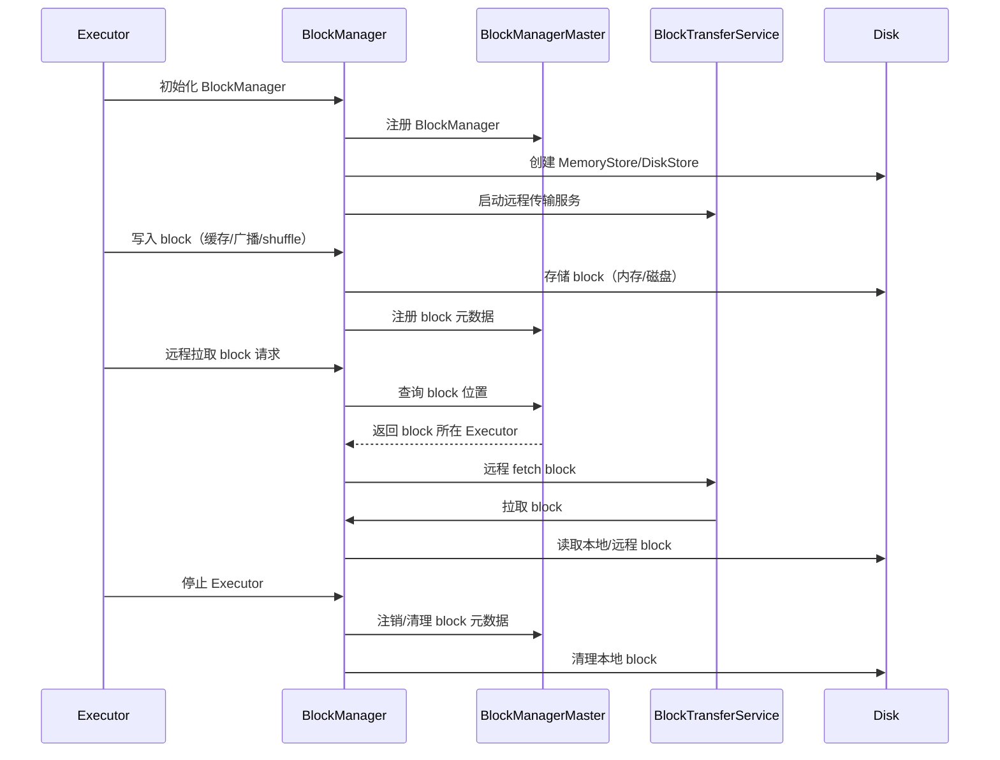
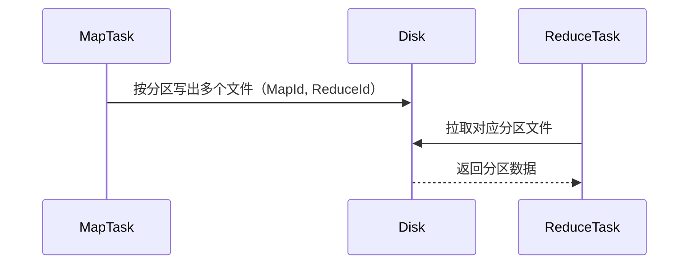
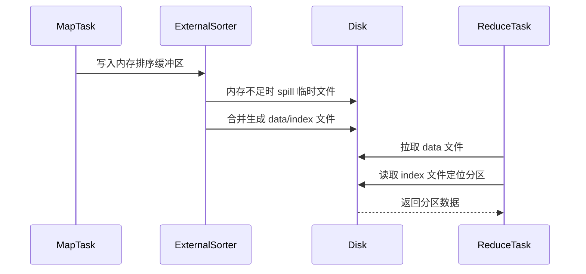
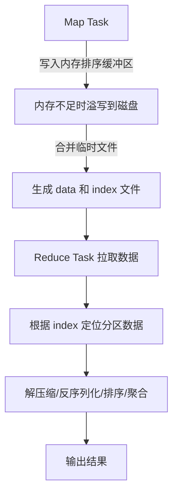
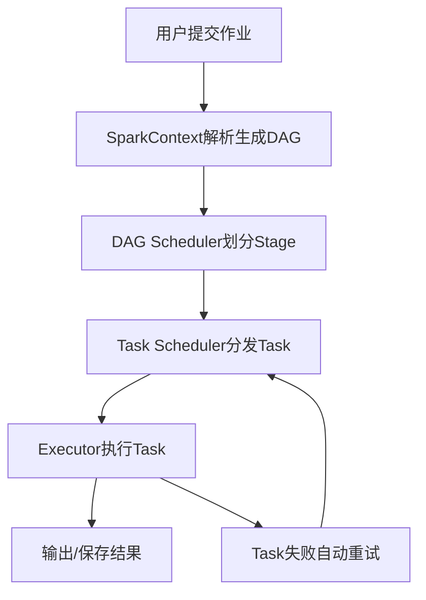
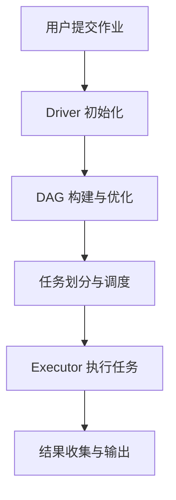
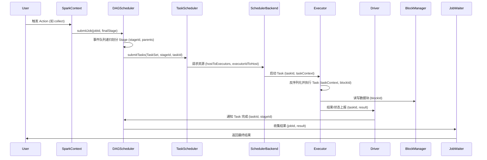

<!-- filepath: /Users/huangg/data/sublime/资料/spark.md -->
# 目录

- [目录](#目录)
- [Spark 基础概念](#spark-基础概念)
  - [RDD、DataFrame、Dataset](#rdddataframedataset)
    - [基础与区别](#基础与区别)
    - [常用操作](#常用操作)
  - [Spark SQL 与 Catalyst 优化器](#spark-sql-与-catalyst-优化器)
  - [参数配置](#参数配置)
- [Spark 核心组件与原理](#spark-核心组件与原理)
  - [BlockManager](#blockmanager)
    - [操作时序图](#操作时序图)
  - [Shuffle机制与源码解析](#shuffle机制与源码解析)
    - [Shuffle 原理与流程](#shuffle-原理与流程)
    - [Shuffle 类型与时序图](#shuffle-类型与时序图)
      - [Hash Shuffle 时序图](#hash-shuffle-时序图)
      - [Sort Shuffle 时序图](#sort-shuffle-时序图)
    - [Sort Shuffle 图解](#sort-shuffle-图解)
    - [Shuffle 优化与调优](#shuffle-优化与调优)
    - [Spark Shuffle 调优](#spark-shuffle-调优)
  - [内存管理](#内存管理)
    - [内存管理机制](#内存管理机制)
    - [内存管理优化](#内存管理优化)
    - [内存管理常见问题](#内存管理常见问题)
    - [内存管理源码解析](#内存管理源码解析)
  - [容错机制](#容错机制)
- [Spark 作业与任务流程](#spark-作业与任务流程)
  - [作业执行流程](#作业执行流程)
    - [作业执行流程图示](#作业执行流程图示)
  - [任务提交流程与源码解析](#任务提交流程与源码解析)
    - [提交流程概述](#提交流程概述)
    - [提交流程图示](#提交流程图示)
    - [关键组件](#关键组件)
    - [提交方式](#提交方式)
    - [提交命令示例](#提交命令示例)
- [Spark 性能优化](#spark-性能优化)
  - [查询与作业优化](#查询与作业优化)
  - [Join 优化](#join-优化)
  - [缓存与持久化](#缓存与持久化)
  - [代码层面优化](#代码层面优化)
- [Spark 通信与网络](#spark-通信与网络)
  - [Netty 基础与应用](#netty-基础与应用)
- [Spark 关键参数与配置](#spark-关键参数与配置)
  - [资源相关](#资源相关)
  - [JVM 相关参数](#jvm-相关参数)
  - [其他常用参数](#其他常用参数)
- [Spark 典型面试题与答疑](#spark-典型面试题与答疑)
  - [常见面试题归纳](#常见面试题归纳)
- [附录](#附录)
- [Spark 源码解析](#spark-源码解析)
  - [任务提交流程源码解析](#任务提交流程源码解析)
    - [关键类与核心职责](#关键类与核心职责)
    - [源码主流程梳理](#源码主流程梳理)
    - [关键源码片段与伪代码](#关键源码片段与伪代码)
    - [详细时序图（替换流程图，补充变量与交互）](#详细时序图替换流程图补充变量与交互)
    - [事件驱动与容错机制](#事件驱动与容错机制)
    - [关键源码文件索引](#关键源码文件索引)
    - [关键对象、变量与交互逻辑](#关键对象变量与交互逻辑)
      - [主要对象与变量](#主要对象与变量)
      - [交互流程与变量流转](#交互流程与变量流转)
      - [典型对象交互时序图](#典型对象交互时序图)
      - [关键变量生命周期说明](#关键变量生命周期说明)
  - [Shuffle 源码解析](#shuffle-源码解析)
    - [关键类与方法](#关键类与方法)
    - [源码流程梳理](#源码流程梳理)
      - [关键对象与变量](#关键对象与变量)
      - [Shuffle 时序图（变量交互）](#shuffle-时序图变量交互)
      - [典型源码调用链](#典型源码调用链)
      - [Shuffle 关键流程变量说明](#shuffle-关键流程变量说明)
- [内存管理源码解析](#内存管理源码解析-1)

---

# Spark 基础概念

## RDD、DataFrame、Dataset

### 基础与区别

- RDD（Resilient Distributed Dataset）：弹性分布式数据集，核心抽象，支持容错、分布式、不可变、延迟计算。
- DataFrame：结构化分布式数据表，支持 SQL 查询，依赖 Catalyst 优化器和 Tungsten 引擎。
- Dataset：类型安全的分布式数据集，DataFrame 是 Dataset 的特例。
- 区别：RDD 类型安全、无结构，DataFrame/Dataset 有结构，性能更优。

### 常用操作

- Transformation（如 map、filter、reduceByKey）：惰性执行，生成新 RDD。
- Action（如 collect、count、saveAsTextFile）：触发实际计算。
- 分区调整：repartition/coalesce，读取时指定分区数。

---

## Spark SQL 与 Catalyst 优化器

- Spark SQL：结构化/半结构化数据处理模块，支持 SQL 语法和 DataFrame/Dataset API。
- Catalyst 优化器：解析、优化、生成物理计划和代码。
- 查询执行流程：SQL → 逻辑计划 → 优化计划 → 物理计划 → RDD。
- explain() 查看执行计划。

---

## 参数配置

- 输出压缩：

```scala
df.write.option("compression", "gzip").csv("output_csv_dir")
df.write.option("compression", "gzip").json("output_json_dir")
df.write.option("compression", "bzip2").text("output_text_dir")
```

- 注册 UDF/Jar：

```scala
import com.ys.axe.saas.comn.util.IPV6Util
import org.apache.spark.sql.functions.udf
val fullIpv6 = udf((arg: String) => IPV6Util.getFullIPv6(arg))
spark.udf.register("fullIpv6", fullIpv6)
```

```sql
create function default.gt_geohash_dist as 'com.glab.function.lbs.GetDistanceByGeoHash' using jar 'hdfs://gt-wz-ga/ext-jar/ys-bi-udf-hive-function.jar';
```

---

# Spark 核心组件与原理

## BlockManager

### 操作时序图


---

## Shuffle机制与源码解析

### Shuffle 原理与流程

- Shuffle是指在数据重分区（Data Redistribution）过程中，将数据从一个或多个输入分区重新分布到新的输出分区的操作。
- 主要发生在 groupByKey、reduceByKey、join 等算子。
- 过程分为：
  1. Map阶段：输入数据按key分组，形成(key, value)对。
  2. Shuffle阶段：将Map端输出的数据根据分区规则写到本地磁盘，等待Reduce端拉取。
  3. Reduce阶段：Reduce任务拉取对应分区的数据，进行聚合、合并等操作，输出最终结果。
- Shuffle过程涉及大量磁盘和网络I/O，是Spark性能瓶颈之一。

### Shuffle 类型与时序图

#### Hash Shuffle 时序图


#### Sort Shuffle 时序图


### Sort Shuffle 图解

- Sort Shuffle 是 Spark 中常用的 Shuffle 类型，适用于大规模数据处理。
- Map 端：
  1. 数据写入内存排序缓冲区。
  2. 内存不足时溢写到磁盘，生成多个临时文件。
  3. 最后将内存结果与磁盘文件合并，生成一个 data 文件和一个 index 文件。
- Reduce 端：
  1. 拉取 Map 端的 data 文件。
  2. 根据 index 文件定位分区数据。
  3. 对数据进行解压缩、反序列化、排序和聚合。



### Shuffle 优化与调优

- 压缩：spark.shuffle.compress，减少网络传输量。
- 合理设置分区数：spark.sql.shuffle.partitions，避免分区过多或过少。
- 使用本地化Shuffle，减少网络I/O。
- 使用广播变量和累加器，减少Shuffle数据量。
- 启用spill机制，内存不足时溢写磁盘，防止OOM。
- 聚合缓冲区：Map端本地聚合，减少传输数据量。
- 合理选择Shuffle类型：大数据量优先Sort Shuffle。

### Spark Shuffle 调优

- **细粒度分配**：
  - 合理设置分区数，避免分区过多或过少。
  - 使用 `spark.sql.shuffle.partitions` 参数调整分区数。

- **动态分配资源**：
  - 启用动态分配：`spark.dynamicAllocation.enabled=true`。
  - 设置最小和最大 Executor 数量：
    ```properties
    spark.dynamicAllocation.minExecutors=2
    spark.dynamicAllocation.maxExecutors=10
    ```

- **压缩与序列化**：
  - 启用压缩：`spark.shuffle.compress=true`。
  - 使用高效序列化器：`spark.serializer=org.apache.spark.serializer.KryoSerializer`。

- **本地化 Shuffle**：
  - 尽量将 Shuffle 数据放置在与计算节点相同的节点上，减少网络传输。

---

## 内存管理

### 内存管理机制

- Spark 内存分为堆内（On-Heap）和堆外（Off-Heap）内存。
- 堆内内存由 JVM 管理，堆外内存由 Spark 直接管理，减少 GC 影响。
- 内存池分为：
  1. **Storage Memory**：用于缓存 RDD、DataFrame、广播变量等。
  2. **Execution Memory**：用于任务运行中的临时数据存储（如 Shuffle、Join）。
- Storage Memory 和 Execution Memory 动态共享，优先满足 Execution Memory。
- 内存不足时：
  - 缓存数据会被逐步淘汰。
  - 计算数据会溢写到磁盘（spill）。

### 内存管理优化

1. **调整内存分配参数**：
   - `spark.executor.memory`：每个 Executor 的内存总大小。
   - `spark.memory.fraction`：Execution 和 Storage 内存占总内存的比例，默认 0.6。
   - `spark.memory.storageFraction`：Storage 内存占共享内存池的比例，默认 0.5。

2. **启用堆外内存**：
   - `spark.memory.offHeap.enabled=true`。
   - `spark.memory.offHeap.size=2G`。

3. **减少内存碎片化**：
   - 使用堆外内存。
   - 调整 JVM 堆大小，减少频繁 GC。

4. **优化任务执行**：
   - 减少宽依赖操作。
   - 使用广播变量，避免重复传输大数据。

### 内存管理常见问题

1. **OOM（内存溢出）**：
   - 原因：分区数据过大、内存不足。
   - 解决：增加内存、调整分区数、启用 spill。

2. **GC 开销过高**：
   - 原因：频繁创建和销毁对象。
   - 解决：使用堆外内存、优化代码逻辑。

3. **内存碎片化**：
   - 原因：长生命周期对象占用内存。
   - 解决：减少临时对象、合理分配内存。

### 内存管理源码解析

1. Executor 启动时初始化 `UnifiedMemoryManager`，划分 Execution/Storage 内存池。
2. 任务执行时，`TaskMemoryManager` 向内存管理器申请 Execution Memory。
3. 缓存数据时，`MemoryStore` 申请 Storage Memory。
4. 内存不足时，优先释放 Storage Memory，或将数据 spill 到磁盘。

---

## 容错机制

- Spark 通过RDD的血缘关系（Lineage）实现容错。每个RDD都记录了其生成方式（依赖链），当分区数据丢失时可通过重算恢复。
- Shuffle数据丢失时，相关Map Task会被重新调度执行，生成丢失的数据块。
- 容错机制依赖于DAG调度和任务重试，保证作业最终完成。
- 常见容错场景：节点故障、磁盘损坏、网络异常等。

---

# Spark 作业与任务流程

## 作业执行流程

1. 用户提交作业（如SQL、DataFrame操作）。
2. SparkContext解析作业，生成DAG（有向无环图）。
3. DAG Scheduler将DAG划分为多个Stage（阶段），每个Stage由多个Task组成。
4. Task Scheduler负责将Task分发到集群各Executor节点。
5. 各Executor执行Task，产生中间结果（如Shuffle），最终输出结果。
6. 失败Task自动重试，直至成功或超过最大重试次数。

### 作业执行流程图示



---

## 任务提交流程与源码解析

### 提交流程概述

1. **用户提交作业**：
   - 用户通过 Spark 提供的 API（如 Spark SQL、DataFrame、RDD）提交作业。

2. **Driver 初始化**：
   - Driver 进程启动，创建 SparkContext，负责作业的调度和任务分发。

3. **DAG 构建与优化**：
   - SparkContext 将用户代码解析为逻辑执行计划（DAG）。
   - 使用 Catalyst 优化器对逻辑计划进行优化，生成物理执行计划。

4. **任务划分与调度**：
   - DAG Scheduler 将物理计划划分为多个 Stage，每个 Stage 包含多个 Task。
   - Task Scheduler 将 Task 分发到集群中的 Executor 节点。

5. **Executor 执行任务**：
   - Executor 进程接收 Task，执行计算并将结果返回给 Driver。

6. **结果收集与输出**：
   - Driver 收集各 Task 的结果，生成最终输出。

### 提交流程图示



### 关键组件

- **Driver**：
  - 负责作业的整体调度和任务分发。
  - 维护作业的元数据和状态。

- **Executor**：
  - 负责执行分配的 Task。
  - 提供内存存储和计算资源。

- **Cluster Manager**：
  - 负责资源分配和管理（如 YARN、Mesos、Kubernetes）。

### 提交方式

1. **本地模式**：
   - 适用于开发和调试，所有组件运行在单机上。

2. **集群模式**：
   - Driver 运行在集群中，适用于生产环境。

3. **客户端模式**：
   - Driver 运行在提交作业的客户端，适用于交互式分析。

### 提交命令示例

```bash
spark-submit \
  --class org.apache.spark.examples.SparkPi \
  --master yarn \
  --deploy-mode cluster \
  --executor-memory 2G \
  --total-executor-cores 4 \
  examples/jars/spark-examples_2.12-3.1.2.jar 100
```

---

# Spark 性能优化

## 查询与作业优化

- 选择合适存储格式（Parquet、ORC）。
- 调整分区策略，避免数据倾斜。
- 使用缓存/持久化。
- 启用谓词下推。
- 优化 Join 策略。
- 动态分区裁剪。
- 调优参数配置。

## Join 优化

- 广播 Join：小表广播到每个节点，减少 shuffle。
- 预处理数据，减少 Join 输入量。
- 合理选择 Join 策略，调整分区数。
- 使用宽表减少 Join 次数。

## 缓存与持久化

- 缓存（Cache）：默认内存，适用于频繁使用数据。
- 持久化（Persist）：多种存储级别，适用更灵活场景。
- 选择依据：数据量、使用频率、容错需求。

## 代码层面优化

- map/mapPartitions 少创建变量。
- 复杂逻辑用 mapPartitions。
- 广播变量或分区内只创建一次变量。
- 谨慎使用 reduceByKey，注意返回数据格式。

---

# Spark 通信与网络

## Netty 基础与应用

- Netty：高性能异步事件驱动网络通信框架，Spark 用于 RPC、Shuffle、心跳。
- 线程模型：Reactor，BossGroup 监听连接，WorkerGroup 处理 I/O。
- 内存管理：池化 ByteBuf，动态扩展和释放。
- 异常排查：日志、调试工具、分析线程池和缓冲区。
- 关键参数：spark.shuffle.io.numConnectionsPerPeer、spark.network.timeout、spark.shuffle.io.preferDirectBufs、spark.rpc.netty.dispatcher.numThreads。
- 性能调优：调整线程池、连接数、序列化、内存池、缓冲区。

---

# Spark 关键参数与配置

## 资源相关

```properties
spark.executor.memoryOverhead=2048
spark.memory.offHeap.enabled=true
spark.memory.offHeap.size=2G
spark.sql.autoBroadcastJoinThreshold=2g
spark.dynamicAllocation.enabled=true
spark.files.maxPartitionBytes=128m
spark.files.openCostInBytes=4m
spark.hadoop.parquet.enable.summary-metadata=true
```

## JVM 相关参数

```properties
--conf "spark.executor.extraJavaOptions=-XX:+PrintHeapAtGC -XX:+UseG1GC -XX:+PrintGCDetails -XX:+PrintGCTimeStamps"
--conf "spark.driver.extraJavaOptions=-XX:+PrintHeapAtGC"
-XX:+PrintGC
-XX:+PrintGCDetails
-XX:+PrintHeapAtGC
-XX:+PrintGCTimeStamps
-XX:+TraceClassLoading
-XX:+HeapDumpOnOutOfMemoryError
-Xloggc:/path/to/gc.log
```

## 其他常用参数

```properties
spark.sql.parquet.binaryAsString=true
spark.sql.shuffle.partitions=300
spark.default.parallelism=300
```

---

# Spark 典型面试题与答疑

## 常见面试题归纳

- RDD、DataFrame、Dataset 区别与联系
- Spark SQL 查询优化方法
- Shuffle 原理与优化
- 数据倾斜与分区调整
- 广播 Join 机制
- 内存管理与 OOM 避免
- Netty 通信原理与调优
- 代码层面优化建议

（详细问答已合并入各主题章节，避免重复）

---


# Spark 源码解析

本章节结合源码，详细解析 Spark 任务提交流程、Shuffle 流程、内存管理等核心机制的实现原理，帮助深入理解 Spark 的底层设计。

## 任务提交流程源码解析

### 关键类与核心职责
- `SparkContext`：用户 API 入口，负责环境初始化、作业提交、资源管理。
- `DAGScheduler`：将作业划分为 Stage，管理 Stage 依赖，调度 TaskSet。
- `TaskSchedulerImpl`：将 TaskSet 分发到集群 Executor，管理 Task 状态。
- `SchedulerBackend`：与底层集群管理器（如 YARN、Standalone、K8s）通信，分配资源。
- `JobWaiter`：用于等待作业执行完成，收集结果。
- `EventLoop`：事件驱动机制，异步处理调度事件。

### 源码主流程梳理
1. **用户提交作业**
   - 通过 RDD、DataFrame、SQL 等 API 触发 Action（如 collect、count、save）。
   - 入口方法：`SparkContext.submitJob()`。
2. **DAGScheduler 处理作业**
   - `DAGScheduler.runJob()`：根据 RDD 依赖关系构建 DAG，有向无环图。
   - 生成 Job、Stage、TaskSet，管理 Stage 之间的依赖。
   - 通过事件驱动（EventLoop）异步调度 Stage 和 Task。
3. **Stage 划分与依赖管理**
   - 窄依赖（如 map、filter）合并为同一 Stage，宽依赖（如 shuffle、join）切分为新 Stage。
   - 递归查找所有父 Stage，确保依赖顺序。
4. **TaskSet 提交与调度**
   - `TaskScheduler.submitTasks()`：将 TaskSet 提交给 TaskSchedulerImpl。
   - TaskScheduler 负责将 Task 分发到合适的 Executor。
   - 通过 `SchedulerBackend` 与集群管理器通信，获取资源并启动 Task。
5. **Executor 执行 Task**
   - Executor 进程拉取 Task，反序列化后执行。
   - 计算结果通过 BlockManager 返回 Driver。
   - Task 状态和结果通过心跳机制和事件上报。
6. **结果收集与作业完成**
   - Driver 端 JobWaiter 等待所有 Task 完成，收集结果。
   - 若 Task 失败，DAGScheduler 负责重试和容错。
   - 所有 Stage 成功后，作业完成，返回最终结果。

### 关键源码片段与伪代码

```scala
// 用户触发 Action
rdd.collect() // -> SparkContext.runJob

// SparkContext.submitJob
val jobWaiter = dagScheduler.submitJob(...)

// DAGScheduler.submitJob
// 1. 构建 Job、Stage
// 2. 事件驱动提交 Stage
// 3. 监听 Task 完成

def submitJob(...): JobWaiter = {
  // 构建 finalStage
  submitStage(finalStage)
  // 等待所有 Task 完成
  jobWaiter.awaitResult()
}

def submitStage(stage): Unit = {
  // 递归提交父 Stage
  for (parent <- stage.parents) submitStage(parent)
  // 提交当前 Stage 的 TaskSet
  taskScheduler.submitTasks(taskSet)
}

// TaskSchedulerImpl.submitTasks
// 1. 资源分配
// 2. 启动 Task
// 3. 监听 Task 状态

// Executor 端
while (true) {
  val task = fetchTask()
  runTask(task)
  sendResultToDriver()
}
```


### 事件驱动与容错机制
- DAGScheduler 采用事件驱动（EventLoop），异步处理作业调度、Task 完成、失败重试等事件。
- Task 失败时，DAGScheduler 会根据失败类型（如 FetchFailed、ExecutorLost）决定重试策略。
- 支持 Stage 级别和 Task 级别的重试，保证作业最终完成。

### 关键源码文件索引
- `org.apache.spark.SparkContext`
- `org.apache.spark.scheduler.DAGScheduler`
- `org.apache.spark.scheduler.TaskSchedulerImpl`
- `org.apache.spark.scheduler.SchedulerBackend`
- `org.apache.spark.executor.Executor`
- `org.apache.spark.scheduler.JobWaiter`

### 关键对象、变量与交互逻辑

#### 主要对象与变量
- `SparkContext`：
  - `dagScheduler: DAGScheduler`：作业调度核心对象。
  - `taskScheduler: TaskScheduler`：任务调度与分发。
  - `env: SparkEnv`：运行环境，包含 BlockManager、Serializer、RpcEnv 等。
- `DAGScheduler`：
  - `eventQueue: EventLoop[DAGSchedulerEvent]`：事件队列，异步调度。
  - `jobIdToActiveJob: HashMap[Int, ActiveJob]`：作业 ID 到作业对象的映射。
  - `stageIdToStage: HashMap[Int, Stage]`：Stage ID 到 Stage 对象的映射。
  - `shuffleToMapStage: HashMap[Int, ShuffleMapStage]`：Shuffle ID 到 MapStage 的映射。
- `TaskSchedulerImpl`：
  - `backend: SchedulerBackend`：与集群资源管理器通信。
  - `taskIdToTaskSetManager: HashMap[Long, TaskSetManager]`：Task ID 到 TaskSet 管理器。
- `Executor`：
  - `executorId: String`：唯一标识。
  - `taskRunner: TaskRunner`：任务执行线程。
  - `blockManager: BlockManager`：数据块管理。

#### 交互流程与变量流转
1. **作业提交**
   - 用户调用 `rdd.collect()`，SparkContext 生成 JobId，构造 `ActiveJob`，注册到 `jobIdToActiveJob`。
   - 通过 `dagScheduler.submitJob()` 触发事件，放入 `eventQueue`。
2. **DAGScheduler 事件驱动**
   - `eventQueue` 异步消费事件，处理 `JobSubmitted`、`StageCompleted`、`TaskCompletion` 等事件。
   - 递归构建 Stage，依赖分析，生成 `ResultStage`、`ShuffleMapStage`，注册到 `stageIdToStage`。
   - 每个 Stage 生成 TaskSet，交给 TaskScheduler。
3. **TaskSet 分发与资源分配**
   - `TaskScheduler.submitTasks()`：将 TaskSet 提交给 TaskSchedulerImpl。
   - TaskScheduler 负责将 Task 分发到合适的 Executor。
   - 通过 `SchedulerBackend` 与集群管理器通信，获取资源并启动 Task。
4. **Executor 拉取与执行 Task**
   - Executor 通过 RPC 拉取 Task，反序列化为 `Task` 对象。
   - `TaskRunner` 线程执行 Task，期间会用到 `blockManager` 读写数据块。
   - 任务执行过程中，变量如 `taskContext`（记录 Task 状态、尝试次数、累加器等）贯穿始终。
5. **结果与状态回传**
   - Task 执行完毕后，结果通过 `blockManager` 或直接序列化后 RPC 发送给 Driver。
   - Executor 通过心跳机制（HeartbeatReceiver）周期性上报状态。
   - Driver 端 `JobWaiter` 监听所有 Task 完成，收集结果。
6. **失败重试与容错**
   - Task 失败时，`DAGScheduler` 通过事件队列收到 `TaskFailed`，分析失败类型。
   - 对于 FetchFailed 等宽依赖失败，重新提交父 Stage。
   - 变量如 `failedStages`、`runningStages`、`waitingStages` 维护调度状态。

#### 典型对象交互时序图


#### 关键变量生命周期说明
- `jobId`：贯穿整个作业生命周期，唯一标识一次作业。
- `stageId`：每个 Stage 唯一标识，便于依赖管理和重试。
- `taskId`：每个 Task 唯一标识，便于调度、重试和状态跟踪。
- `taskContext`：Task 执行期间的上下文，记录尝试次数、累加器、状态等。
- `blockId`：数据块唯一标识，BlockManager 读写数据的核心。

---

## Shuffle 源码解析

### 关键类与方法
- `ShuffleManager`：Shuffle 管理接口，支持 Hash/Sort Shuffle。
- `SortShuffleManager`：默认实现，支持大规模数据。
- `ShuffleWriter`/`ShuffleReader`：写入/读取 Shuffle 数据。
- `BlockManager`：管理数据块的本地/远程存储与传输。

### 源码流程梳理

1. **Map 端 Task 执行**
   - 每个 Map Task 处理输入分区数据，调用 `ShuffleManager.getWriter()` 获取 `ShuffleWriter` 实例。
   - `ShuffleWriter.write(records)`：将数据按分区写入内存缓冲区（如 `ExternalSorter`）。
   - 内存不足时，`spill` 到磁盘，生成临时文件。
   - 所有数据处理完后，`mergeSpills` 合并内存和磁盘文件，生成最终的 shuffle data 文件和 index 文件。
   - 通过 `BlockManager` 注册 shuffle block，供 Reduce 端拉取。
   - 关键变量：`shuffleId`、`mapId`、`blockId`、`partitionId`、`spillFiles`、`dataFile`、`indexFile`。

2. **BlockManager 交互**
   - `BlockManager` 负责 shuffle block 的本地存储、注册、元数据维护。
   - 通过 `BlockManagerMaster`（Driver 端）注册 block 元数据，供 Reduce 端定位。
   - 变量：`blockId`、`blockStatus`、`blockLocations`。

3. **Reduce 端 Task 拉取数据**
   - Reduce Task 启动时，调用 `ShuffleManager.getReader()` 获取 `ShuffleReader` 实例。
   - `ShuffleReader.read()`：根据 `shuffleId`、`reduceId`，向 `BlockManagerMaster` 查询所有 Map 端的 block 位置。
   - 通过 `BlockTransferService` 拉取本地或远程的 shuffle block。
   - 拉取的数据块会被解压缩、反序列化，聚合后参与后续计算。
   - 变量：`shuffleId`、`reduceId`、`blockId`、`blockLocations`、`fetchFailed`。

4. **容错与重试**
   - Reduce 端拉取 block 失败（如 FetchFailed），会向 Driver 上报，DAGScheduler 重新调度对应 Map Task。
   - 变量：`failedBlocks`、`fetchFailed`、`reRunMapTask`。

#### 关键对象与变量
- `ShuffleManager`：统一 shuffle 入口，管理 writer/reader。
- `SortShuffleManager`/`HashShuffleManager`：不同实现，决定数据写出方式。
- `ShuffleWriter`/`ShuffleReader`：写入/读取 shuffle 数据的核心对象。
- `BlockManager`/`BlockManagerMaster`：数据块本地/全局管理。
- `ExternalSorter`：Map 端排序、spill、merge 的实现。
- 变量：`shuffleId`、`mapId`、`reduceId`、`blockId`、`spillFiles`、`dataFile`、`indexFile`、`blockLocations`。

#### Shuffle 时序图（变量交互）


#### 典型源码调用链
```scala
// Map 端
val writer = shuffleManager.getWriter(shuffleHandle, mapId, context)
writer.write(records) // -> ExternalSorter.insertAll -> spill/merge -> BlockManager

// Reduce 端
val reader = shuffleManager.getReader(shuffleHandle, startPartition, endPartition, context)
reader.read() // -> BlockManagerMaster.getLocations -> BlockTransferService.fetchBlocks
```

#### Shuffle 关键流程变量说明
- `shuffleId`：每次 shuffle 操作的唯一标识。
- `mapId`：每个 Map Task 的唯一标识。
- `reduceId`：每个 Reduce Task 的唯一标识。
- `blockId`：每个 shuffle 分区数据块的唯一标识。
- `spillFiles`：Map 端溢写到磁盘的临时文件集合。
- `dataFile`/`indexFile`：最终 shuffle 输出文件。
- `blockLocations`：所有 Map 端 block 的物理位置。
- `fetchFailed`：Reduce 拉取失败标记，触发重试。

---

# 内存管理源码解析

1. Executor 启动时初始化 `UnifiedMemoryManager`，划分 Execution/Storage 内存池。
2. 任务执行时，`TaskMemoryManager` 向内存管理器申请 Execution Memory。
3. 缓存数据时，`MemoryStore` 申请 Storage Memory。
4. 内存不足时，优先释放 Storage Memory，或将数据 spill 到磁盘。

---


